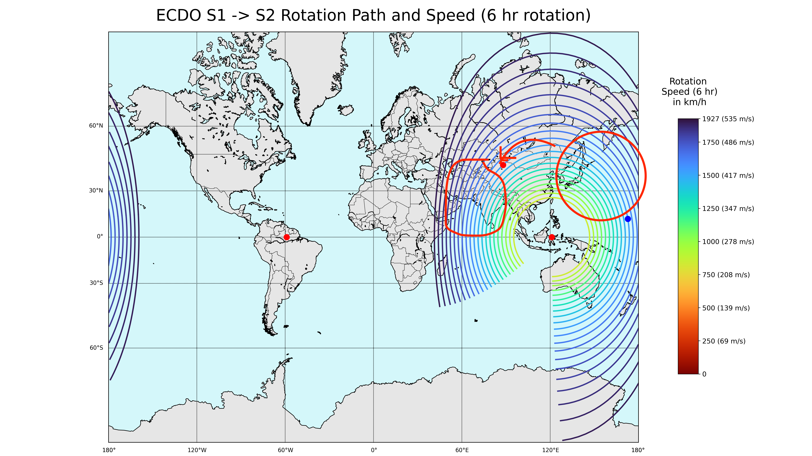

# Asia

A massive continent that is home to the east ECDO pivot at Sulawesi, Indonesia. Rushing into the Pacific in S1 -> S2. it will undoubtedly experience a massive water surge. The entire Asian continent seems like it will end up being a massive floodplain, evidenced by saltwater lakes littering Mongolia, northern China, and the Himalayas, and erosion karst landscapes throughout southern China.

Asia will rotate clockwise, following the length of the red and yellow lines.

https://github.com/user-attachments/assets/490f770f-1b53-44cc-95e4-2f1b290e80a0

See [here](https://github.com/sovrynn/ecdo/tree/master/6-LITERATURE-MEDIA/nobulart/ecdo-visualizations) for the full-res visualization. [1]

## Asia Pivot Safe Locations

Sulawesi? What would your suggestions be ?

Yes and the neighbouring Borneo island. The intersection of south, central and West Sulawesi is mountainous is relatively high in elevation. Also plenty of agriculture potential. For Borneo the area bordering between central to north Borneo seems geologically stable (out of the ring of fire potential, extremely abundant in agriculture, fresh water etc).

Central and centre north Borneo is by far the best spot in Indonesia to ride this out.

# Analysis

## Inner Asia Flood?

If you just look purely at the static position of the pacific in a 104 rotation, you'll see the ocean next to japan ends up where india is. Combine that with the lack of flood myths in that part of asia and the salt lakes all over china and not looking so good potentially. Just speculating based on the data

## Oceanic Displacement

The oceanic displacement for Asia, particularly east Asia, begins with its land and shallow tranches of ocean bordering the deep Pacific Ocean. Here's how I see the macro ocean chokepoints and flow:

The Pacific Ocean, ranging from 4-6km deep, is going to get displaced onto a coastline ranging from -2000m to 0m in height. Depending on the rotation speed and the chokepoint topography, you could see very high water surges.

## Tectonic Plates

Asia has one of the most fractured tectonic plate regions in the world.

## Citations

1. [Craig Stone](https://nobulart.com)
