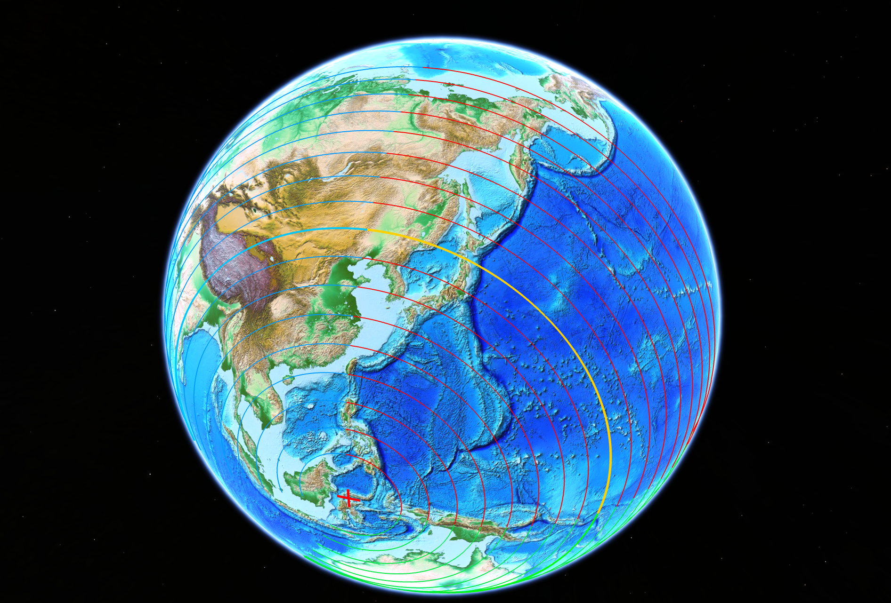

# Asia

A massive continent that is home to the east ECDO pivot at Sulawesi, Indonesia. Rushing into the Pacific in S1 -> S2. it will undoubtedly experience a massive water surge. The entire Asian continent seems like it will end up being a massive floodplain, evidenced by saltwater lakes littering Mongolia, northern China, and the Himalayas, and erosion karst landscapes throughout southern China.

Asia will rotate clockwise, following the length of the red and yellow lines.

https://github.com/user-attachments/assets/490f770f-1b53-44cc-95e4-2f1b290e80a0

See [here](https://github.com/sovrynn/ecdo/tree/master/6-LITERATURE-MEDIA/nobulart/ecdo-visualizations) for the full-res visualization. [1]

# Analysis

## Oceanic Displacement

The oceanic displacement for Asia, particularly east Asia, begins with its land and shallow tranches of ocean bordering the deep Pacific Ocean. Here's how I see the macro ocean chokepoints and flow:

The Pacific Ocean, ranging from 4-6km deep, is going to get displaced onto a coastline ranging from -2000m to 0m in height. Depending on the rotation speed and the chokepoint topography, you could see very high water surges.

## Saltwater Lakes

Saltwater lakes in red, freshwater lakes in green, and brackish lakes in orange.

## Tectonic Plates

Asia has one of the most fractured tectonic plate regions in the world.

## Citations

1. [Craig Stone](https://nobulart.com)
