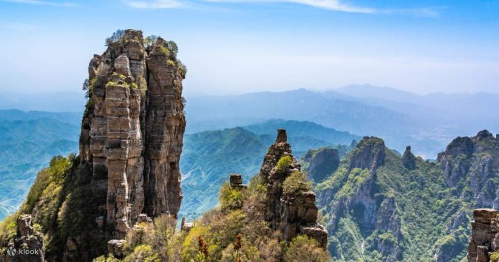
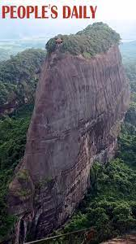

# China

China, while having a very large stretch of very high elevation land, still has to deal with quite a bit of water during S1 -> S2, and not only along the lines you see here - it potentially has to deal with ocean spilling over from Russia.

Beijing rotates to the end of the yellow line during S1 -> S2.

https://github.com/user-attachments/assets/4757ef9a-c6b8-4a11-be43-70da19bdab3d

Beijing:
- Coordinates (39.9 N, 116.4 E)
- Rotating at 1242 km/h during a 6 hour rotation

Potentially mega current ripples in the Taklamakan Desert.

## Ocean Displacement

I predict China will have to deal with water coming from 3 major chokepoints, along with the (shallow) water already in the Yellow Sea. Note that the Yellow Sea bay forms a natural chokepoint in and of itself. If you just look at the shape of the east Asian coastline, it's got several very concave bays.

China's mainland will not escape unscathed from this water.

## Baishi Mountain (Baishishan), Hebei Province, 2096m [1]

## Mangshan Mountain, Hunan, 1902m [2]

## Shaoguan, Danxia, South China

615m, Bazhai Mountain:

## China Karst Landscapes

https://whc.unesco.org/en/list/1248/

- Wulong Karst National Park (average elevation 1850m):
	- Wulong Karst - Qingkou Giant Doline (Tiankeng)
	- Wulong Karst - Three Natural Bridges
	- Wulong Karst - Furong Cave
- Jinfoshan Karst (~1000m)
- Shibing Karst (~750m)
- Libo Karst - 'Xiaoqijong' (~800m)
- Libo Karst - 'Dongduo' (~800m)
- Guilin Karst - Putao Fenling Karst
- Guilin Karst - Lijiang Fengcong Karst (~330m)
- Shilin Karst - Naigu Stone Forest
- Shilin Karst - Suogeyi Village (~1900m)

Naigu Stone Forest (1625-1900m elevation, 20-40m tall):

Three Natural Bridges, Wulong (200-300m tall):

Lijiang River:

## Zhangjiajie Mountains (1000m, 120-300m tall) [4]

Zhangjiajie mountains are a group of mountains with very interesting shape. They are tall, narrow mountain pillars.

The mountains lie at an average elevation of over 1000m.

"Zhangjiajie Sandstone Peak Forest Geopark in north-west Hunan Province, China, contains more than 3,100 natural pillars, columns and peaks made of quartz sandstone. More than 1,000 of them soar above 120 metres (393 feet) tall, and 45 reach over 300 metres (984 feet)."

This is what the terrain looks like, from Google Maps:

The pillars are of quartz-sandstone pillars and [resemble kartz terrain](https://en.wikipedia.org/wiki/Zhangjiajie_National_Forest_Park). Supposedly they were created from [sea erosion 380 million years ago](http://www.chinatoday.com.cn/ctenglish/se/txt/2009-01/21/content_175438.htm).

The absolute goldmine work into these mountains is a 2020 research paper by Yaohuang Li proposing ocean erosion as the main cause of these structures. Check `research-papers/Zhangjiajie-sea-erosion.pdf` to read it.

Definitely a good chance this location was created by fast-moving water/debris.

## Misc Info

### Desert Terrain

### Longest Inhabited Cities

Beijing and Luoyang are the only two locations in China which have been inhabited continuously for a long time.

Beijing's history goes far back as 1100 BC, which is ~3100 years ago, when it was named the City of Ji during the Zhou Dynasty. [3]

There may have been a city named Zhenxun built near present day Luoyang in 2070 BC.

Surprisingly, neither of them are at very high elevation:
- Beijing is from 43.5m at the lowest, to 2303m at the highest (Mount Ling)
- Luoyang is at 144m

### Zhoukoudian Cave (Beijing)

[Zhoukoudian Cave](https://en.wikipedia.org/wiki/Zhoukoudian_Peking_Man_Site) (39.4 N, 115.5 E) is a cave in Beijing where remains of a very old (200k+ years) human predecessor was found.

Surprisingly, the cave is located only at an [elevation of 128m](https://www.degruyter.com/document/doi/10.1515/char.2001.1.1.85/pdf).

### Wangfujing site (Beijing)

This is an archaelogical site in Beijing (39.9 N, 116.4 E) where Paleolithic Stone Age tools were found.

It's only at an elevation of 50m above sea level.

## Citations

1. https://en.wikipedia.org/wiki/Baishi_Mountain
2. https://whhlyt.hunan.gov.cn/whhlyt/english/Tourism/NationalForestParks/202206/t20220610_25443187.html
3. https://en.wikipedia.org/wiki/History_of_Beijing
4. Zhangjiajie:
	- https://en.wikipedia.org/wiki/Zhangjiajie_National_Forest_Park
	- http://www.chinatoday.com.cn/ctenglish/se/txt/2009-01/21/content_175438.htm
	- https://whhlyt.hunan.gov.cn/whhlyt/english/TourismInRegions/Zhangjiajie/ZhangjiajieAttractions/202211/t20221108_29119497.html
	- https://www.guinnessworldrecords.com/world-records/593531-largest-concentration-of-sandstone-pillars
5. [Craig Stone](https://nobulart.com)

# TODO

Things to look into:
- historical sites
- interesting mountain ranges

Danxia Rainbow mountains

ChatGPT Karst:
- Guilin and Yangshuo:
	- Li River
		- Elephant Trunk Hill
		- Reed Flute Cave
- Zhangjiajie
- Fengjie
- Shilin
- Jingxi (Guangxi)
- Lijiang
	- Jade Dragon Snow Mountain
- Guizhou
	- Libo Karst
	- Anshun
		- Huangguoshu Waterfall
- Tengchong
- Yungui Plateau
