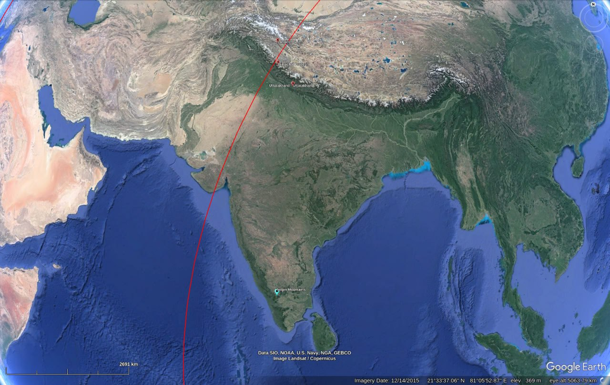
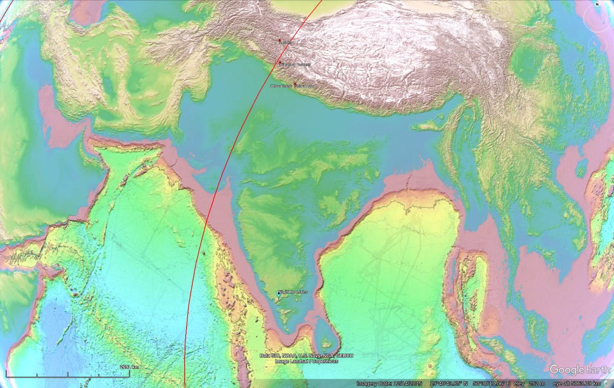

# Himalayas (Tibet)

Potential to get inundated from the east. It's the large chunk of high-elevation land in the southwest of China.

"Tibet will be inundated for sure." [1]

Viz from 2000m to 6000m.

## Salt lakes in Tibet

Red are salt lakes, yellow are freshwater, orange are "brackish".

*"In ancient times, before the collision of tectonic plates originated the Himalayas, the Tibetan plateau was covered by a great sea. The many salty lakes that remain were the main deposits of such a precious commodity for Tibetans."* [7] (Hard copy in this folder)

Not looking good for Tibet...

## Overview [1]

The mighty Himalayas. They get their feet wet on the southern slopes during S2>S1. I think maybe not Uttarakhand.

## Glacial erosion?

Displacement of oceans is a given, but what about displacement of glaciers?

U-shaped valley at the head of Leh valley, Ladakh [2]:

## Marine fossils from warmer climates in Tibet sediment deposits

*"About 15,000 feet up on Tibet's desolate Himalayan-Tibetan Plateau, an international research team led by Florida State University geologist Yang Wang was surprised to find thick layers of ancient lake sediment filled with plant, fish and animal fossils typical of far lower elevations and warmer, wetter climates."* [9]

## Tibet flood myth

See `EVIDENCE/cataclysm-chronology/asia`. In *Worlds in Collision*, Velikovsky cites a source saying that Tibet was inundated.

## Citations

1. [Craig Stone](https://nobulart.com)
2. https://himalayacarbongeomorphology.wordpress.com/
3. https://www.coretreks.com/blogs/lakes-in-nepal/
4. Kusai Lake: https://www.geodoi.ac.cn/weben/doi.aspx?Id=1251
5. Ayakkum: https://en.wikipedia.org/wiki/Lake_Ayakkum
6. Dogai Coren: https://www.mindat.org/loc-262229.html
7. https://himalaya.socanth.cam.ac.uk/collections/journals/ret/pdf/ret_65_03.pdf
8. Saline lakes Mongolia: https://www.mongolian.travel/boon-tsagaan-nuur/
9. https://phys.org/news/2008-06-fossils-tibet-history-elevation-climate.html

# TODO

Wulanwula 750m sediment deposits: https://ui.adsabs.harvard.edu/abs/2002AGUFMGP71A0980Z/abstract

Himalayan alluvial deposits: https://ui.adsabs.harvard.edu/abs/2020AcGlS..94..176Z/abstract

Dogai Coring salt springs: https://www.geojournals.cn/dzxben/js/pdf/web/viewer.aspx?file_no=2014ens1125&journal_id=dzxben

Saltwater lakes:
- Pangong Lake
- Tso Moriri Lake
- Nam Co Lake
- Zhari Namco
- Tso Kar

Freshwater lakes [3]:
- Tsomgo (Changu)
- Gyaring Lake (Gya Lake?)
- Rara Lake
- Lake Manasarovar
- Tilicho