# India

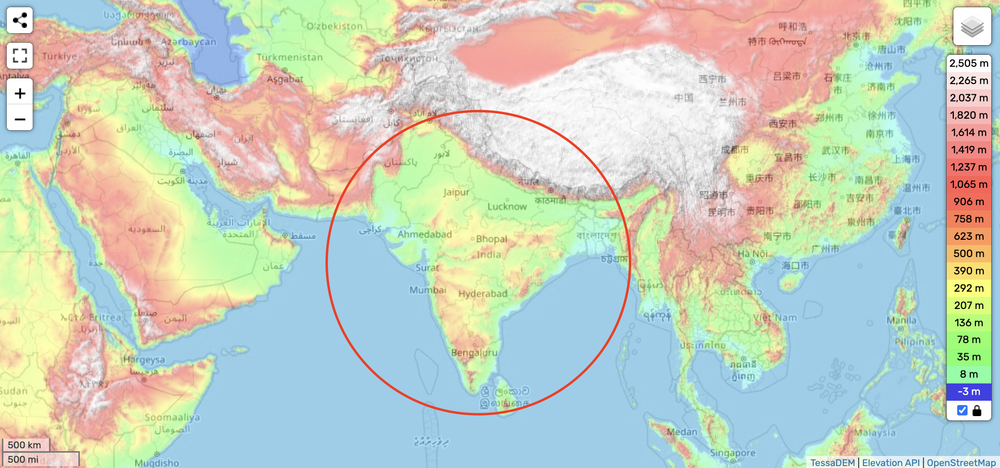

May be spared the worst of it by the Himalayas, going from S1 to S2.

Many ancient and massive pyramid like structures to be found across India, such as the Chola temples.

However, real trial may be the return (S2 -> S1). [1]

## Analysis [1]

https://github.com/user-attachments/assets/6ab919f1-12ac-4c40-966d-5b1552d6045e

See [here](https://github.com/sovrynn/ecdo/tree/master/6-LITERATURE-MEDIA/nobulart/ecdo-visualizations) for the full-res visualization. [1]

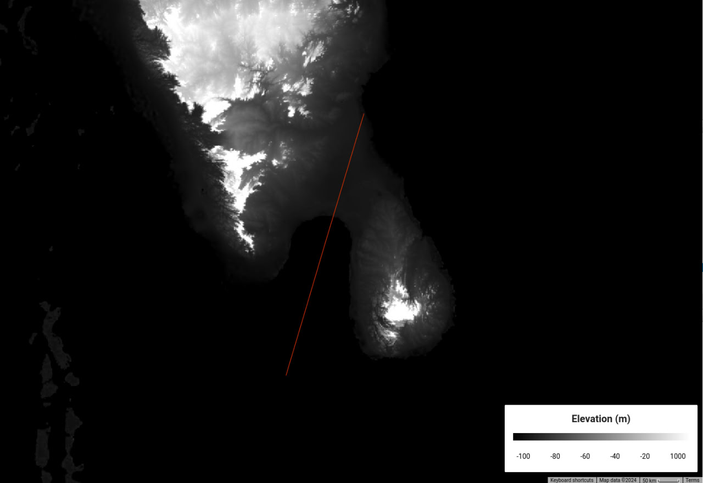
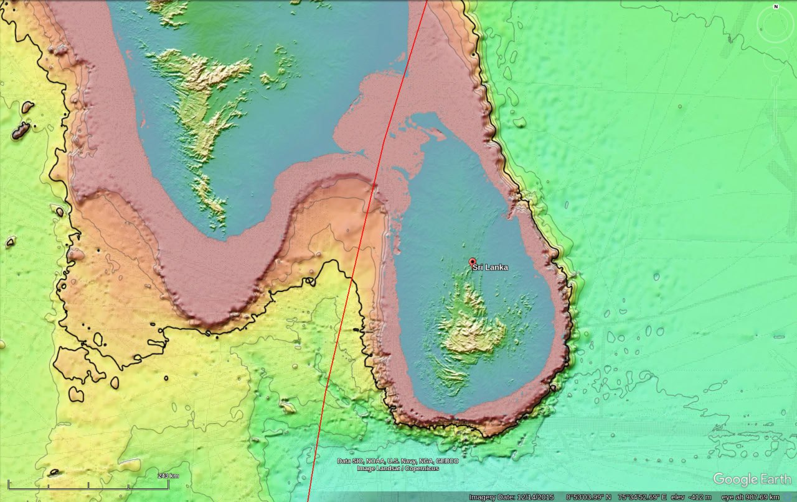
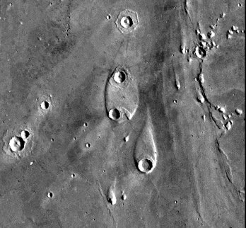

India & Sri Lanka (incl. Mohenjo-Daro). ECDO rotations S1>S2 and S2>S1. The new model provides a hint of seiche. Greyscale elevation and false-colour bathymetry. Remarkable channel erosion type morphology between Sri Lanka and India following the ECDO path. Sri Lanka has the characteristic teardrop form which some islands take on in fast flowing rivers. Third image is Mars megaflood erosion with a teardrop island (flow would have been from the bottom of the image to the top) [1]. Red lines are ECDO displacement path [2].

Tamil flood story: "Half of the land mass Kumari Kandam, which was south of India, sank in a great flood, destroying the first Tamil Sangam (literary academy). The people moved to the other half and established the second Tamil Sangam there, but the rest of Kumari too sank beneath the sea. The lone survivor was a Tamil prince named Thirumaaran, who managed to rescue some Tamil literary classics and swim with them to present-day Tamil Nadu." [3]

1. https://physics.uwo.ca/~jlandstr/planets/webfigs/terrestrials/slide16.html
2. https://theethicalskeptic.com/2024/05/12/exothermic-core-mantle-decoupling-dzhanibekov-oscillation-ecdo-theory/
3. https://talkorigins.org/faqs/flood-myths.html#Tamil

## Flooded cities circa 1900 BC

There is a paper by BB Lal (see `EVIDENCE/cataclysm-chronology/asia/india`) that references multiple cities in North India that were flooded circa 1900 BC.

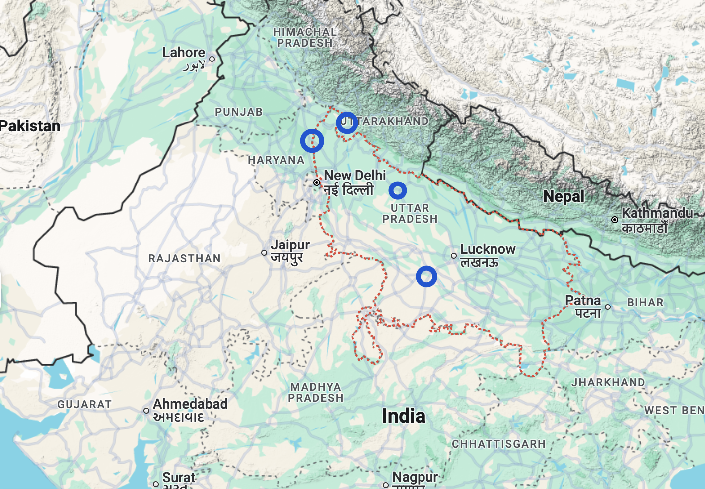

The exact locations are as follows:

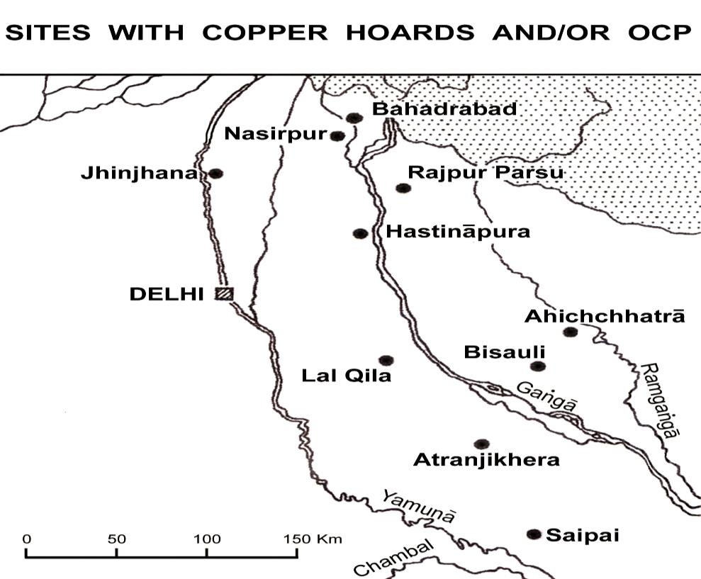

The approximate elevation of this area is 100m - 300m.

## Nigiri Hills

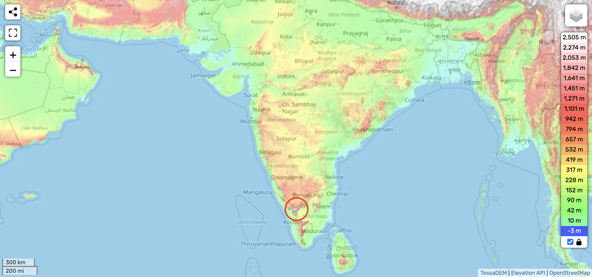

### Analysis [1]

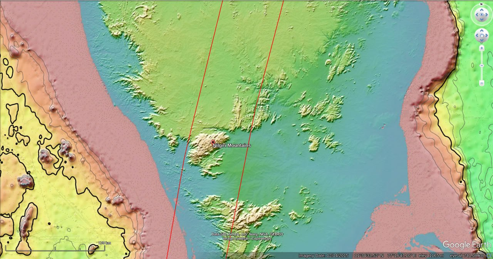
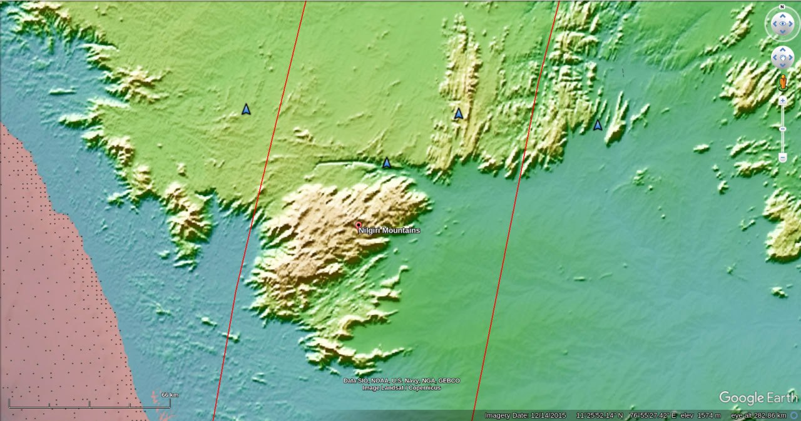
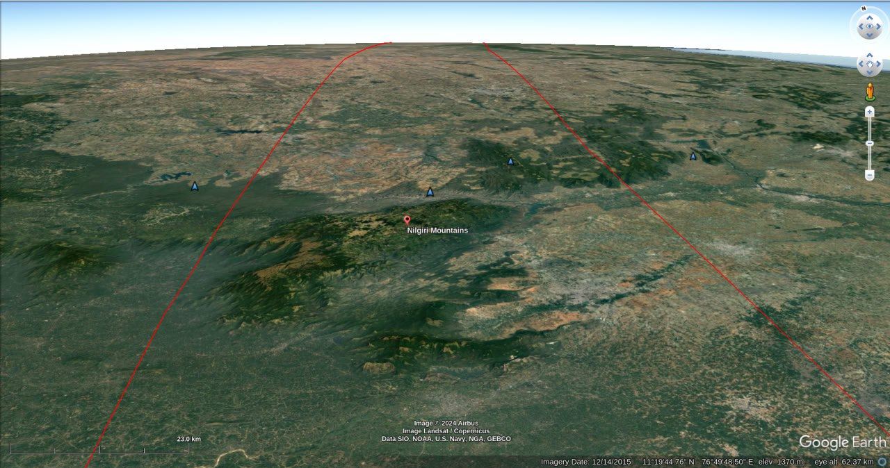

Red lines are the ECDO path. Appears to be quite a few striations running along the path around it (I marked a few with blue arrows). Considering their relative flatness, I think these are overtopped going from S2>S1.

## Kumari Kandam

See `EVIDENCE/cataclysm-chronology/india` for analysis on this.

## Sigiriya

Sigiriya or Sinhagiri (Lion Rock Sinhala: සීගිරිය, Tamil: சிகிரியா/சிங்ககிரி, pronounced SEE-gi-ri-yə) is an ancient rock fortress located in the northern Matale District near the town of Dambulla in the Central Province, Sri Lanka. It is a site of historical and archaeological significance that is dominated by a massive column of granite approximately 180 m (590 ft) high. Construction began c.477 AD, so this is likely wiped clean every time.

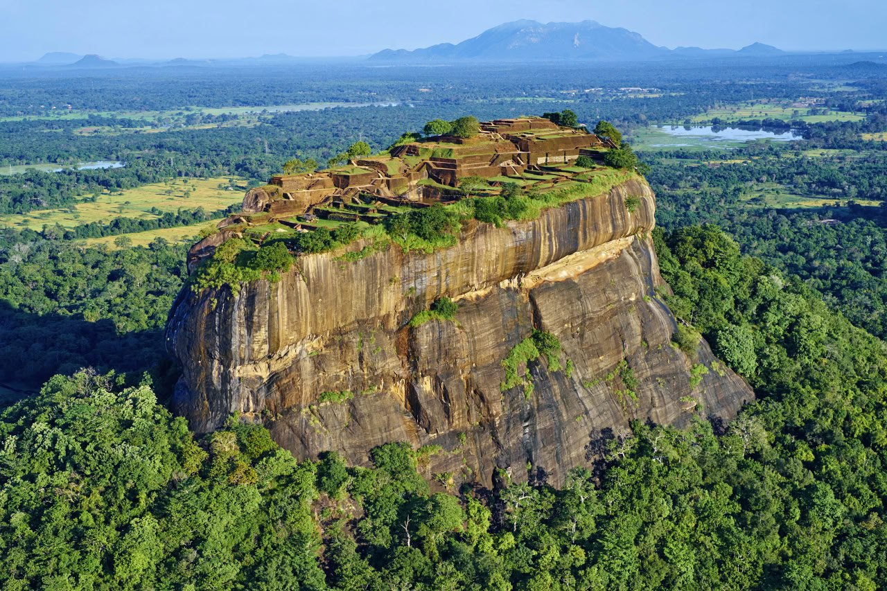
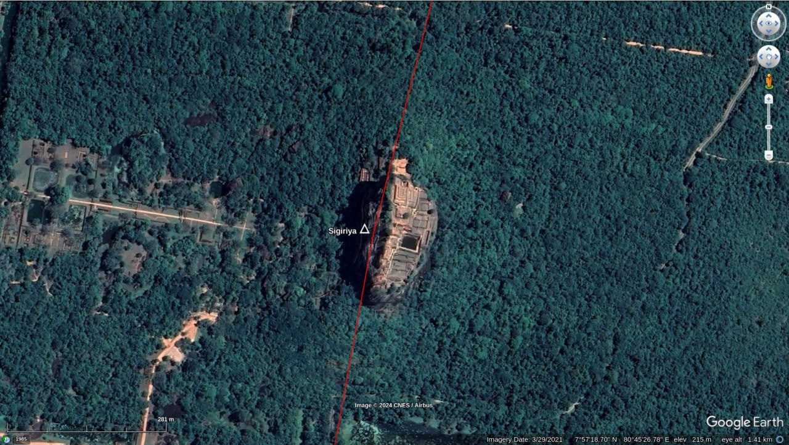
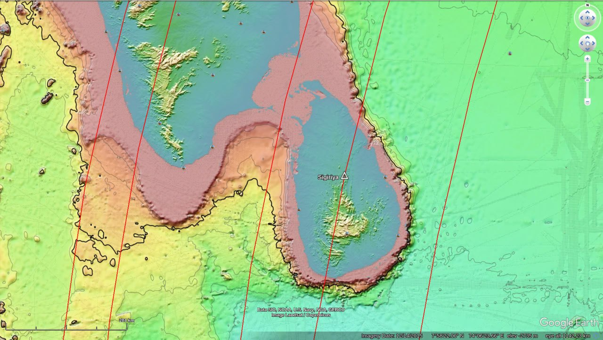

[1] https://en.wikipedia.org/wiki/Sigiriya

## Indian temples

Looking for ones that are more central or inland.
- https://en.wikipedia.org/wiki/Kandariya_Mahadeva_Temple
- https://en.wikipedia.org/wiki/Nalanda_mahavihara
- https://en.wikipedia.org/wiki/Teli_ka_Mandir
- https://en.wikipedia.org/wiki/Martand_Sun_Temple
- https://en.wikipedia.org/wiki/Pattadakal

This is a good starting point for finding more: https://en.wikipedia.org/wiki/Ancient_Indian_architecture

At this point (based on the apparent age of the Michigan whale bones) I'm assuming that anything less than 1,000 years is probably not worth considering. Some of the structures listed here are claimed/thought to be many thousands of years old:
https://en.wikipedia.org/wiki/Ancient_Indian_architecture

## Oldest inhabited cities [1]

Here it is with the longest inhabited cities in the region. Red inhabited since before 1200BC. Yellow since before 700BC.

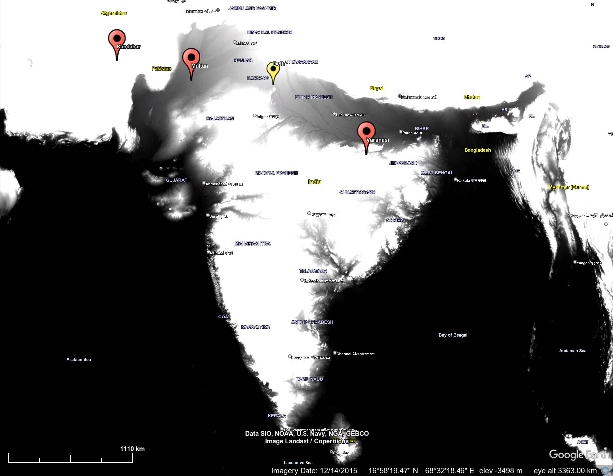

The thought I'd had is that these cities almost certainly are devastated by quakes and wind as well, but they're not deluged, and hence manage to recover much more quickly.

## Citations

1. [Craig Stone](https://nobulart.com)

# TODO

- Varanasi
	- Long way inland, well protected by the Himalayas during S1 -> S2, and a minimum of 800-900km land buffering between the cities and the coast on the S2 -> S1 rotation.
- Doddabetta Peak in Ooty

Khewra Salt Mine