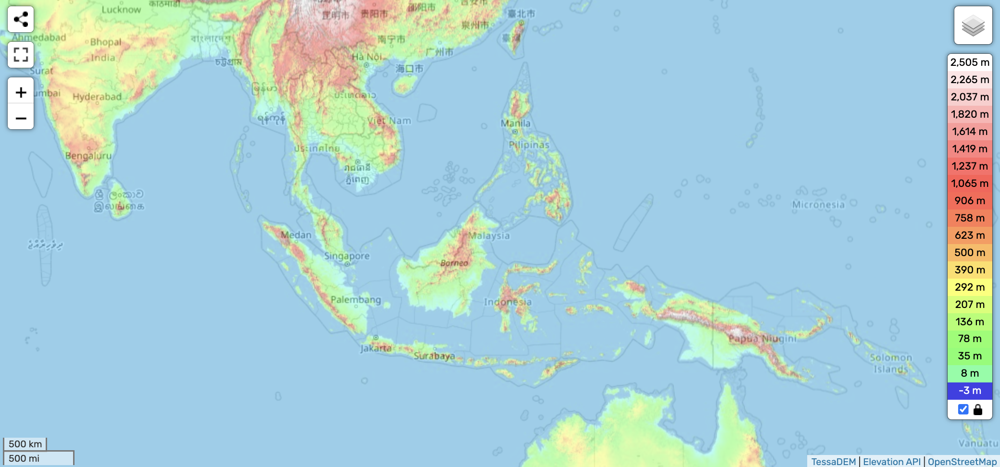

# Indonesia

Home of the eastern ECDO pivot in Sulawesi. Lots of volcanoes. Interesting location to look into.

## Nobulart

The oldest known cave art happens to be on the eastern ECDO pivot, in Sulawesi. The pivots would not encounter the high velocity lateral flows that would be seen in most other locations, as they would maintain their position relative to the water.

https://www.livescience.com/archaeology/51000-year-old-indonesian-cave-painting-may-be-the-worlds-oldest-storytelling-art
