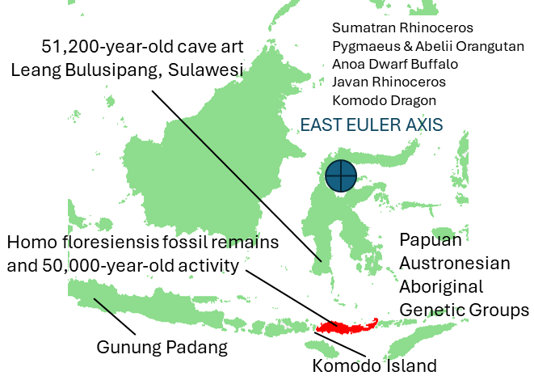
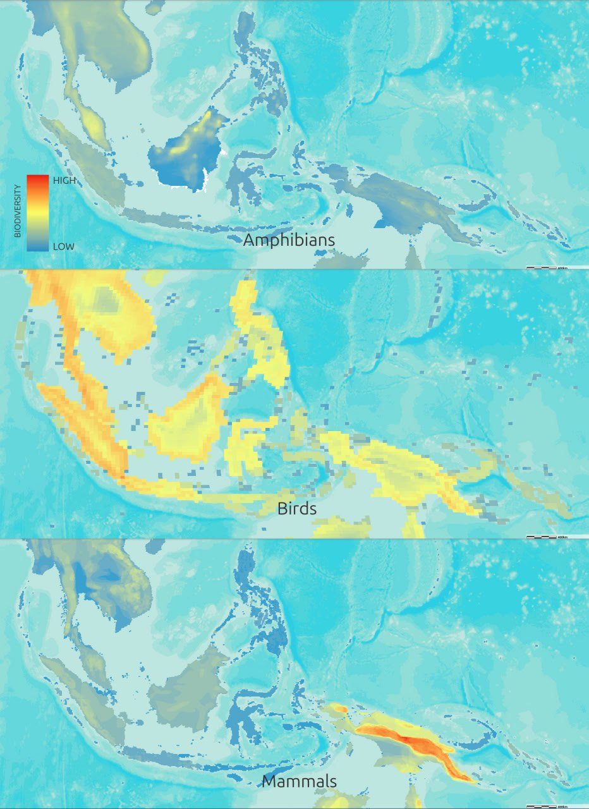
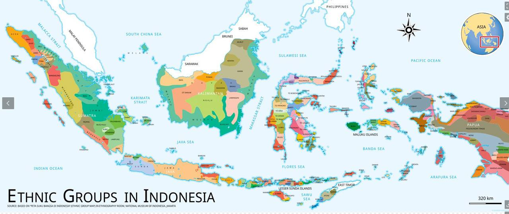
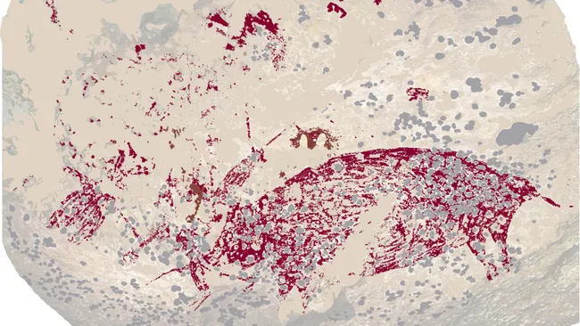
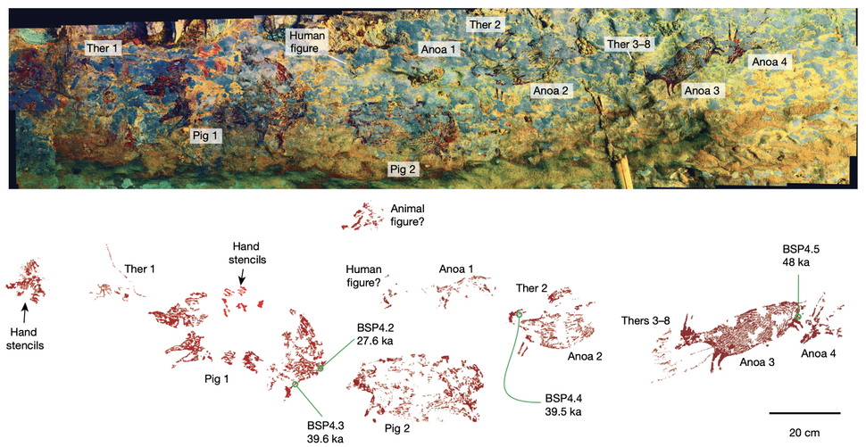
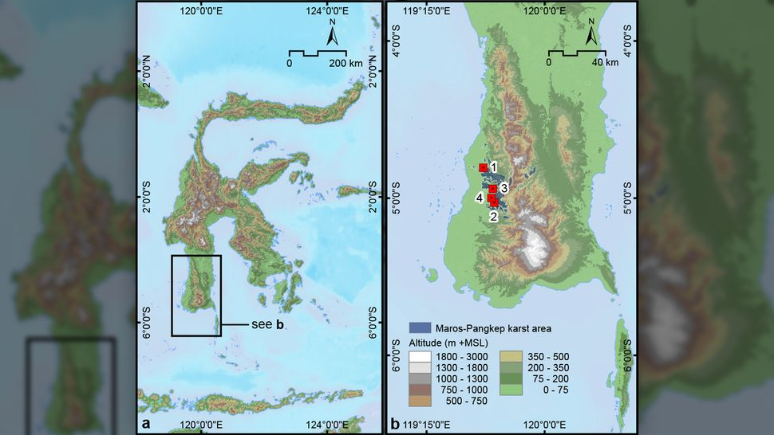
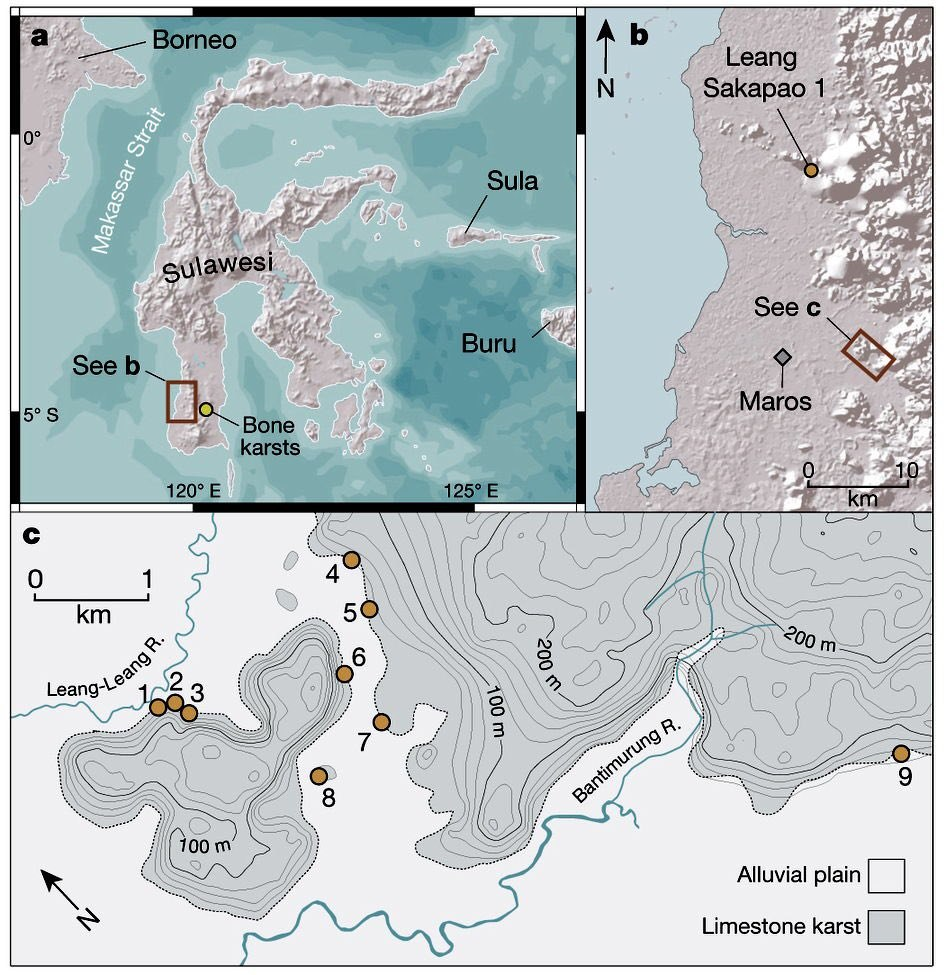
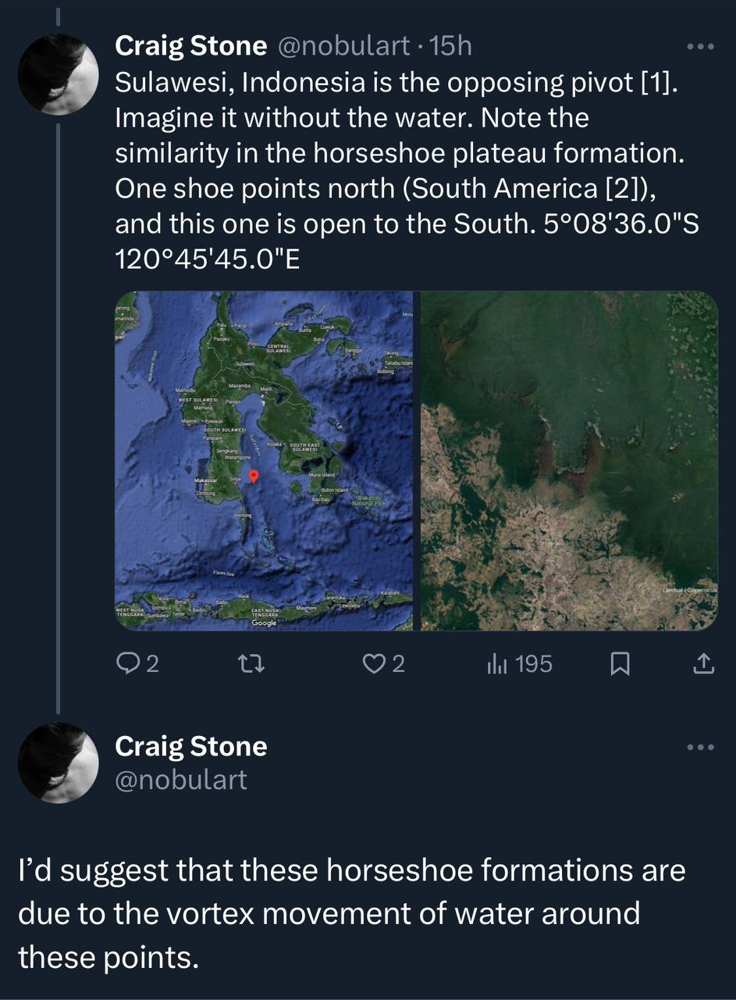

# Indonesia

Home of the eastern ECDO pivot in Sulawesi. Lots of volcanoes. Interesting location to look into.

## Biodiversity

## Oldest Cave Art [1]

The oldest known cave art happens to be on the eastern ECDO pivot, in Sulawesi. The pivots would not encounter the high velocity lateral flows that would be seen in most other locations, as they would maintain their position relative to the water.

*"A 51,000-year-old painting in the Sulawesi cave "art gallery" is the oldest evidence of narrative rock art ever discovered."*

*"The caves in the Maros-Pangkep karst are a cave complex, where prehistoric finds were made.[3] The whole complex is also called "Prehistoric place Leang-Leang..."* [2]

This location sits at an elevation of about 350m.

## Horseshoe

## Citations

1. https://www.livescience.com/archaeology/51000-year-old-indonesian-cave-painting-may-be-the-worlds-oldest-storytelling-art
2. https://en.wikipedia.org/wiki/Caves_in_the_Maros-Pangkep_karst