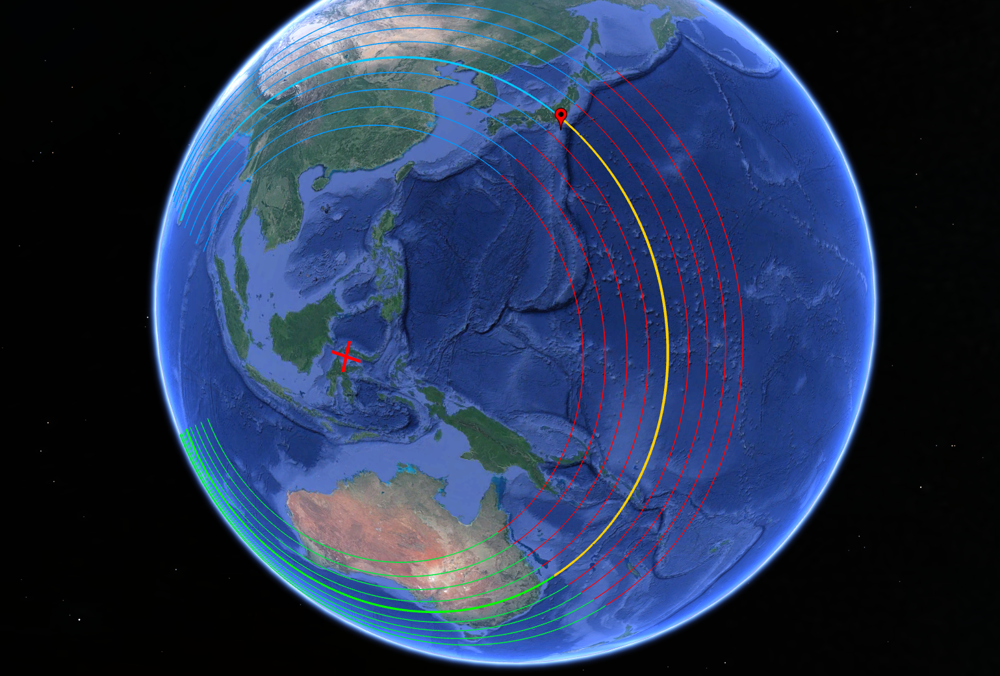
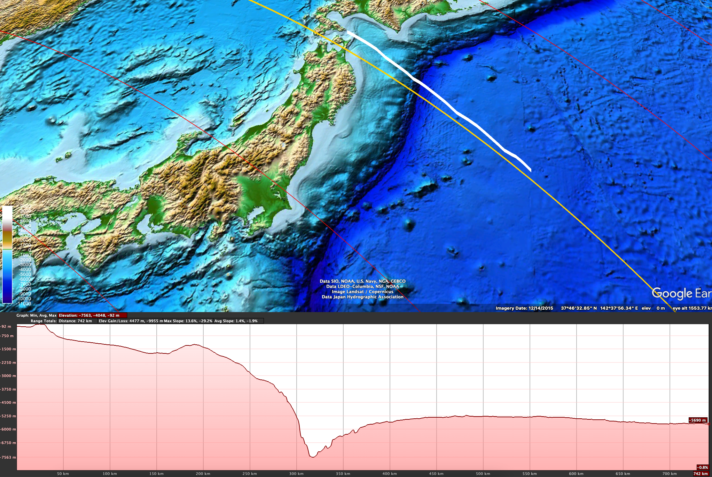
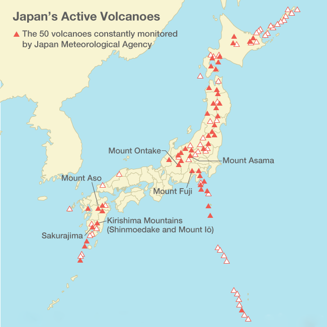

# Japan

An island nation in East Asia lying on the Pacific Plate boundary. It has to deal with a huge span of Pacific Ocean, along with a major subduction zone of the Pacific plate.

Tokyo:
- Coordinates: (35.7 N, 139.7 E)
- Rotating at speeds of 1235 km/h during a 6 hour rotation

## Ocean displacement

Japan has two major sub-oceanic chokepoints due to the Pacific plate subduction. The upper one in particular is completely blocked:

The quantity of water being pushed up at these chokepoints is going to be immense. The depth of the Pacific in that area is 5-6 km, and it has to essentially reach surface level, potentially at speeds of over 1000 km/h. The surge will be insane.

See this elevation path of the upper chokepoint, which is going to be the major one:

## Volcanoes and tectonics

Japan has many volcanoes [5], and is situated right on the Pacific Plate boundary. In fact, there are very few regions in Japan that aren't in close proximity to a volcano. [6]

If these all erupt at the same time, spewing out ash and magma, it would likely be enough to make Japan completely inhabitable, just on its own.

As for earthquakes, Japan is known to experience many earthquakes even in normal times. It would be far worse during the ECDO.

## Flood Myths

Japan has no major flood myths. [4] When considering such a major event as an ECDO, one may wonder why there is no major flood myth, if there were survivors to such an event, as tales would have been told about it for generations to come, and it would have significantly restructured society on the island.

## Oldest history

The oldest written reference to Japan traces back to the Chinese Book of Han, around the first century AD. [1]

The oldest remains of human inhabitants have been traced back to at least 10,000 BC. [2] For example, human remains in the Kamikuroiwaiwakage Cave have been dated to around 14,500 years ago. [3]

It seems likely that humans did indeed inhabit Japan during periods long ago.

## Verdict

Japan has to deal with very deep Pacific Ocean chokepoints, volcanoes peppering its island, and powerful subduction plate boundaries. It's likely that Japan will face significant trials during S1 -> S2.

If I had to find a region to stay in, it would be at one of the highest mountain peaks in the mid-western areas of Japan that don't have any volcanoes (see map above). But given the earthquakes, volcanoes, and Pacific Ocean water surge, it would likely be a gamble.

## Citations

1. https://en.wikipedia.org/wiki/History_of_Japan#cite_note-:0-1
2. https://www.journals.uchicago.edu/doi/10.1086/694447
3. https://en.wikipedia.org/wiki/Kamikuroiwaiwakage_Site
4. https://en.wikipedia.org/wiki/List_of_flood_myths#Japan
5. https://en.wikipedia.org/wiki/List_of_volcanoes_in_Japan
6. https://www.legacyias.com/sakurajima-volcano-erupted-on-japan/
