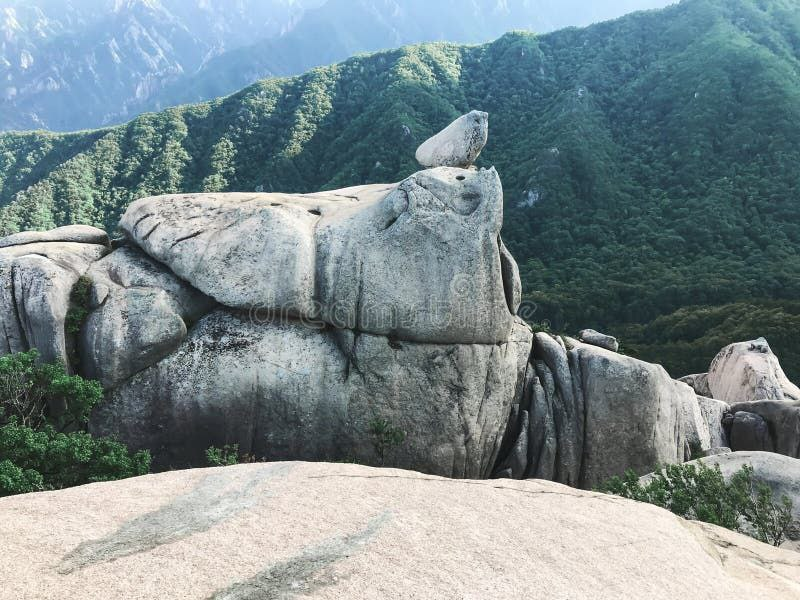

# Korea

Overall, while there is evidence of survivors of an ECDO event (Dangun's parents), Korea is not a great location. It's right on the coast, has to deal with a massive Pacific Ocean surge coming over from Japan, has a massive volcano, and has a large concave bay, which would force the ocean up over the land.

Seoul:
- (37.5 N, 127 E)
- 4215 km away from the eastern pivot, it would rotate at 1184 km/h in a 6 hour rotation.

## S1 -> S2 Rotation path

Japan is the only land between Korea and the Pacific.

## Elevation profile

Korea is quite hilly, with mountains running along the east, particularly in the north. The west is more of a plain.

## Chokepoint water flow

The way I see it, Korea's geography is pretty much as bad as it gets for bypassing the water flow. Its east coast essentially forms a huge chokepoint, which will force the surge coming over from Japan to flow up over the land. I predict the water will flow over Korea starting at these two areas:

If I had to guess, most of Korea will be inundated, with only a few areas at the highest elevations safe. This is how I'm visualizing the flow, with the circled areas entirely inundated:

This is an 800m flood map. For reference, Mount Myohang's highest point is 1909 m. [3] I think the water flow will be an absolute minimum of 700m in the entire central chokepoint area because that's the only level at which there is enough space for the water to flow westward.

## Erratics

Red is clear erratic evidence, green is places that seem safe.

## Daechongbong Peak (1708m)

## Taebaeksan

Peak elevation of 1567m. Picture from Munsubong Peak (1515m). [7]

## Sobaeksan (Birobong)

Birobong Peak, 1439m.

## Ulsanbawi (Seoraksan) Erratics

Ulsanbawi is a large rock mountain in the Seoraksan mountains. It is situated on the east coast of Korea, bordering the massive coastal chokepoint bay, right under the border with North Korea. It has a peak of 874m [5], and some interesting features:

## Gwanaksan

~500m peak.

## Bibong Peak (금선사)

~500m peak.

## Bukhansan

Baegundae peak (800m):

## Mt. Myohang (1909m)

Surprisingly, the cave where Dangun's parents survived a likely ECDO event is not extremely high in elevation. It's on the extremity of Korea's high elevation land, and close to Korea's main water flow-point.

That being said, it's the furthest high-elevation location from Mt. Paektu, which is promising.

## Volcanoes

Korea has two volcanoes on the mainland:
- Mt. Paektu (north)
- Ch'uga-Ryong, maybe extinct (central) [4]

And two island volcanoes:
- Hallasan (Jeju, south)
- Ulleungdo (east)

Since Korea moves closer to the equator, and is also very close to major subduction fault lines, it's almost certain to see significant volcanic activity.

## Mt. Paektu

Unfortunately, most of Korea's high-elevation land is right next to a huge volcano. Perhaps the volcano is actually the reason that this high-elevation land exists.

*"The mountain's caldera was created in 946 by the colossal (VEI 6)[21] "Millennium" or "Tianchi" eruption, one of the most powerful eruptions in the last 5,000 years, comparable to the 230 CE eruption of Lake Taupō and the 1815 eruption of Mount Tambora.[22] The eruption, whose tephra has been found in the southern part of Hokkaidō, Japan, and as far away as Greenland,[23] destroyed much of the volcano's summit, leaving a caldera that today is filled by Heaven Lake."* [1]

It seems likely that if an ECDO were to happen, this volcano would erupt with at least as much strength as it did in the Millennium eruption. After all, the Millennium eruption was not the first eruption of this volcano either.

I stumbled across this little visual during my investigation - it highlights how while Mt. Paektu might not be submerged, most humans may not be able to survive anywhere near it unless they are underground due to the volcanic ash.

See https://en.wikipedia.org/wiki/946_eruption_of_Paektu_Mountain

## Tectonic plates

Korea lies quite close to major subduction of the Pacific and Phillipine plates, along with other fault lines.

This is an interesting dataset. From what I can see, it indicates that Mount Paektu is much greater in scale than the central volcano. The two island volcanoes have also clearly been active recently. [2]

## Final verdict - Safe Locations

It's not clear to me that there are any surefire safe locations on this peninsula based on the 800m Seoraksan erratics. It might be possible that south Korea is almost completely submerged, and almost all of the mountain range in north Korea gets completely covered in ash. In that case, a cave in Mt. Myohang, which is basically the furthest possible high point that's away from Mt. Paektu in Korea, might actually be one of the very few places that a human could survive an ECDO event in Korea under normal circumstances.

In the south of Korea, Jirisan doesn't look terrible. It has a peak of 1915m which matches Mt. Myohang. It's the highest mainland mountain in South Korea. I didn't find obvious erratics on the peak. Additionally it's away from the western terrain chokepoint, and isn't surrounded by high-elevation land, giving the water plenty of room to go around.

## Citations

1. https://en.wikipedia.org/wiki/Paektu_Mountain
2. https://volcano.si.edu/volcano.cfm?vn=305060
3. https://en.wikipedia.org/wiki/Mount_Myohyang
4. https://www.volcanodiscovery.com/chuga-ryong.html
5. https://mapcarta.com/16013170
6. http://nationalatlas.ngii.go.kr/pages/page_670.php
7. https://www.peakbagger.com/peak.aspx?pid=-161482

# TODO

It seems there is some good geological research on Korea found here: https://www.jgsk.or.kr/_common/do.php?a=current&b=21

Specifically there is a paper there which references some "Haengmae" sediment deposits in Taebaeksan, although it dates them to much older than ECDO timeframes: https://www.jgsk.or.kr/_common/do.php?a=current&b=21&bidx=3784&aidx=41718
- Previous iteration on that work: https://www.jgsk.or.kr/_common/do.php?a=full&b=22&bidx=3618&aidx=40811

[6]:

