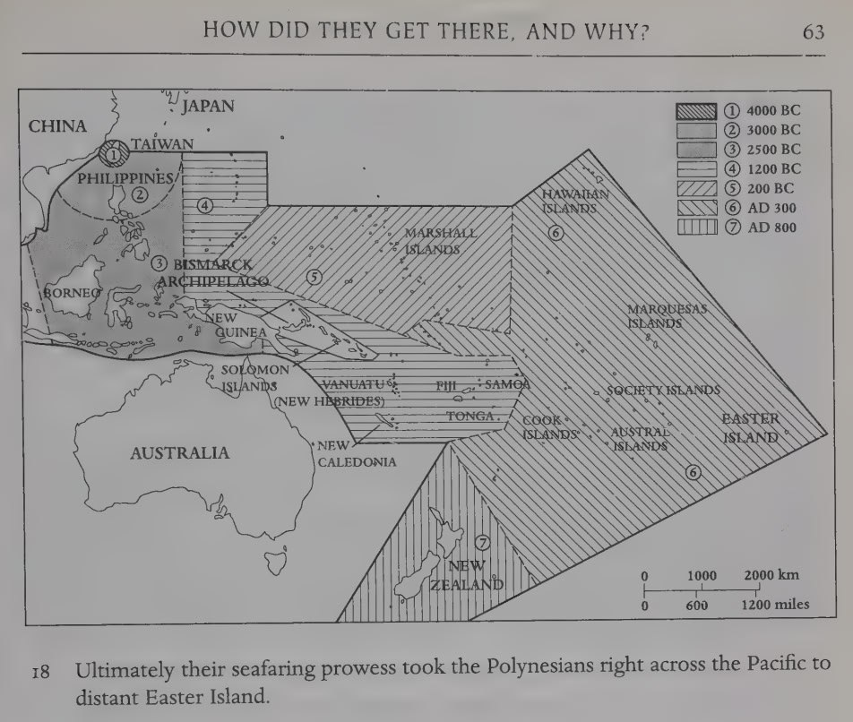

# Taiwan

Interesting spot. At first glance, it has very high elevation and relatively low rotation speed. But if you look closely, it has to deal with some interesting underwater chokepoints...

## Polynesian's Roots

If you look in `EVIDENCE/civilization-remnants`, you'll see that Polynesians might be able to trace their roots back to Taiwan, indicating the island has safe locations. Certainly, given its very high elevation profile, there will be safe spots.

## Mount Xueshan (Peak 3886m)

Picture from the peak [1]:

Profile (0m to 4000m):

### Beilengjiao, Xueshan (Peak 3880m)

Picture from the peak [1]:

## Citations

1. https://www.peakbagger.com/range.aspx?rid=547