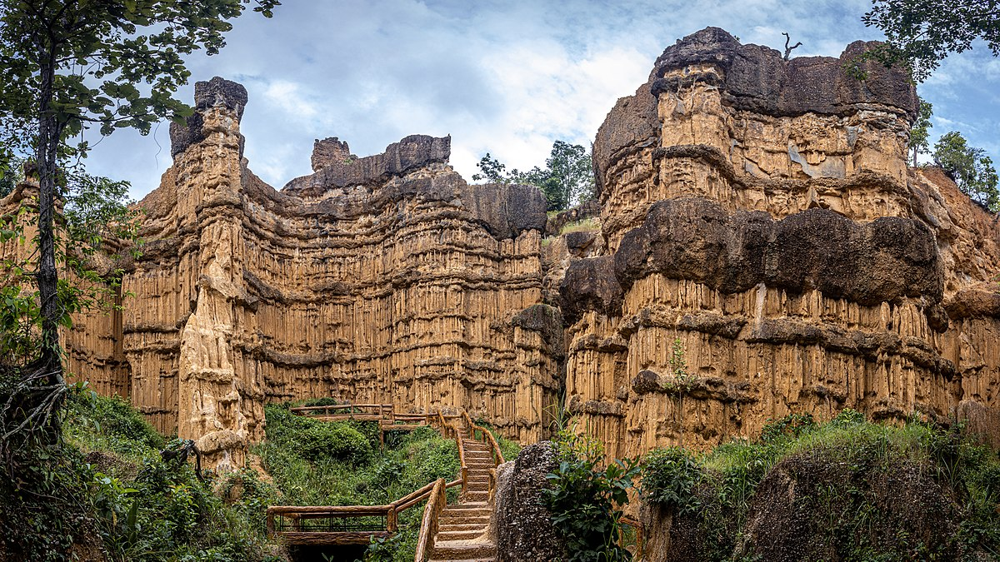
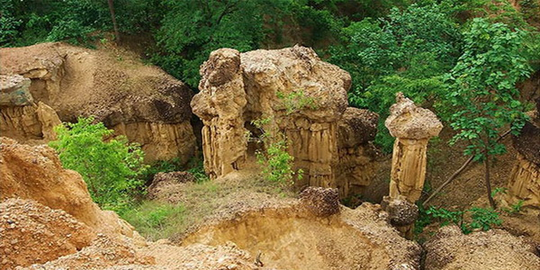

# Thailand

## Pha Chor, Mae Wang National Park (Northern Thailand)

Some interesting erosion structures, about 30m high and ~400m elevation. Looks like they have both horizontal and vertical directions of erosion. May just be caused by rain. [1]

## Citations

1. https://mychiangmaitour.com/maewang_national_park/