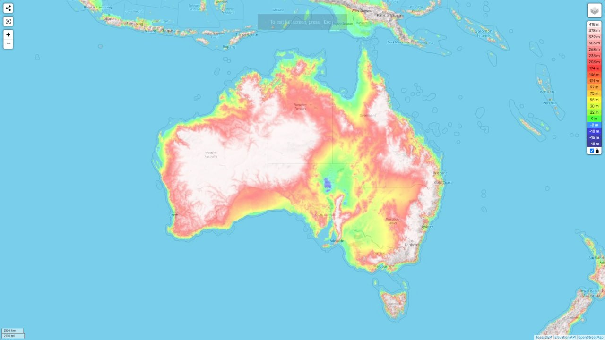
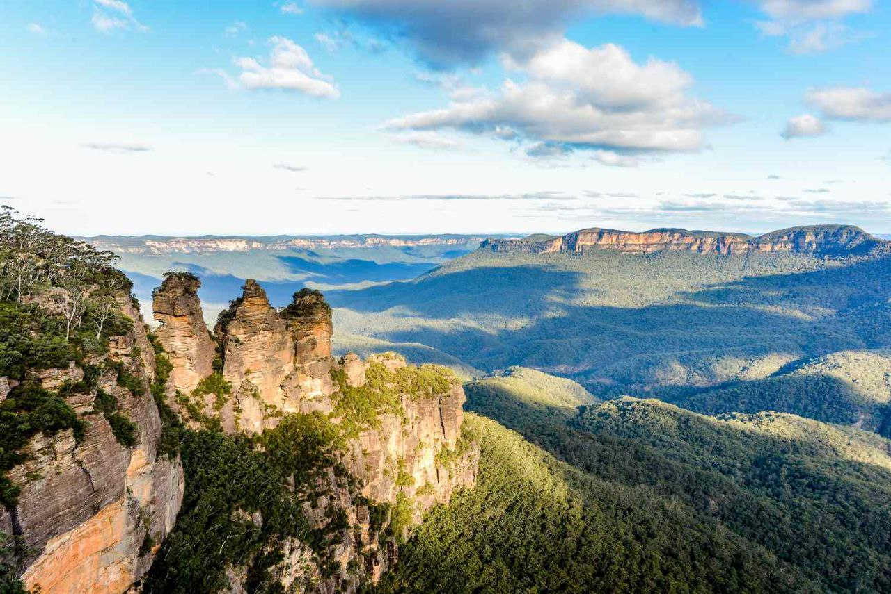
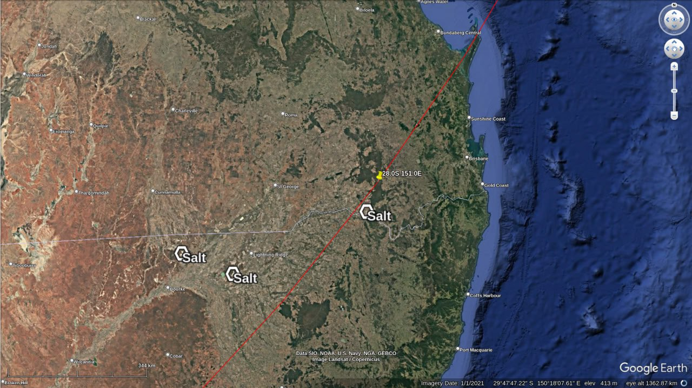

# Australia

Australia is relatively close to the eastern ECDO pivot in Indonesia.

## Analysis [1]

https://github.com/user-attachments/assets/8a5e0e8b-4d8b-45f8-a703-c56c91c3be7c

See [here](https://github.com/sovrynn/ecdo/tree/master/6-LITERATURE-MEDIA/nobulart/ecdo-visualizations) for the full-res visualization. [1]

Oceania ECDO visualization using the V4 model.[1] Australia and many of the Pacific islands have many flood stories.[2] Australia bears many evidences of possible diluvial flows reinforced with numerous large salt deposits.[3] We also find a description of a possible rotation in the Australian paleomagnetic record from half a billion years ago.[4] Australia: "A great flood drowned most of the people. A few escaped to the top of the tall mountain Bibbiringda, which is inland of the northern bay of Cape Cleveland. [Frazer, p. 236]" and "Bunjil, the creator, was angry with people because of the evil they did, so he caused the ocean to flood by urinating into it. All people were destroyed except those whom Bunjil loved and fixed as stars in the sky, and a man and a woman who climbed a tall tree on a mountain, and from whom the present human race is descended. [Gaster, p. 114]"[2]

Australia's proximity to the Sulawesi pivot means that water velocities are somewhat less than in many other places. Vast regions are characterized by dune-like striations which run for many hundreds of kilometers (period 600m, amplitude 15m) - whether or not there is a diluvial aspect to the formation of their substructures is not clear. There are significant salt deposits in the central southern basin region. Topography suggests inundation mostly from the south during S1>S2. Note the crescent-shaped waves running tangent to the moment of inertia (red line) east of Adelaide.

1. https://theethicalskeptic.com/2024/05/12/exothermic-core-mantle-decoupling-dzhanibekov-oscillation-ecdo-theory/
2. https://talkorigins.org/faqs/flood-myths.html
3. https://x.com/nobulart/status/1812565796972798086
4. https://x.com/nobulart/status/1817571533050581496

## Blue Mountains

## Salt in southwest

## Citations

1. [Craig Stone](https://nobulart.com)

# TODO

Charlottes Pass in the southeast.