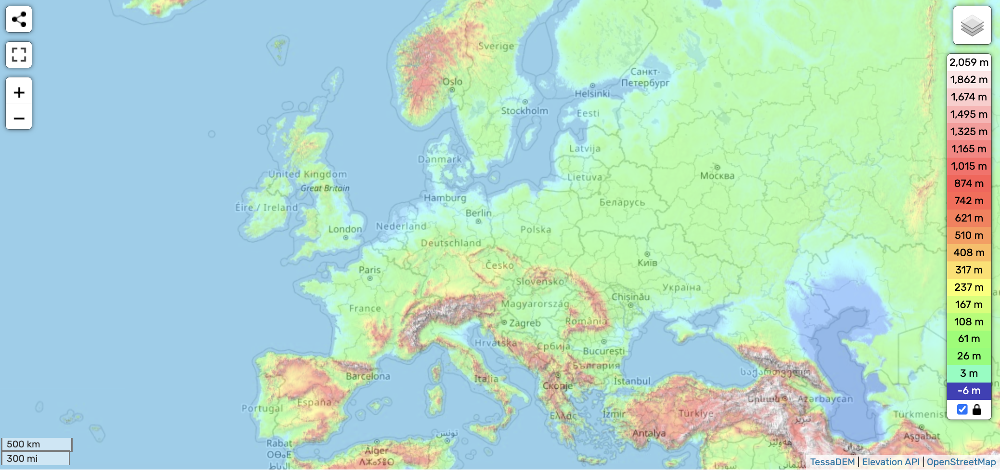

# Europe

Europe, being centered around the 31 Meridian, has to traverse a lot of net distance during the ECDO rotation.

https://github.com/user-attachments/assets/185b5a4e-2778-45ce-b69f-de3a8c76a87e

See [here](https://github.com/sovrynn/ecdo/tree/master/6-LITERATURE-MEDIA/nobulart/ecdo-visualizations) for the full-res visualization. [1]

## Citations

1. [Craig Stone](https://nobulart.com)