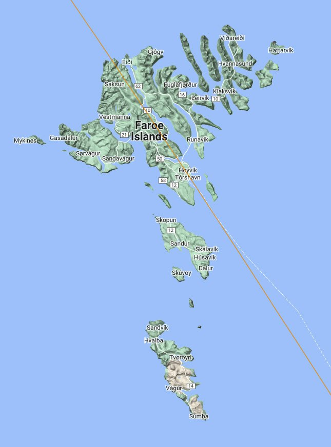

# Europe

Europe, being centered around the 31 Meridian, has to traverse a lot of net distance during the ECDO rotation.

https://github.com/user-attachments/assets/185b5a4e-2778-45ce-b69f-de3a8c76a87e

See [here](https://github.com/sovrynn/ecdo/tree/master/6-LITERATURE-MEDIA/nobulart/ecdo-visualizations) for the full-res visualization. [1]

## Overview

Europe [detail]. Bathymetry, topography and ECDO-derived displacement for S1>S2>S1 [1].  Note the extensive buffer afforded to most of Europe by Iceland, Norway, Sweden and the North Sea continental shelf, most of which is little more than 100m deep [pink areas on the bathymetry map]. Norway, Sweden and Finland all exhibit uniform stratification in their geology running from the northwest to the southeast, along the ECDO moment of inertia. Current ripple morphology is unlikely in this area where the water flows would be heavily disrupted by the rocky terrain, providing little opportunity for sheet flows to be established.

## Swedish, Finnish Erratics

This flow direction once again almost perfect describes how Swedish and Finish erratics might have traveled 800km SE to Belarus. Not saying it IS the case, just that it seems at least as plausible as glacial ice flowing uphill does.

## Water flow evidence

The Lichtenberg figure water flow evidence over eastern Europe and western Asia is quite spectacular on the elevation map.

## Faroe Islands

Faroe Islands. Spectacular erosion features with a distinct NNW-SSE polarization. Orange line is the ECDO displacement path.

1. https://maps.app.goo.gl/ACkKjvmTByFDka8Q6
2. https://youtu.be/EruSZNI4th4

## Citations

1. [Craig Stone](https://nobulart.com)

# TODO

Lion Man - very old artifact from Germany: https://www.britishmuseum.org/blog/lion-man-ice-age-masterpiece