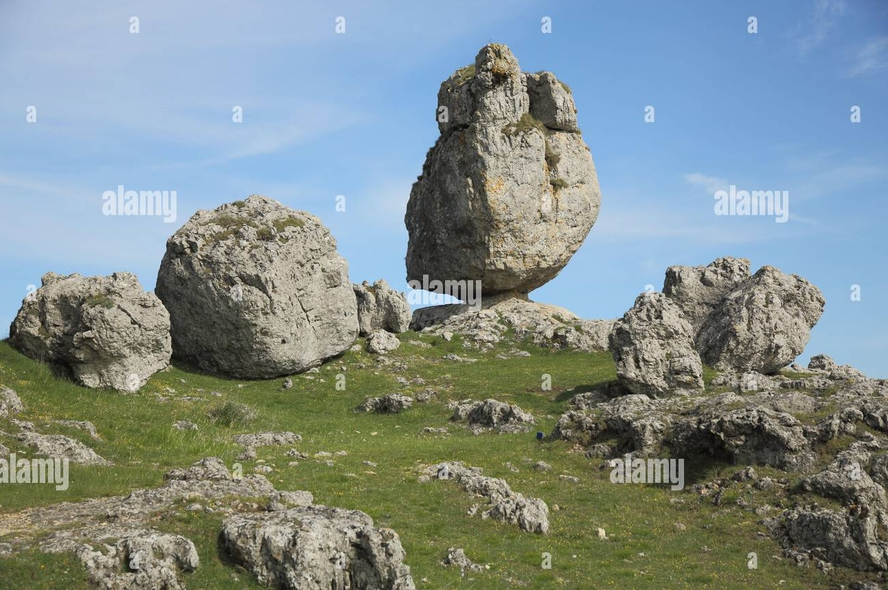

# France

Mega current ripples found in France. See `EVIDENCE`.

## Cevennes National Park

Gorges de la Jonte (~1000m):

Chaos of Nimes Le Vieux (1100m):

## La Roque Gageac

Cliff erosion. Location less than 100m elevation. [2]

## Castel Merle

100m elevation.

## Vezere Valley

## Citations

1. [Craig Stone](https://nobulart.com)
2. https://www.travelfranceonline.com/la-roque-gageac-village-dordogne-valley/

# TODO

Very old cave art - Lascaux Shaft
- https://www.researchgate.net/figure/The-Scene-in-the-Lascaux-Shaft-Photo-by-Norbert-Aujoulat_fig4_292996387
- https://en.wikipedia.org/wiki/Lascaux
