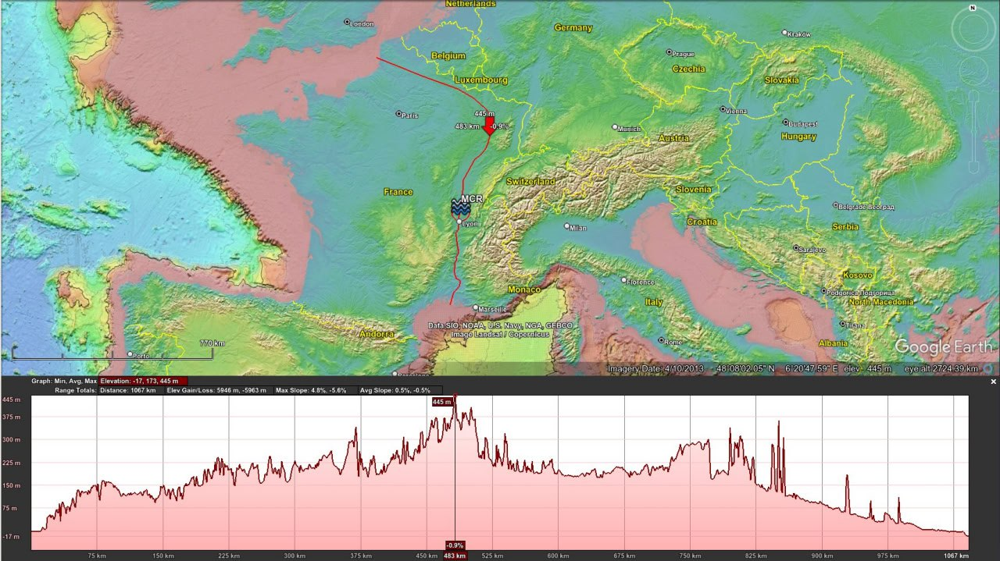

# France

## Overview [1]

Contrast enhanced elevation data [1,2]. Current ripple period is ±500m. Amplitude is 5-7m. Total area ±2,500 square kilometres. Red marker is Versailleaux for reference. The intervening land between the morphology location and the ocean to both the north and the south rises little more than 450m elevation above sea level [3]. How could a sheet flow from a glacial lake bursting have produced morphology on this scale in this terrain? The water would have had to have been >1km deep, and not pooled, but moving. For reference, lake Missoula is estimated to have been 600m deep, and its catastrophic outflows are presumed to have created the Channeled Scablands' 60m-period giant current ripples under a 50m deep water flow. ECDO Europe detail for reference [4]

1. https://code.earthengine.google.com/9a58abb11419602f54e625808666feb7
2. see above
3. https://maps.app.goo.gl/6BDqkjcwCDwNV6hZ9
4. https://theethicalskeptic.com/2024/05/23/master-exothermic-core-mantle-decoupling-dzhanibekov-oscillation-theory/

## Citations

1. [Craig Stone](https://nobulart.com)

# TODO

Very old cave art - Lascaux Shaft
- https://www.researchgate.net/figure/The-Scene-in-the-Lascaux-Shaft-Photo-by-Norbert-Aujoulat_fig4_292996387
- https://en.wikipedia.org/wiki/Lascaux