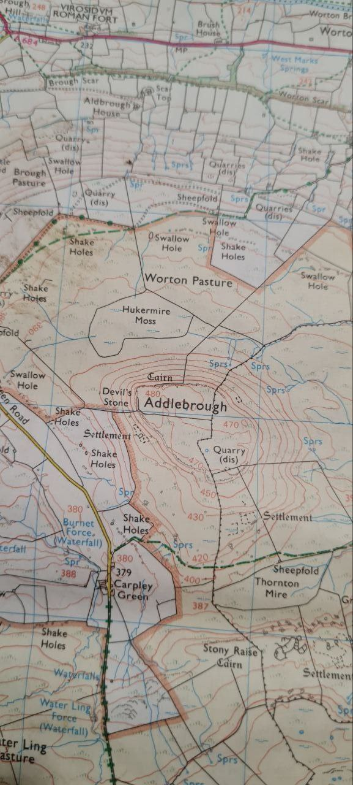

# Great Britain

The water will be moving really, really fast here. However, we don't know exactly how high the water surge will be because there aren't clear terrain chokepoints north of Britain. A big chunk of the Arctic Sea could possibly flow around into the Atlantic.

"I think the flow lines suggest the UK will act as a boat for this surge which then smashes into France and Spain. Most of the UK and Ireland is also overwhelmed don't get me wrong but I think some isolated high areas may be like boulders poking out the rapids."

## Newport and Newgrange, White Wall

https://maps.app.goo.gl/9DkaEdd8XxpHhvJv9

## Bricklieve Mountains

The Bricklieve Mountains and surrounding area. Red line is the ECDO moment of inertia.

1. https://maps.app.goo.gl/bXwhvftLyyTJKwsJ6

## Roscommon area, around Balloony

https://dcenr.maps.arcgis.com/apps/webappviewer/index.html?id=b7c4b0e763964070ad69bf8c1572c9f5

## North York Moors National Park

Looks pretty streamline to me thanks to the rest of the UK blocking it from the water flow.

Viz -100m to 1000m.

Marked here are the 5 erratics I found in the region below:

*"The geology of the North York Moors National Park in northern England is provided largely by a thick southerly dipping sequence of sedimentary rocks deposited in the Cleveland Basin during the Jurassic Period. A series of ice ages during the Quaternary period has left a variety of glacial deposits, particularly around the margins of the National Park."* [3]

## Erratics List:

- Wainstones
- Old Boundary Marker
- Simon Howe Stone Circle
- White Cross Boundary Marker
- Millenium Stone

### Wainstones Erratics

### Old Boundary Marker Erratic [1,2]

### Millenium Stone

## Shetland

Cursory look at Shetland. You can see that there is a flat underwater cliff right in front of it, along with a large underwater structure. The northern one looks like it could deflect some of the deepest originating water flows slightly around Shetland.

Zooming in further we see there is one bay (left) and a very narrow waterway (right).

Looking at the elevation, left bay will almost certainly flood the green plain south of it. On the waterway, there's room for the water to rise while not inundating the island much.

We can expect that significant amounts of the deep oceans will create a water surge due to the fast rotation speed. Turkey rotates at similar speed with a similar ocean slope (0.02), and has the Black Sea displaced over it.

Based on that, I drew an approximate depth of water displacement, expecting that the deepest oceans might get redirected slightly due to the northern underwater structure. It's over 700m deep on average.

The water surrounding the island is 140m deep. Shetland only has a highest peak of 450m, and its average elevation is much lower. It wouldn't take much of a water surge to almost completely inundate this island.

## Great Britain Coast

This is a great illustration of these MASSIVE clay and other sediment layers that underlie GB (Dorset and Devonshire), sloping down into the sea.

## East Yorkshire

### Investigating Ripples Potentially Related to ECDO

I'm not sure this is going to work but I have taken some screenshots of ripples I have found on the East Yorkshire coast on permanent pasture that has likely never been cultivated or developed. The ripples are small. Max about 1 metre high and 10 metres wide. These lie on top of the original cliff top that is buried in sediment. This sediment makes up about half this county and all of its present coastline along the North Sea. Hopefully this will be clear in the coming images...

Geographic location:

Ripple sites (A,B,C). Blue line is the original buried coastline. Everything to the East is land made of sediment (Boulder Clay):

Ripple sites in yellow boxes:

A,B,C- ripple sites. D- Archaeological discovery. Blue Line- old cliff line:

Also for interest this archaeological discovery was found at point D: https://www.thehistoryblog.com/archives/63342

## Nobulart Response

Do you know what the main crops in this area are? These appear to be of agricultural origin. Old swales or forestry planting rows perhaps. They appear too regular and grouped at conflicting angles to be flow ripples.I have access to some high-res DEM imagery for the UK. I'll pull it up.

Maybe this: https://en.m.wikipedia.org/wiki/Ridge_and_furrow

## Devil's stone

Devil's stone https://megalithix.wordpress.com/2008/10/02/devils-stone-addlebrough/

## Yorkshire Wolds

The land from the present day cliff line (B) to the original cliff line (A) shouldn't really be there.

https://hobthrush.co.uk/the-fairy-stones-burdale/

Nobody seems quite sure what created the dry valleys of East Yorkshire but deluge isn't a theory being considered.

## Vale of Pickering

This screams deluge from the north not lowland hugging glaciers but you can't comprehend the truth without the earth flip piece of the jig saw.

## Citations

1. https://en.m.wikipedia.org/wiki/File:Old_Boundary_Marker_by_Blakey_Ridge,_Farndale_East_Parish_-_geograph.org.uk_-_6038888.jpg
2. https://www.wikidata.org/wiki/Q26584178#/map/0
3. https://en.wikipedia.org/wiki/Geology_of_North_York_Moors_National_Park
