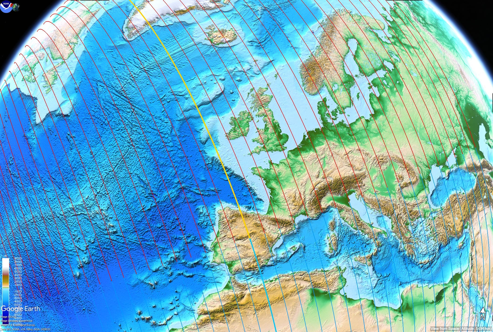
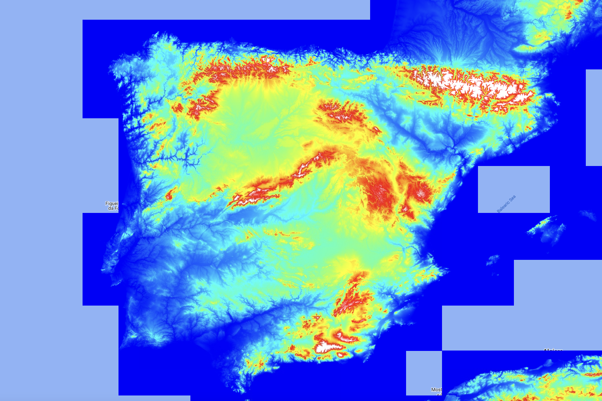
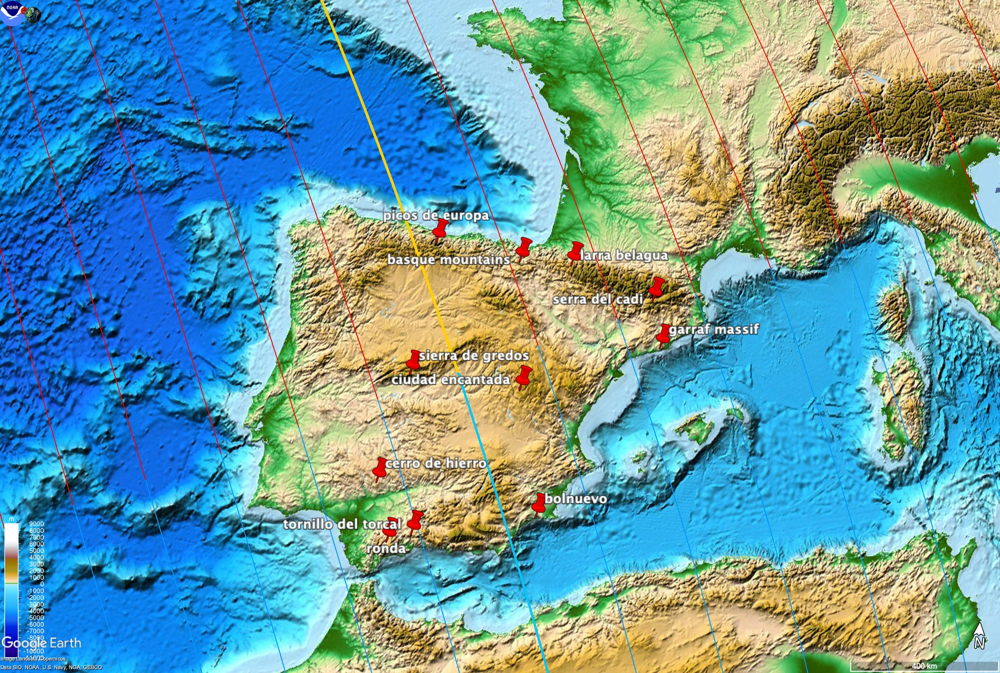
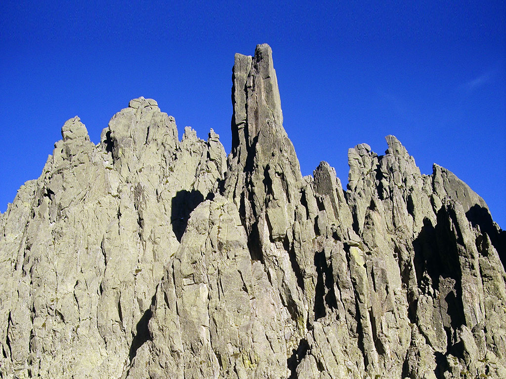
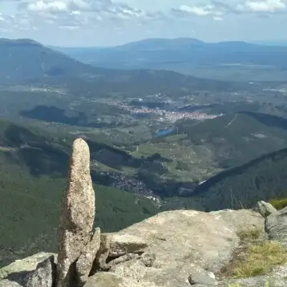
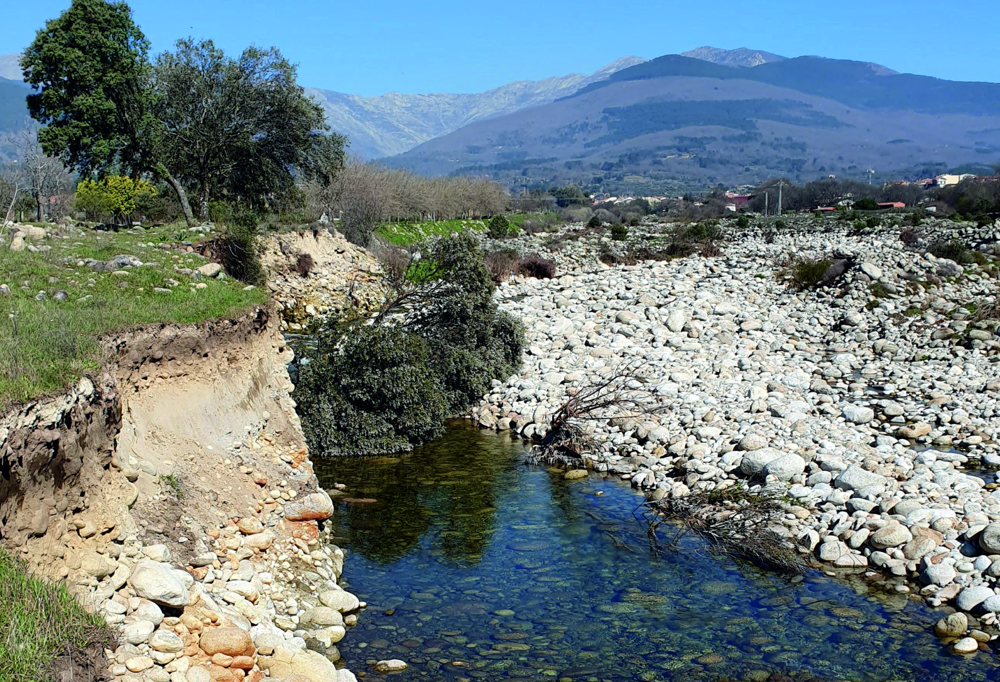

# Spain

Stats:
- 3000m to 5000m deep Pacific Ocean in front of it
- 6 hr rotation rotating at speeds of 1250 km/h

## Profile

Big Atlantic Ocean chokepoint.

## Areas with erosion

Found from karst lists [1] and just clicking through some images and websites using Google.

## Sierra de Gredos

Not on the list of well-known karst areas, but found some interesting pictures [2]:

### Candelada Avila [3]

## Safe locations?

In terms of high-elevation locations (2000m+), you have a mountain in the South, some peaks in the middle, some peaks in the coastal north, and larger chunks in the Pyrenees.

## Citations

1. https://en.wikipedia.org/wiki/List_of_karst_areas#Spain
2. https://sendasycumbres.com/sierra-de-gredos/
3. https://geolodiaavila.com/tag/erosion/