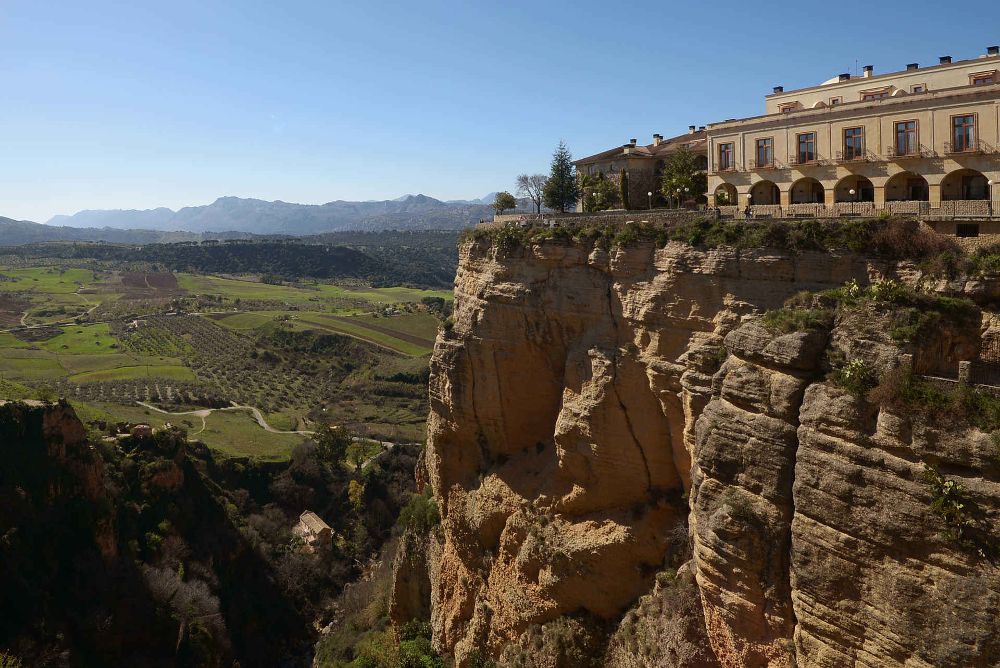
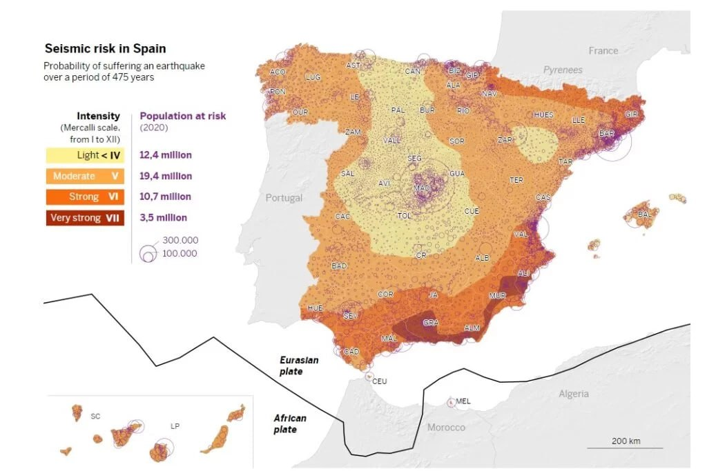
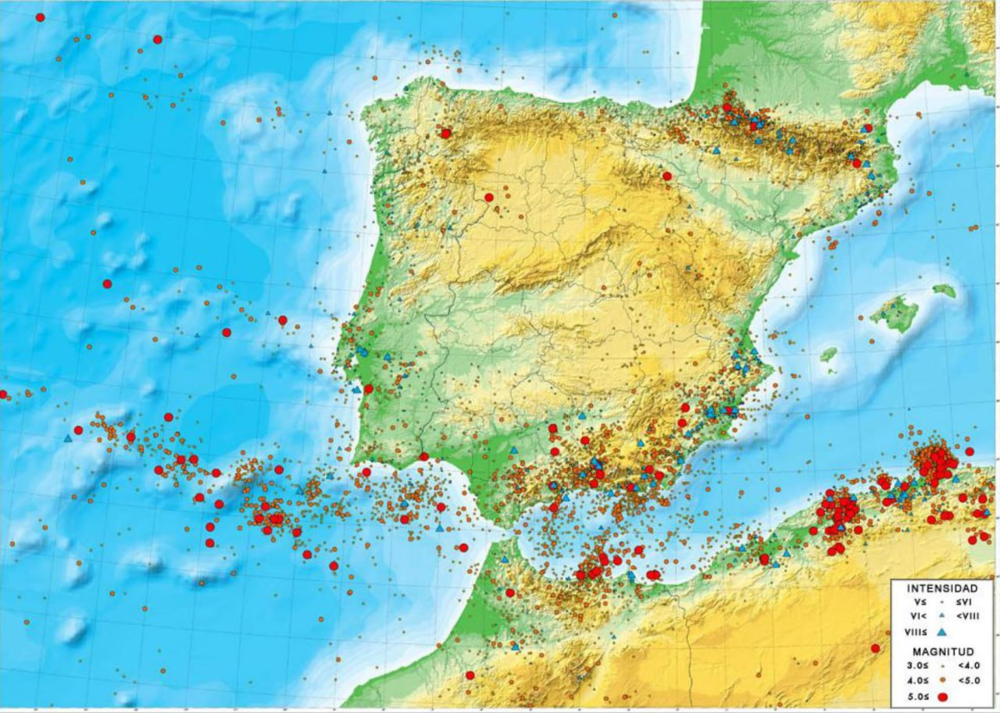

# Spain

Seems like the Atlantic and Arctic Ocean will flow over most of Spain, potentially leaving only some highest peaks untouched.

Stats:
- 3000m to 5000m deep Pacific Ocean in front of it
- 6 hr rotation rotating at speeds of 1250 km/h

*"Spain has a crazy level of biodiversity which is promising. Possibly Grenada could be a good option. I think the Pyrenees may exist because of sedimentation from successive deluges and are at a choke point that will make the range get hit very hard again and again."*

## Profile

Big Atlantic Ocean chokepoint.

## Areas with erosion

Found from karst lists [1] and just clicking through some images and websites using Google.

Pena Olvidada (Pico de Europa), 2410m:

Ciudad Encantada (sitting at elevation of 1415m):

Sierra de Gredos - Not on the list of well-known karst areas, but found some interesting pictures. Los Galayos, and [2]:

Candelada Avila [3] (just under Sierra de Gredos):

Ronda:

You also have Carcavas de Marchal, in the Sierra Nevada:

## Slopes into the highest areas

Pico de Europa:

Pyrenees:

Sierra Nevada:

## Spain Seismic Profile

## Safe locations?

I'd probably go with a carefully selected location in Pyrenees.

You also have Sierra Nevada in the south (500m (blue) to 3000m viz):

Don't like the look of the Pico de Europa mountain range (looks very erosion-y in pictures).

Mountains in the middle are high elevation but the land in front of them isn't that high elevation. Plus these mountains form a perpendicular obstacle to the water flow, not giving the water much room to flow around.

## Citations

1. https://en.wikipedia.org/wiki/List_of_karst_areas#Spain
2. https://sendasycumbres.com/sierra-de-gredos/
3. https://geolodiaavila.com/tag/erosion/