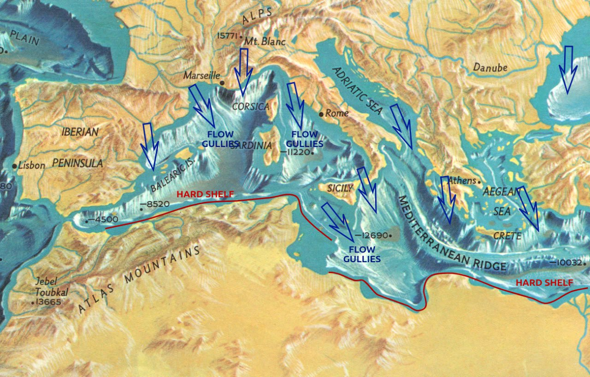

# Mediterranean

This folder is for analysis considering the Mediterranean as a whole, which would mostly consist of sea and tectonic factors.

https://github.com/user-attachments/assets/7eec17ab-af00-4edd-8849-86043655522b

See [here](https://github.com/sovrynn/ecdo/tree/master/6-LITERATURE-MEDIA/nobulart/ecdo-visualizations) for the full-res visualization. [1]

## Bathymetry [1]

Mediterranean Bathymetry. Looks almost as though the entire thing emptied to the South and was refilled from the North.  In one movement probably.

## Citations

1. [Craig Stone](https://nobulart.com)
