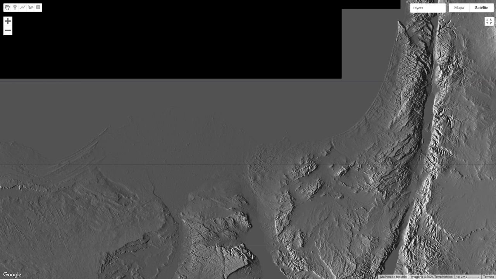

# Middle East aka West Asia

## Saudi Arabia receding shorelines [1]

## Egypt (and Israel) receding shorelines

Lidar DEM, sea level raised to 175m.

## Saint Catherine, Mount Catherine, Egypt 2629m

Looking at their high southern mountains (Saint Catherine, peak 2629m), the pictures actually look really good. The mountains look crumbly and easily eroded by water but I don't see sideways erosion marks like that in Arizona, which is telling because Egypt would be rotating much faster than Arizona. Just from the pictures, my gut says this might actually be a safe spot during a flip.

## Sulaiman Mountains, Pakistan

These wave-shaped mountains are apparently made mainly of sedimentary rocks [2]. They lie downstream from the Tarim Basin which lies north of the Himalayas.

## Citations

1. https://theethicalskeptic.com/2024/05/23/master-exothermic-core-mantle-decoupling-dzhanibekov-oscillation-theory/
2. ChatGPT