# Turkey

Good chance it could have safe locations due to its high elevation and having some very old archaelogical sites.

## Urgup Cones [1]

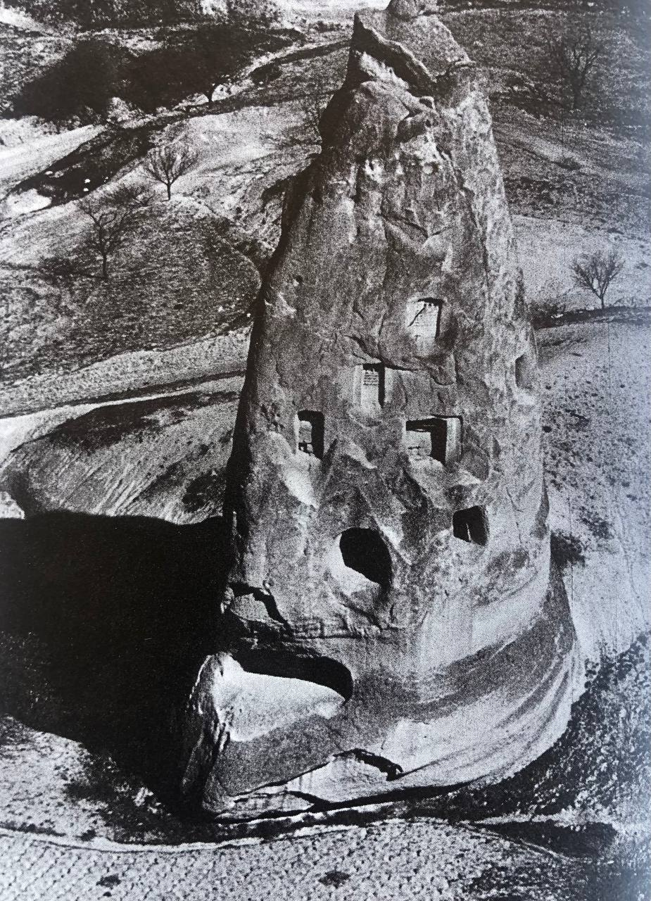
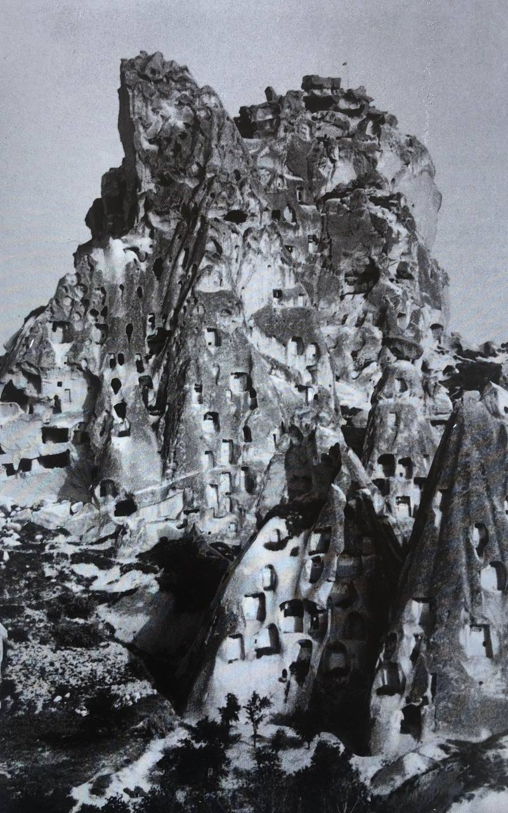
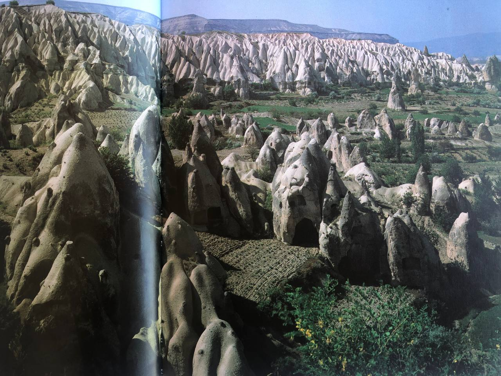
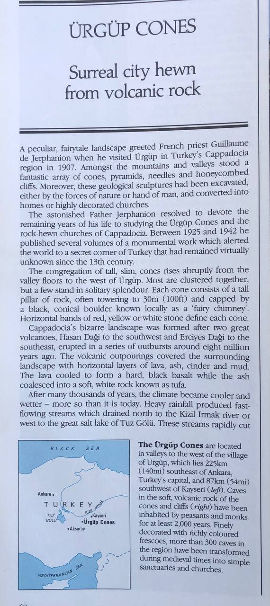

These are the Ürgüp Cones in Turkey. Note the evidence of heavy water erosion several meters deep around the base of the one in the first pic. The Black Sea would inundate this region during S1>S2. Perhaps they preferred digging their houses out of stone in order to be above the flow?

Coordinates are (38.7N, 34.8E).

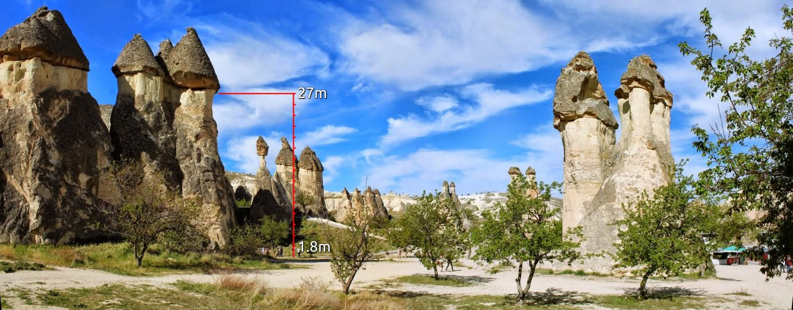

Water depth here appears to have been >25m (at 1000m above sea level). Coordinates are (38°40'38.03" N, 34°51'03.39" E).

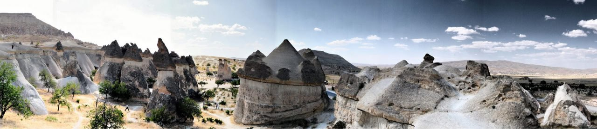
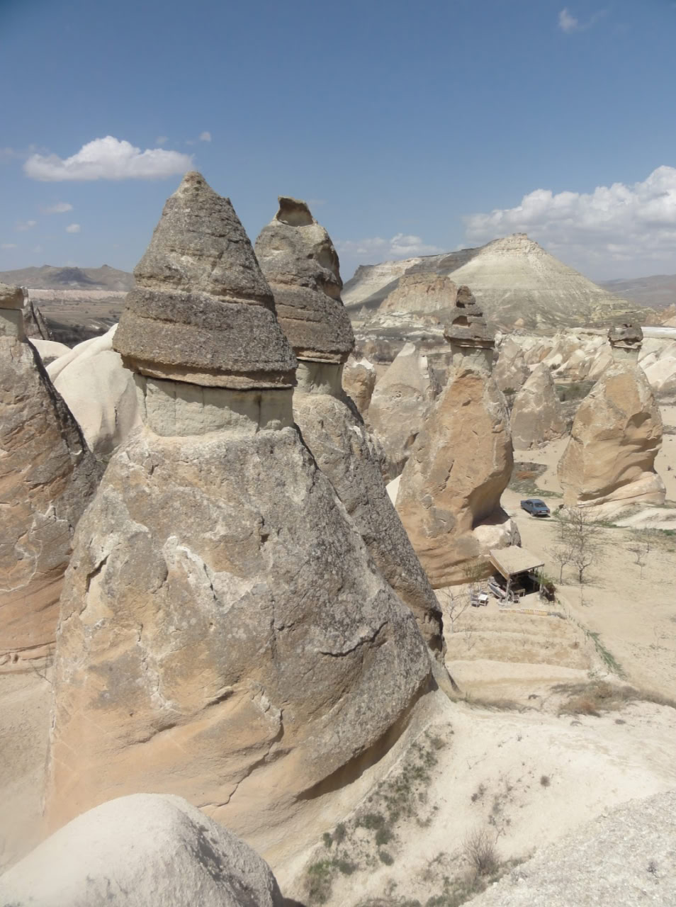
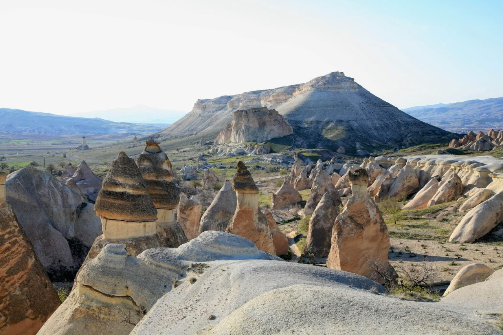
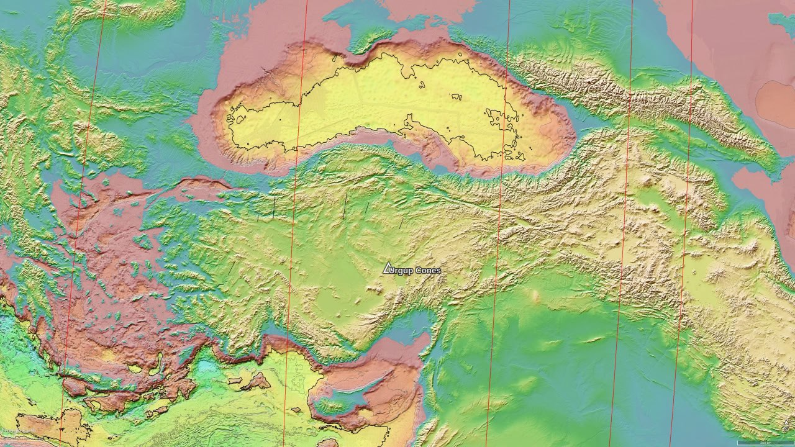
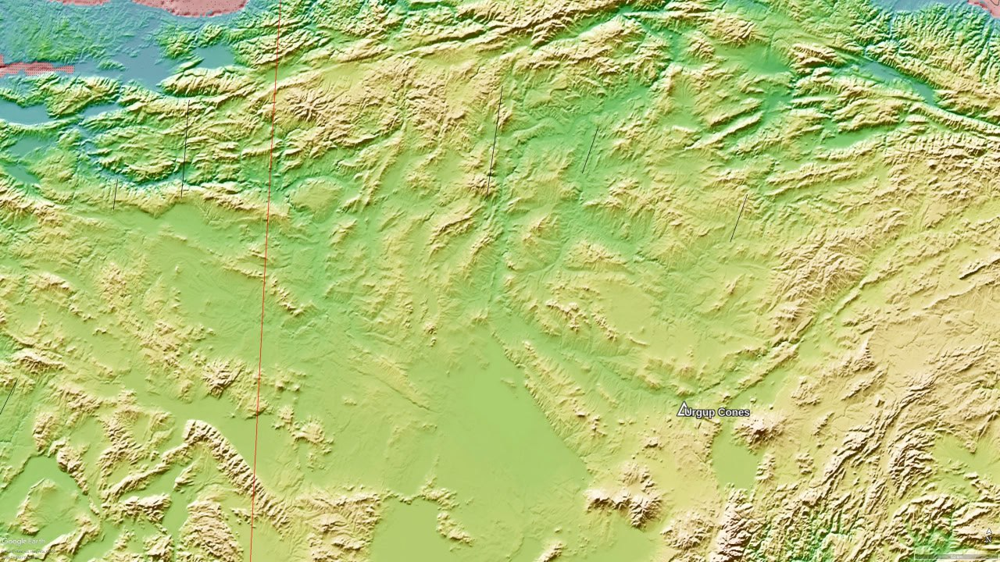
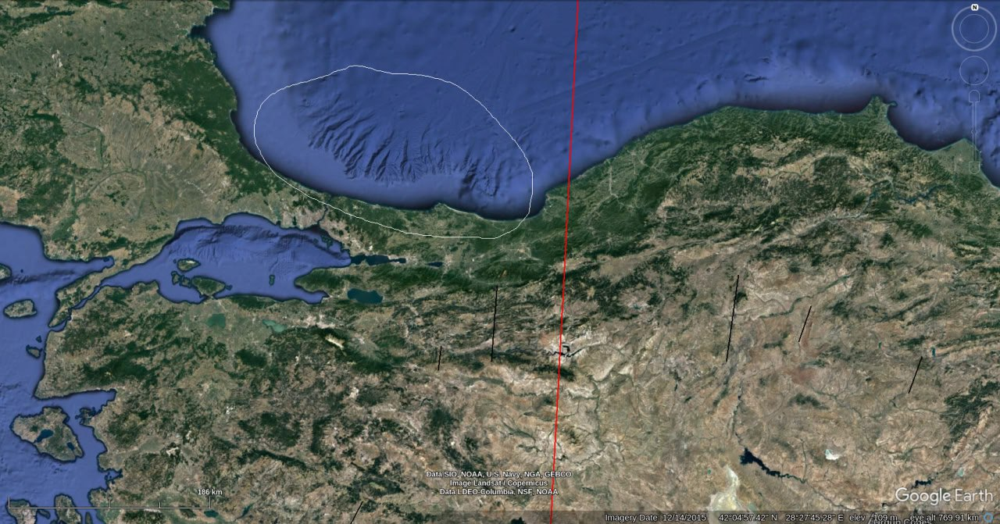

Bedrock morphology shows significant striation congruent with the emptying of the Black Sea to the South.[1][2] Highest flow levels would be from the southwest into the Aegean Sea, which would appear to be supported by the apparent erosion flows in the Black Sea basin at that point [3].

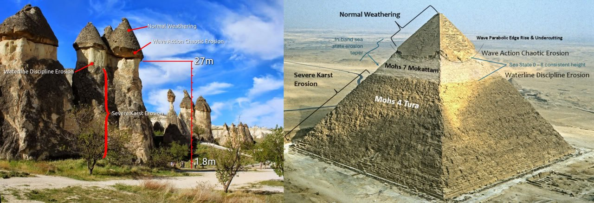

Look familiar? The upper karst erosion would likely be from extended periods underwater, with steady state levels and wave erosion near the top. The dwellings are typically above the high flow regions (which I suspect were later ECDO events).

## Urgup [1]

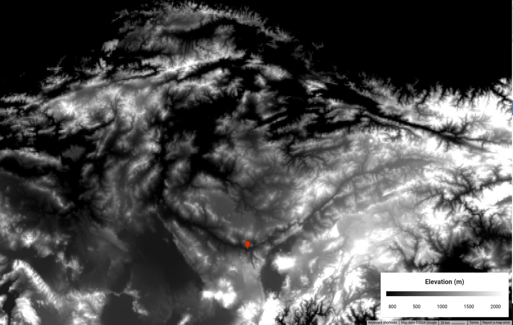

Evidence of an inland lake? It would also explain the inundation of the Urgup Cones.

## Gobekli Tepe Twitter Account

He has some interesting ideas that the reliefs at GT (Gobekli Tepe) are maps.

https://x.com/TheLastNatufian

## Citations

1. [Craig Stone](https://nobulart.com)