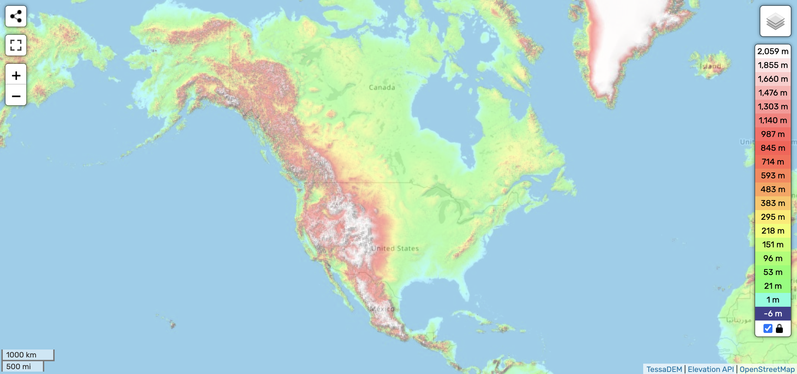

# North America

While there are likely several spots that are safe, North America has not been analyzed yet so much.

## Analysis [1]

https://github.com/user-attachments/assets/d4beb5b6-d62f-49e9-bd4d-f1f70ac339e6

See [here](https://github.com/sovrynn/ecdo/tree/master/6-LITERATURE-MEDIA/nobulart/ecdo-visualizations) for a visualization. [1]

North America. ECDO oscillation cycle visualization using model V4.[0] Camera-orientation locked to the objective. Considerable inland water masses and some of the most widespread and visible mesoscale flow morphology of any landmass. The Navajo flood myth seems to recount multiple consecutive events.[1] The Roraima pivot is visible lower right.[2]  Whale bones in Michigan.[3] Mega current ripples in Nebraska.[4] Flash frozen mammoths in Alaska.[5] suggest that things get pretty wet.[6]
(continued in the comments...)

"The first world, where Navajos originated, was inhabited by Insect People of twelve types. For their sins of adultery and constant quarreling, the gods expelled them by sending a wall of water from all directions. The Insect People flew up into the second world, guided through a hole in the sky by a cliff swallow. The second world was a barren world inhabited by Swallow People. They decided to stay anyway, but after 24 days, one of the Insect People made love to the wife of the Swallow People's chief. They were expelled to the third world; the white face of the wind told them of an opening. The third world was a barren world of Grasshopper People. Again, the Insect People were expelled for philandering after 24 days. The red face of the wind guided them to the hole to the fourth world. This world was inhabited by animals and Pueblos, with whom the Insect People coexisted peacefully. The gods made people in human form from ears of corn, different colors of corn becoming different tribes. The Insect People intermarried with them, and their descendants eventually looked fully human. In time, the men and women argued and decided to live apart. But both groups engaged in unnatural sex acts, and eventually the women were starving, so they got back together. The gods were displeased by their sins, though, and sent a wall of water upon them. The people noticed animals running and sent cicadas to investigate. They escaped the floodwaters by climbing into a fast-growing reed. Cicada dug an entrance into the fifth world, which was inhabited by grebes. The grebes said that people could have that world if they could survive plunging arrows into their heart. The cicadas met this challenge (they bear the scars on their sides still), and people live in the fifth world today."

0. https://theethicalskeptic.com/2024/05/12/exothermic-core-mantle-decoupling-dzhanibekov-oscillation-ecdo-theory/
1. https://talkorigins.org/faqs/flood-myths.html#Navajo
2. https://x.com/nobulart/status/1803432392310329364
3. https://x.com/nobulart/status/1805713737934053885
4. https://x.com/nobulart/status/1810064739260604497
5. https://x.com/nobulart/status/1806268353306067285
6. https://x.com/nobulart/status/1807828443368718601

That area immediately to the east of the southern Rockies (around Denver) seems to be pretty good. There isn’t any obvious evidence of water having been there.

Pike's Peak region in the US is the only place I've identified which is not overtopped by the Pacific.

That said, 3,000ft anywhere east of the Rocky's is going to be overtopped by the Atlantic during S2>S1, without a doubt. There is overtopping erosion evidence throughout the entire Appalachian range, and the simple matter of it is that the Atlantic will reach hundreds of kilometers per hour traversing the eastern seaboard from the NE. Do not underestimate the amount of kinetic energy involved here.

## Citations

1. [Craig Stone](https://nobulart.com)
