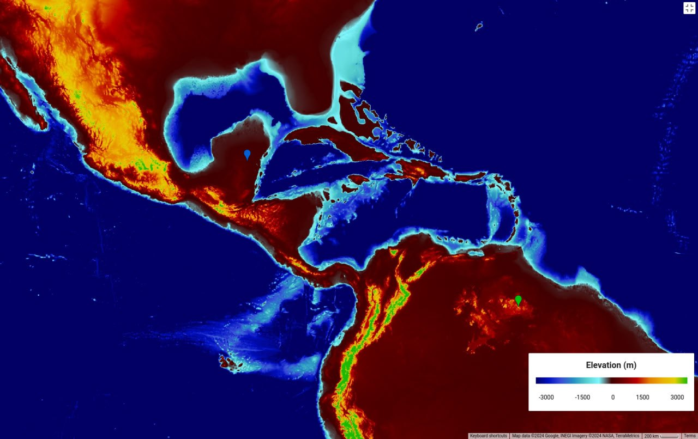

# Carribean

https://github.com/user-attachments/assets/ee02ed35-babd-40e4-ad31-52ce943b8cf7

See [here](https://github.com/sovrynn/ecdo/tree/master/6-LITERATURE-MEDIA/nobulart/ecdo-visualizations) for the full-res visualization. [1]

## Overview [1]

Caribbean & Central America ECDO displacement path visualization.[1] From the Maya: "In the first period of the world lived the Saiyamkoob, "the Adjusters," a dwarf race which built cities now in ruins. They worked in darkness, as the sun had not yet appeared. When it did, they turned to stone, and their images can be found in the ruins. Food for the workers was lowered by rope from the sky, but the rope was cut, the blood ran out of it, and the earth and sky separated. This period ended with water over the earth. The Tsolob, "the Offenders," lived in the second period. These, too were destroyed by a flood. The Maya reigned during the third period, but their period was also ended by flood. The fourth and present age is peopled by a mixture of all previous races. [Alexander, 1920, p. 153]"[2]

"Two floods had destroyed humanity. Three people escaped a third and final flood in a canoe. [Horcasitas, p. 191]¨ - Maya [2]

"The Star people listened to Jaguar and killed and ate a woman. Kuamachi wanted to punish them, but they were too many and too powerful. He went to Wlaha, their chief, and invited them to help in picking dewaka fruit. They were suspicious, but Kuamachi left some fruit with them, and they liked the taste so much they decided to go help pick fruit. Kuamachi and his grandfather Mahanama led them to the trees. The star people climbed the trees and started eating fruit; they weren't afraid of only two people. Kuamachi dropped one fruit; water came out of it, spread, and caused a flood, covering everything but the trees." - Makiritare (Venezuela)

1. https://theethicalskeptic.com/2024/05/12/exothermic-core-mantle-decoupling-dzhanibekov-oscillation-ecdo-theory/
2. https://talkorigins.org/faqs/flood-myths.html#CentralAmerica

## Lake Chichancanab

In `EVIDENCE/earth-geo-state` there is info about a lake that was flooded with salty water.

Location of Lake Chichancanab from which this sample was taken [blue marker]. Mount Roraima [green marker]. At less than 100m above sea level, this area is 100% inundated.

## Salt Lakes

As you can see, there's only one salt lake (Laguna Alchichica) I found in the mountainous areas of Mexico.

An indication that Mexico may be a "boat" during S1 to S2.

## Olmec History

When you consider that the Olmecs are the earliest civilization in Mesoamerica, popping up around 1400 BC, you wonder if they were able to survive the flip hypothesized around 1800 BC by staying in these boatish Mexican mountains.

## La Venta (Veracruz)

Abandoned 400 BC. Found buried.

## Citations

1. [Craig Stone](https://nobulart.com)
