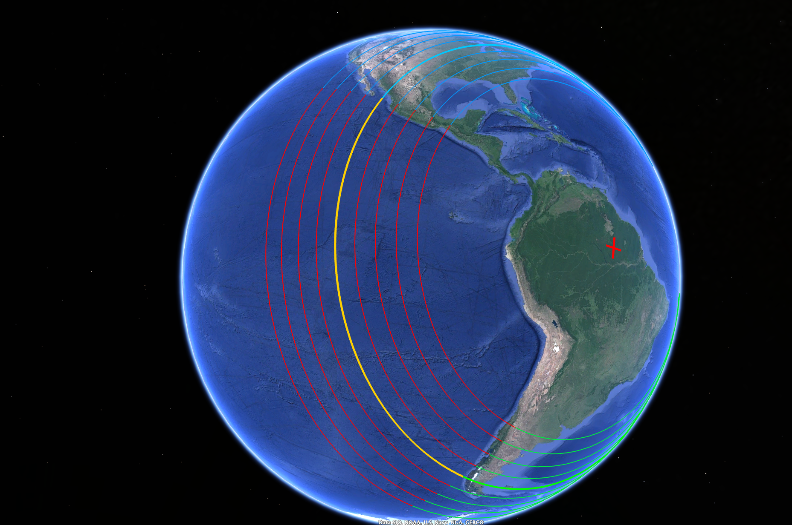
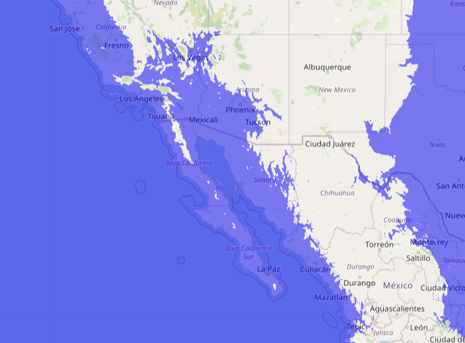
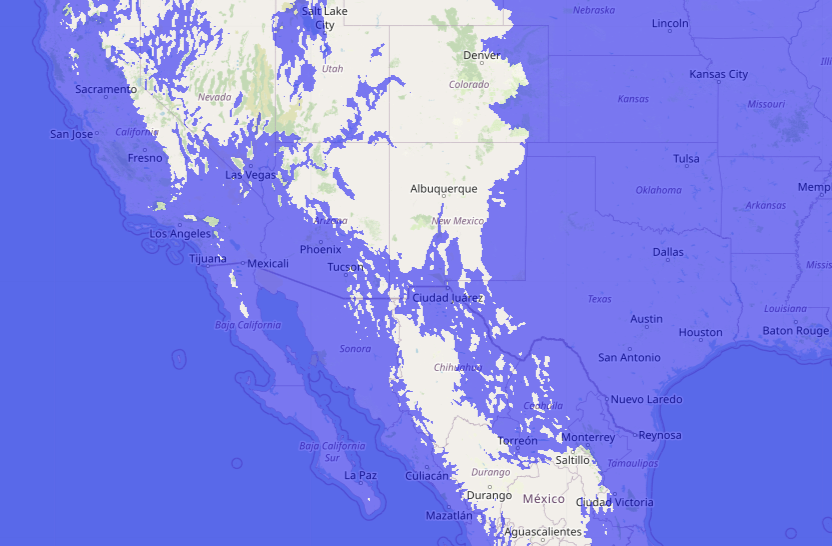
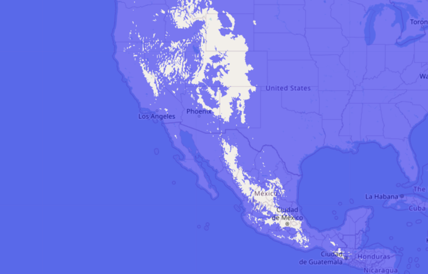
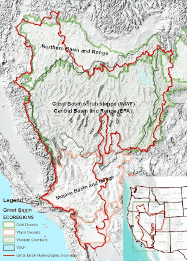
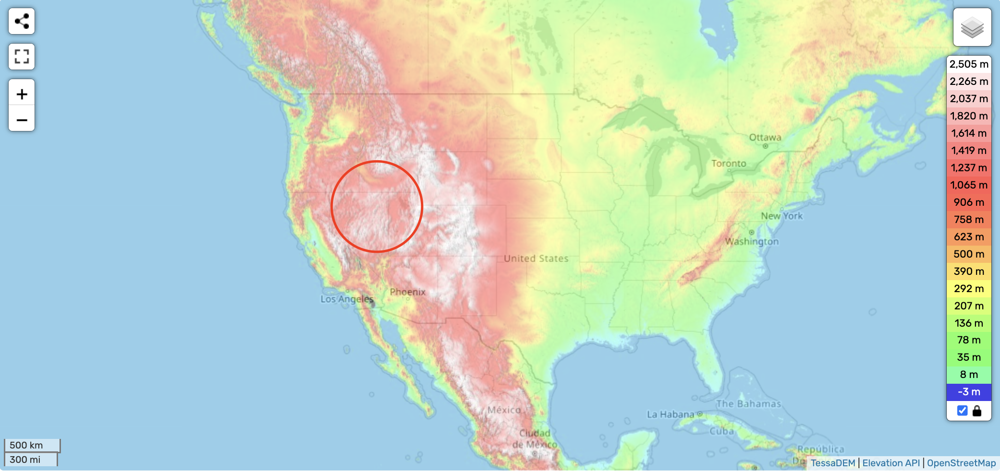
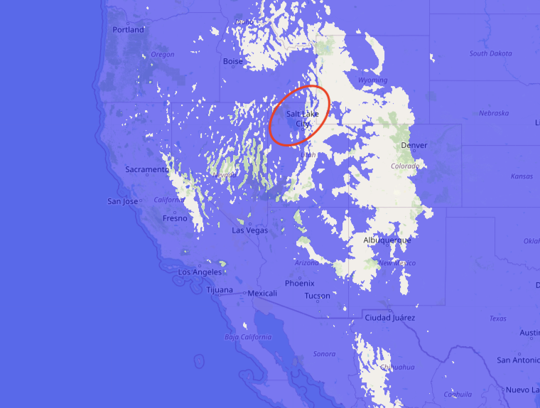
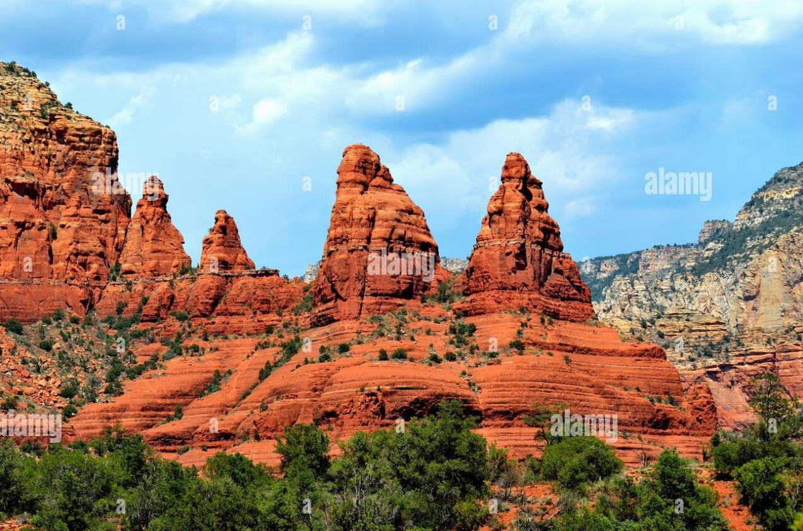
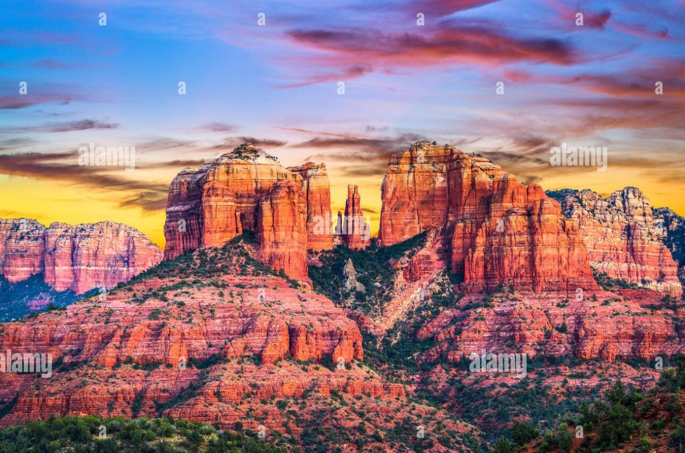
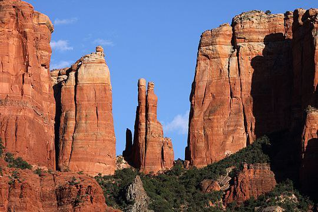

# West Coast

## Gulf of California

How does this clear chokepoint on the west coast of Mexico resolve?

You can see it has to displace a lot of Pacific Ocean. It's about 3.8 km deep in that stretch, and 3 km deep in the entrance to the Gulf of California.

This is really straightforward. The underwater chokepoint is inside the bay, so the water is going to flood in, and the water level will rise, until the water has someplace to escape to!

Here's a 1000m flood map. I don't see any escape routes for the water yet!:

This is a 1500m flood map, the bare minimum level at which I see adequate output channels for the water to start draining out.

However, you could easily see a surge higher than this. You have a 3000m deep channel across the entrance to the bay. But when the surge rises, you're going to see more of that 3000-4000m deep Pacific Ocean flow into the area not just through the bay but also by going over what used to be dry land. I wouldn't be surprised at all to see something like this happen temporarily, where water escapes not only into the east but splashes into the north/northeast (1900m floodmap):

## The Great Basin

Understanding the ECDO flood topography of the Gulf of California helps us understand the Great Basin a lot better.

*"The Great Basin (Spanish: Gran Cuenca) is the largest area of contiguous endorheic watersheds, those with no outlets to the ocean, in North America. It spans nearly all of Nevada, much of Utah, and portions of California, Idaho, Oregon, Wyoming, and Baja California. It is noted for both its arid climate and the basin and range topography that varies from the North American low point at Badwater Basin in Death Valley to the highest point of the contiguous United States, less than 100 miles (160 km) away at the summit of Mount Whitney."*

*"The hydrographic Great Basin is a 209,162-square-mile (541,730 km2) area that once drained internally."* [1]

Now we can explain the salt deposits in Death Valley and the Great Salt Lake in Utah which sits at an elevation of 1277 meters!

## Sedona (Arizona) red rocks

Sedona is home to some lovely sandstone structures.

Cathedral Rock is the most well-known one. It has a peak of 1514m. [2]

These structures appear to have been created by fast moving water. In fact, there are no points at the top where the erosion seems to have stopped; the structures are have smooth rounded shapes all the way to the top.

These would, of course, be explained by the inundation of the Great Basin, by water moving at very high speeds.

## Citations

1. https://en.wikipedia.org/wiki/Great_Basin
2. https://en.wikipedia.org/wiki/Cathedral_Rock
