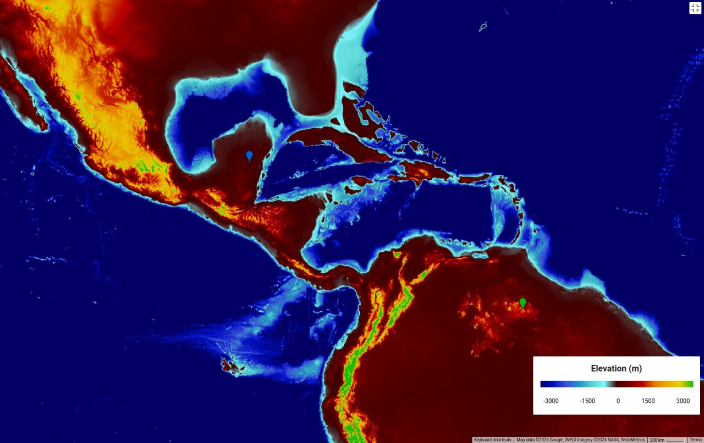

# Mexico

In `EVIDENCE/earth-geo-state` there is info about a lake that was flooded with salty water.

Location of Lake Chichancanab from which this sample was taken [blue marker]. Mount Roraima [green marker]. At less than 100m above sea level, this area is 100% inundated.