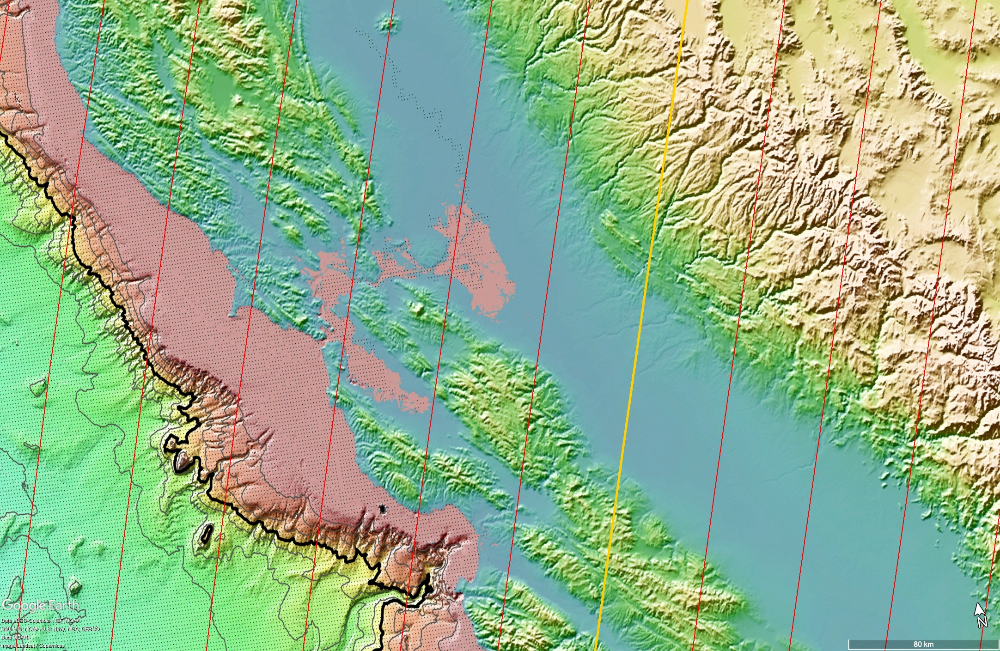
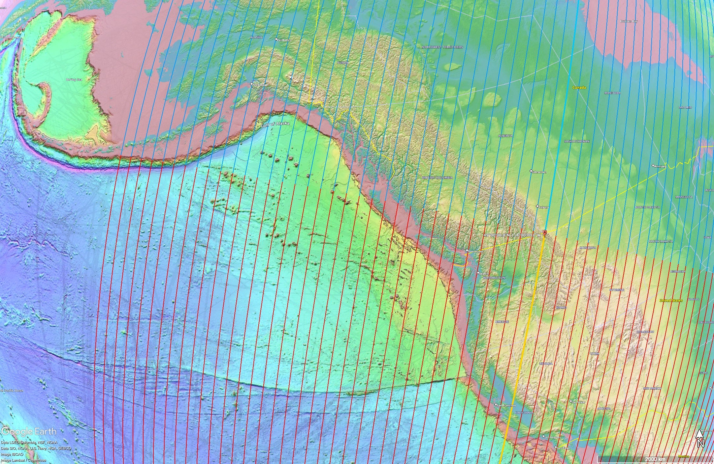
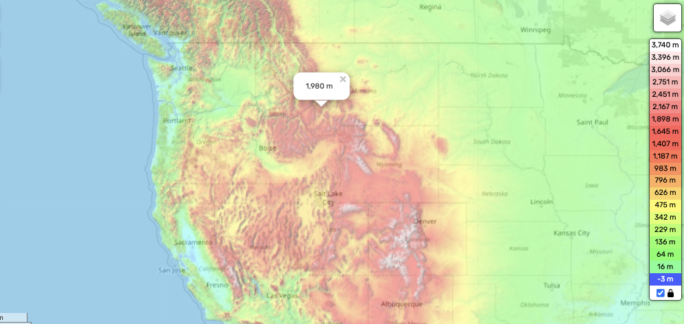

# Pacific Northwest

## Sage Wall, Montana

Video: [The Story of Sage Wall - MEGALITHS in MONTANA?](https://www.youtube.com/watch?v=qSQC3mgp3Mc).

Stats:
- Coords: (45.5, -112)
- Sage Mountain Center
- Elevation 1900m
- 6 hr average rotation speed: 1250 km/h

Located quite a ways inland, in the path of the Pacific Ocean.

### Chokepoints

In terms of chokepoints we see the Gulf of California, San Francisco Bay, and the greater Seattle bay.

I already analyzed the Gulf of California, estimating that it would likely see flows of at least 1500m (`LOCATION-ANALYSIS/north-america/great-basin`). However, you can see that it's not really flowing in the direction of of rotation and there's still a large chokepoint to the north. It's very likely the surge could be greater.

Moving on to the San Francisco Bay, we can see that the water will flow directly into the big inland chokepoint. Red is the current water line.

This one will easily flood over 1200m. Water still trapped at that level.

Even at 1500m, it's barely starting to trickle over to the north.

Next let's look at the Seattle bay:

This one needs to be analyzed by looking at the entire Canadian and Alaskan coast. You can see there's a huge chokepoint in Alaska, that one will see a huge water surge. This one barely starts to trickle over at 1200m, and has room to flow over at 1500m.

### Local Topography

Here's the elevation profile:

Zooming in to the terrain, we can get a view of the shallow valleys from the elevation profile. The place is sitting on a little mountain range within it:

### Consequences

Let's recall that this place is at an elevation of 1900m. We also have clear evidence of large boulders there.

If this place had water flowing through it at 1900m carrying large erratic boulders, then the flow would at least look like this:

Here's what the entire region would look like from a flow perspective:

The boulders tell us that this may have been what happened. At the very least, it's clear that while the Alaskan chokepoint has plenty of room to flow over here, the flow from Seattle, California, and the Gulf of California, gushing but not flowing.

## Kintla Peak, Montana (Rocky Mountains)

Peak of 3080m. North of Montana right on the border with Canada.

Elevation profile:

Elevation range is 1000m (blue) to 3000m (white):

I found some really nice pictures of this location:
- https://www.glacierpeaksphotography.com/post/kintla-peak-august-17-20-2017
- https://enjoyyourparks.com/glacier-national-park/hikes-and-places/boulder-pass-trail/
- https://www.peakbagger.com/peak.aspx?pid=4725
