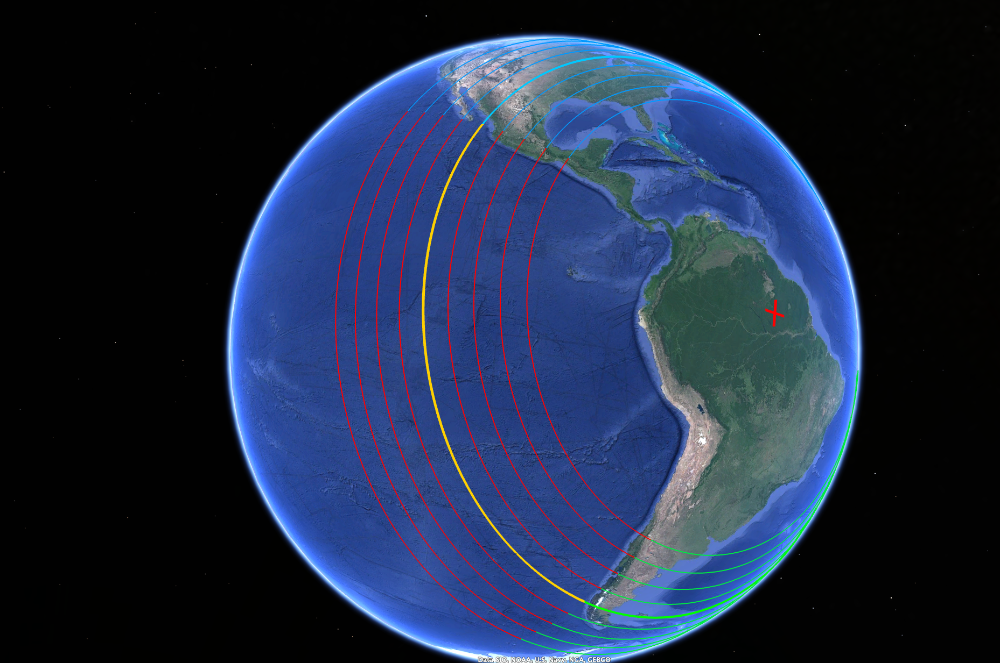
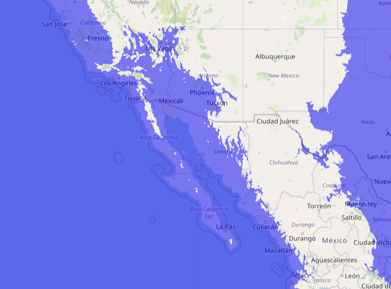
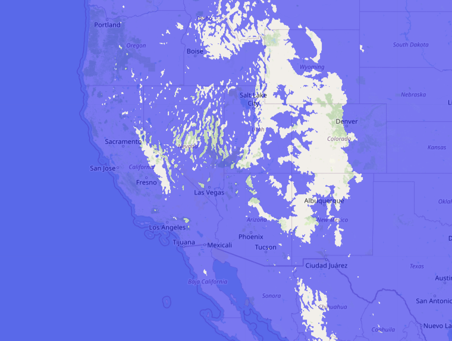
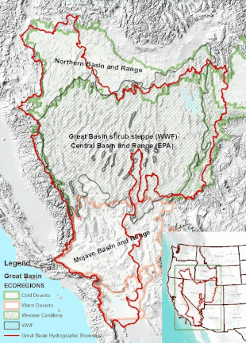
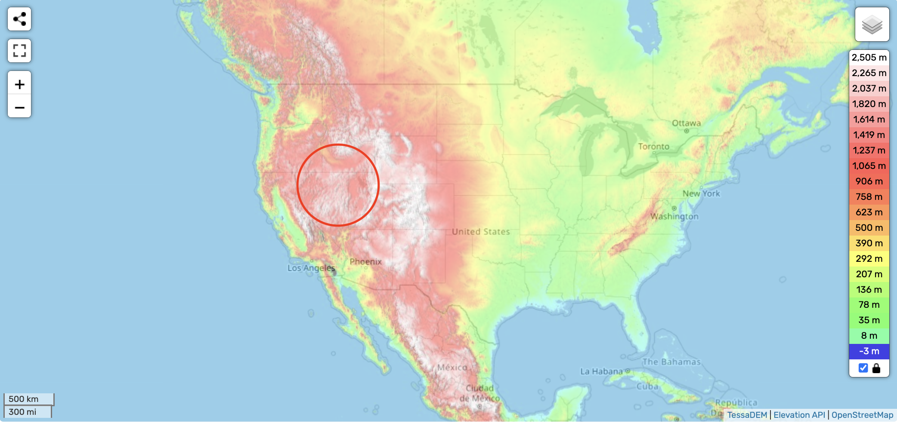
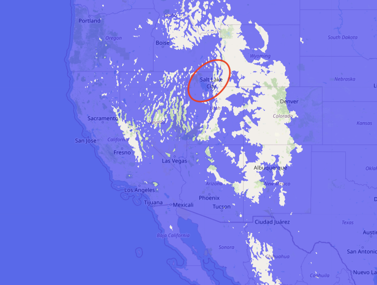

# West Coast

## Gulf of California

How does this clear chokepoint on the west coast of Mexico resolve?

You can see it has to displace a lot of Pacific Ocean. It's about 3.8 km deep in that region.

1000m flood map. Still remains a chokepoint. Pacific Ocean has more than enough depth to fill that choke point up.

2000m flood map. Finally enough output channels for the water to start flowing over to the East and North. But the Pacific Ocean is much deeper than 1800m... the ~1000 km/h flow will leave a lot of water flowing through these escape channels at 2000m.

## The Great Basin

Understanding the topography of the Gulf of California helps us understand the Great Basin more.

*"The Great Basin (Spanish: Gran Cuenca) is the largest area of contiguous endorheic watersheds, those with no outlets to the ocean, in North America. It spans nearly all of Nevada, much of Utah, and portions of California, Idaho, Oregon, Wyoming, and Baja California. It is noted for both its arid climate and the basin and range topography that varies from the North American low point at Badwater Basin in Death Valley to the highest point of the contiguous United States, less than 100 miles (160 km) away at the summit of Mount Whitney."*

*"The hydrographic Great Basin is a 209,162-square-mile (541,730 km2) area that once drained internally."* [1]

Now we can explain the salt deposits in Death Valley and the Great Salt Lake in Utah which sits at an elevation of 1277 meters!

## Sedona, Arizona red rocks

Sedona is home to some lovely sandstone structures.

Cathedral Rock is the most well-known one. It has a peak of 1514m.

These structures appear to have been created by fast moving water. In fact, there are no points at the top where the erosion seems to have stopped; the structures are have smooth rounded shapes all the way to the top.

These would, of course, be explained by the flooding of the entire Great Basin, by water moving at very high speeds.

## Citations

1. https://en.wikipedia.org/wiki/Great_Basin
2. https://en.wikipedia.org/wiki/Cathedral_Rock