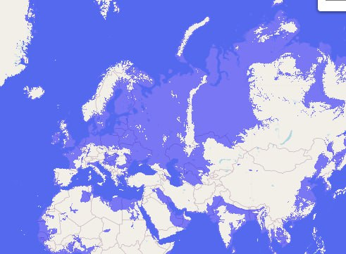
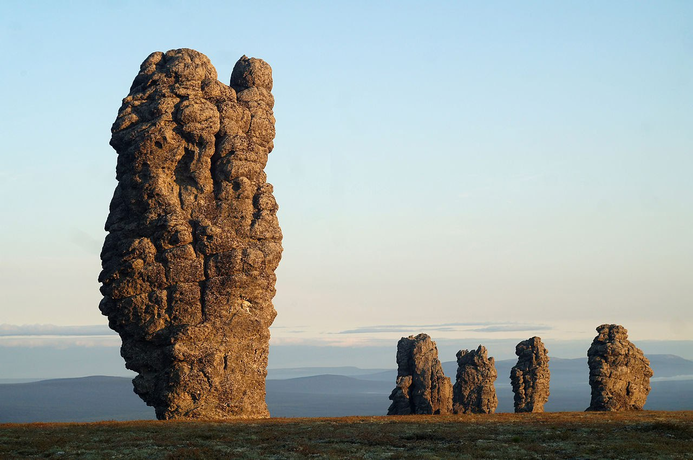
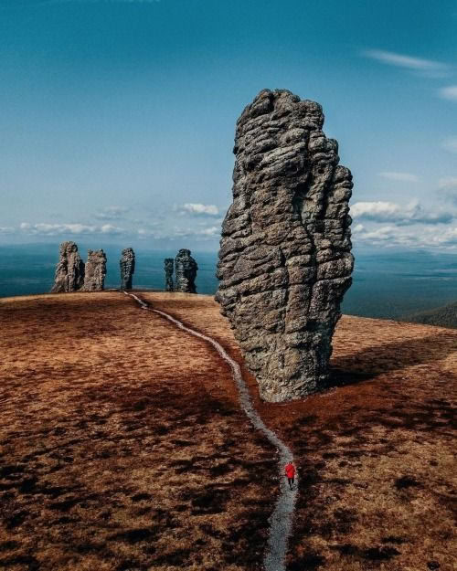
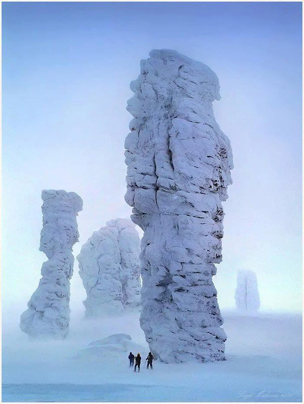
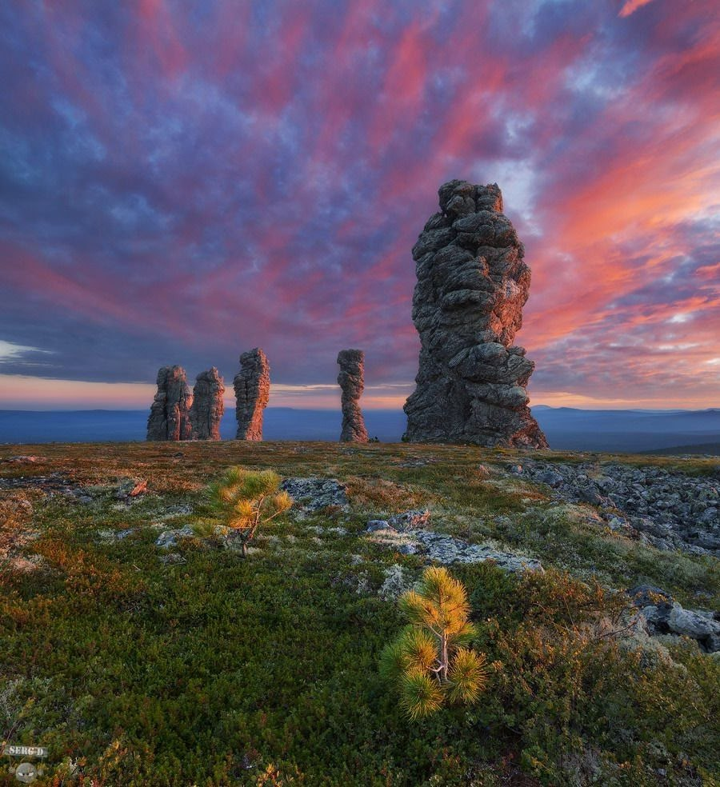
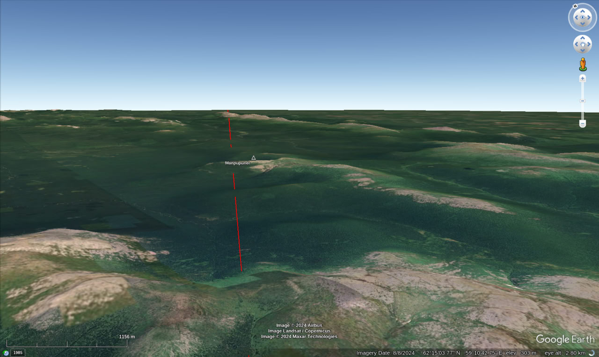

# Russia

Russia is a massive low-elevation floodplain rotating at the highest speeds into the Pacific and Arctic. It will be devastated.

Most of Russia gets smashed by the Arctic doesn't it. This is set at 250m and the Urals clearly get smashed. I imagine its an interesting area to look at...

Altai Mountains have mega current ripples.

## Caspian Sea

Probably, the Caspian Sea will have a 150m higher water level after the rotation. It's a massive basin.

## Manpupuner rock formations

62°15'22.88" N  59°17'51.00" E

Definitely that area would certainly have been inundated. No more than 600m asl. Area looks water-worn.

Some selected comments on these 'mysterious' rocks.

"Some research revealed that the pillars could be of karstic origin, or formations caused by the dissolution of rock layers."[1]

"The granite rocks that make up the Manpupuner formations are estimated to be around 200 million years old, dating back to the Upper Permian or Lower Triassic period. The region was once covered by a shallow sea, and the granite likely formed through the slow cooling and solidification of molten rock beneath the Earth’s surface."[2]

1. https://sutikshandwivedi.medium.com/the-seven-giants-or-manpupuner-russia-a-geological-feature-that-unsolved-by-science-d16feea11dad
2. https://geologyscience.com/gallery/geological-wonders/the-manpupuner-rock-formations-russia/

https://en.wikipedia.org/wiki/Manpupuner_rock_formations#Description
