# Western Pivot [1]

## Overview

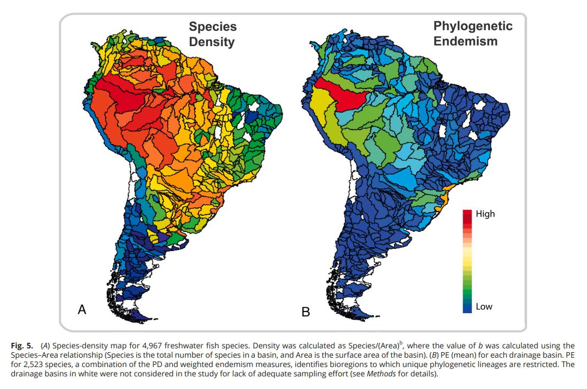
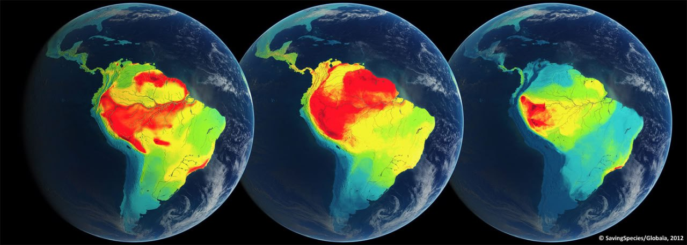
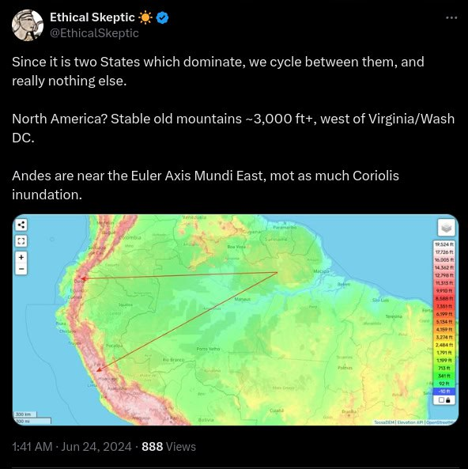

South America's Garden of Eden. It's within the arc described by TES[3] that we see the greatest biodiversity in South America. The first image is freshwater fish species density.[1] Second image is endemic species density of birds (left), mammals (middle), and amphibians (right).[2]
1. https://www.researchgate.net/publication/366847384_Landscape_dynamics_and_diversification_of_the_megadiverse_South_American_freshwater_fish_fauna
2. https://www.ecoclimax.com/2016/06/south-america-showing-color-coded.html
3. https://x.com/EthicalSkeptic/status/1805023386495508796

## Nobulart

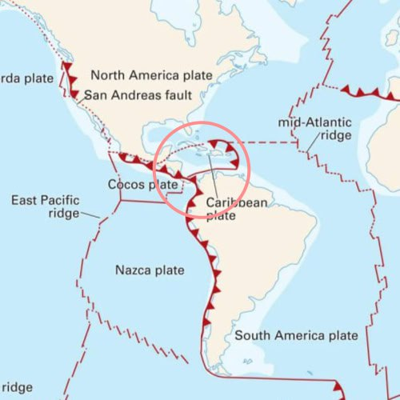
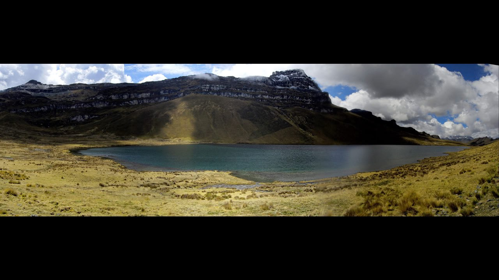
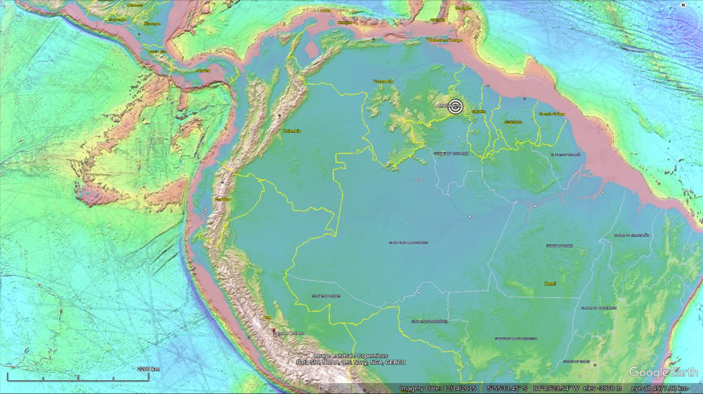

Earthquakes and volcanic activity are going to be intense here because of the nearby triple-plate subduction boundary nexus. Ecuador and Colombia have plenty. If I had to choose within this area, I think my first choice would be the top of Roraima. Second would be somewhere like this at 4300m above sea level. Laguna Toctuca in Peru.
- https://maps.app.goo.gl/ZF2qdc742n2ybmN87

## Nobulart

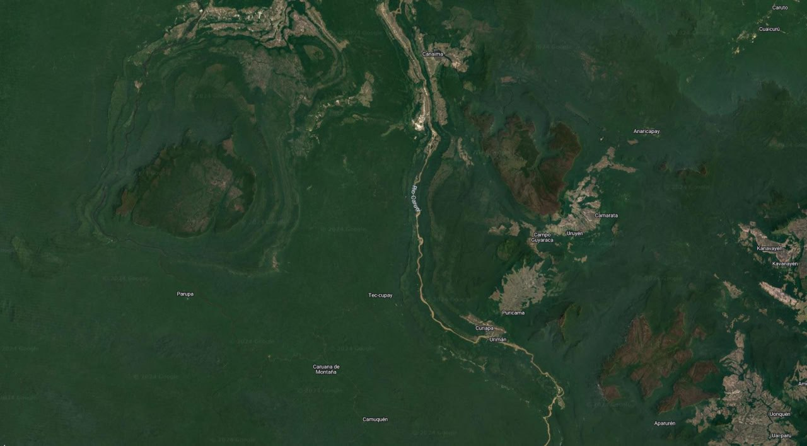
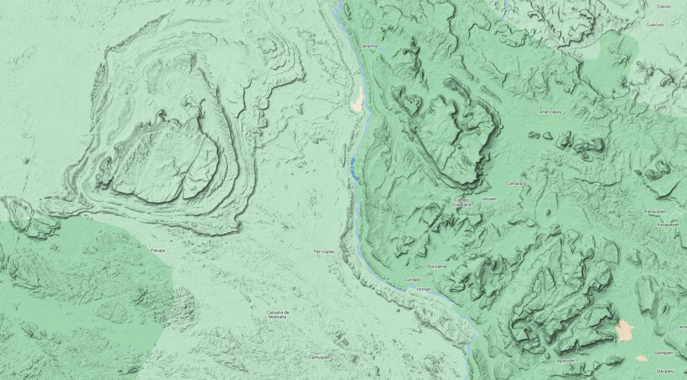
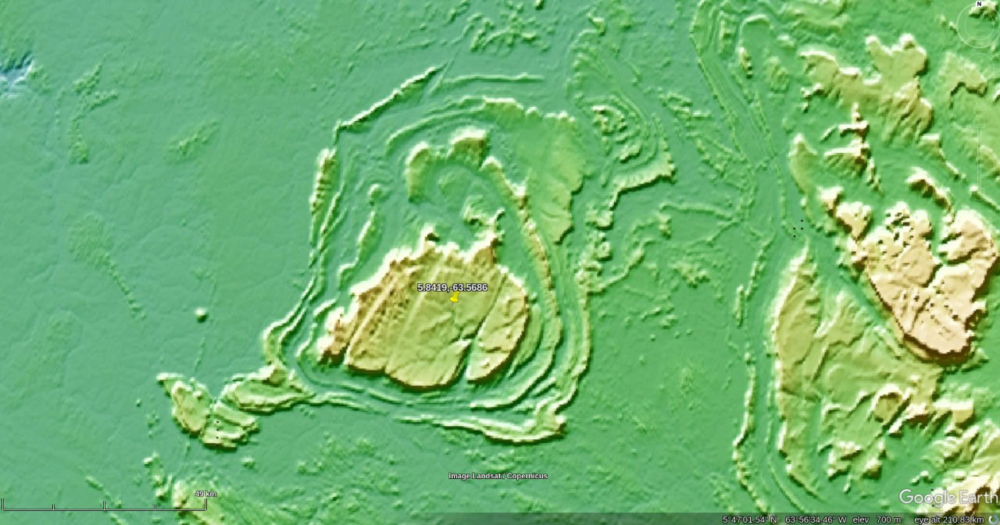

...look at this terraced gem to the west of Roraima. If water didn't do that then I don't know what...
- https://maps.app.goo.gl/3HcWzv3ULpZxRLpC8

## Nobulart

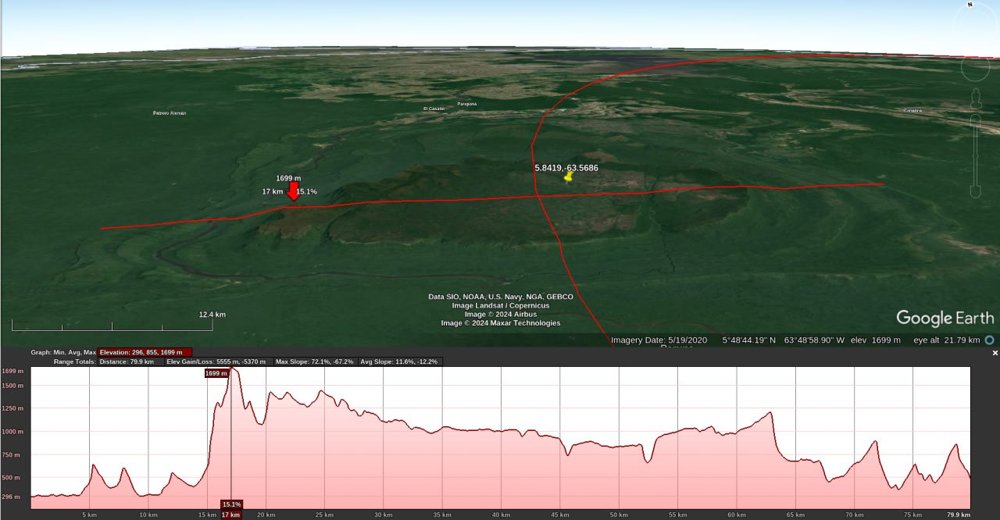
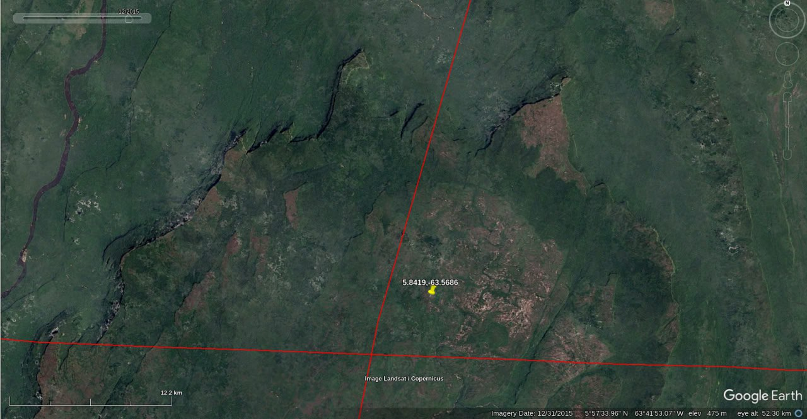
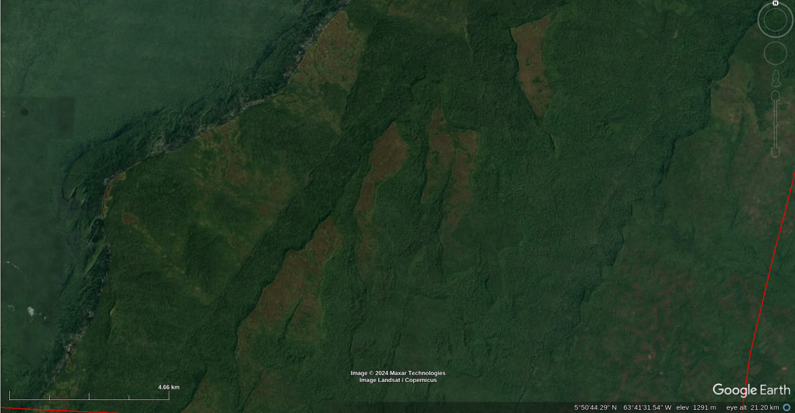

This mesa is just over 300km from Roraima. Red curve is the ECDO path. The structure rises over 500m above the surrounding area. Highest peak over 1700m. Note the eroded "ship's bows"on the northern (leading) edge. Smaller erosion islands on top (over 1300m) suggest that the entire structure may be overtopped.

## Nobulart

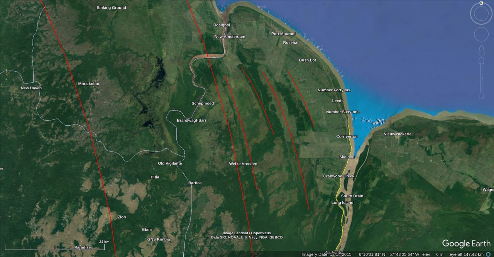
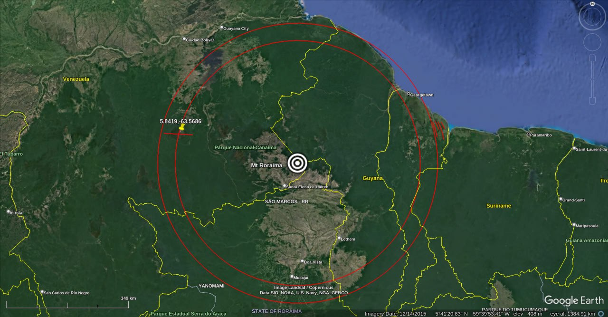

380km from Roraima. Remarkable path congruence at an onboarding point for the water during S1>S2.
- https://maps.app.goo.gl/7G3UwhRJjzXtnpTN8

## Lateral flow

Starting to think that we may be looking at evidence of massive lateral flow. The fact that Roraima is on the pivot is maybe only because the flow was dramatically reduced at this point. First image is from the glacial melt flood paper.

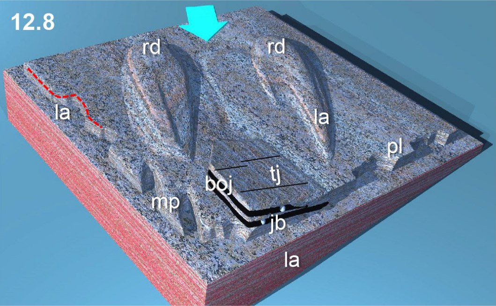
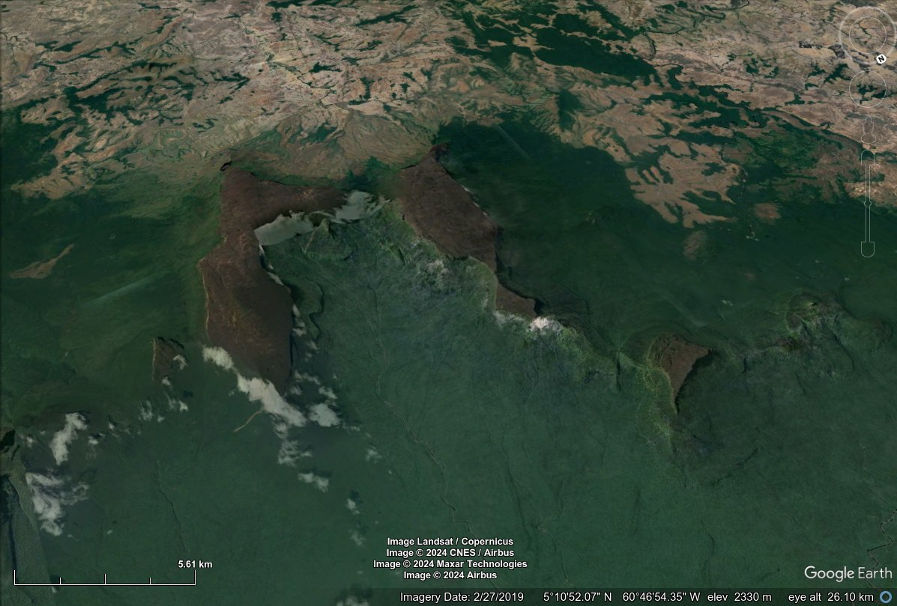

## Authors

1. [Craig Stone](https://nobulart.com)
