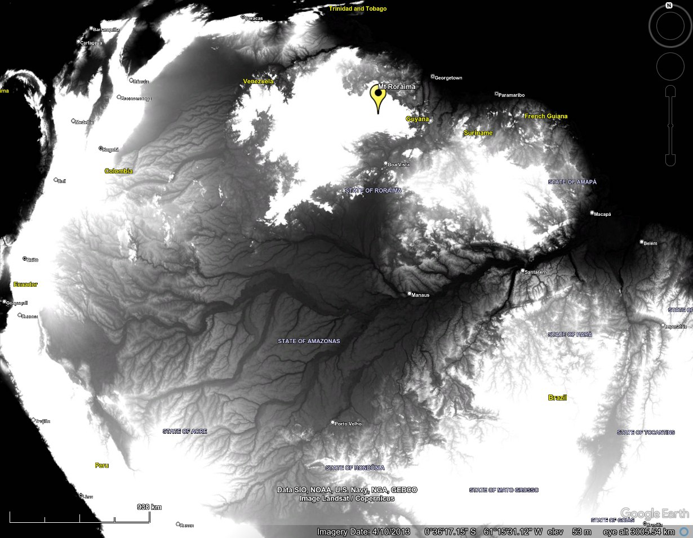
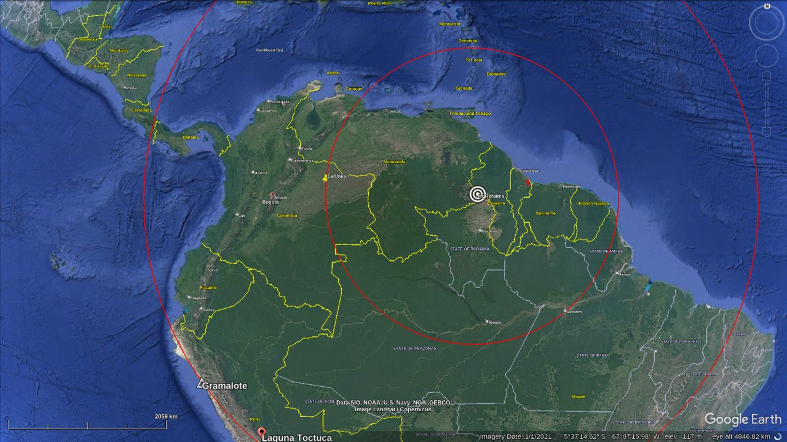
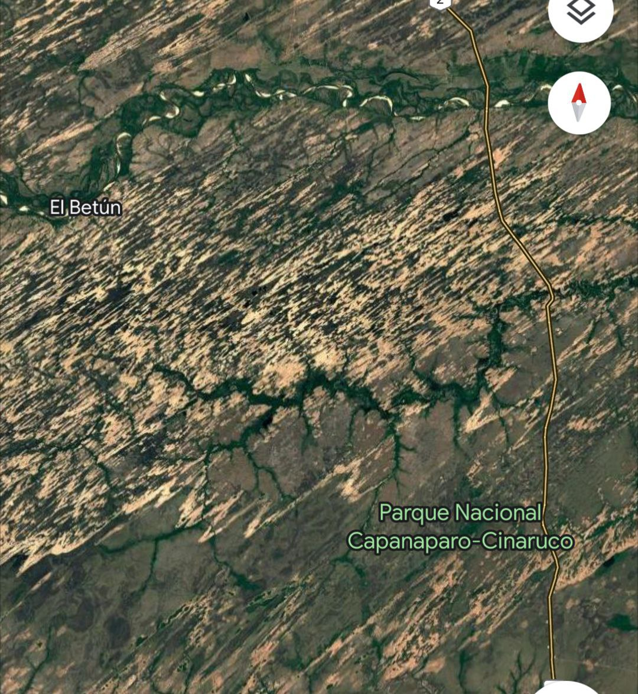
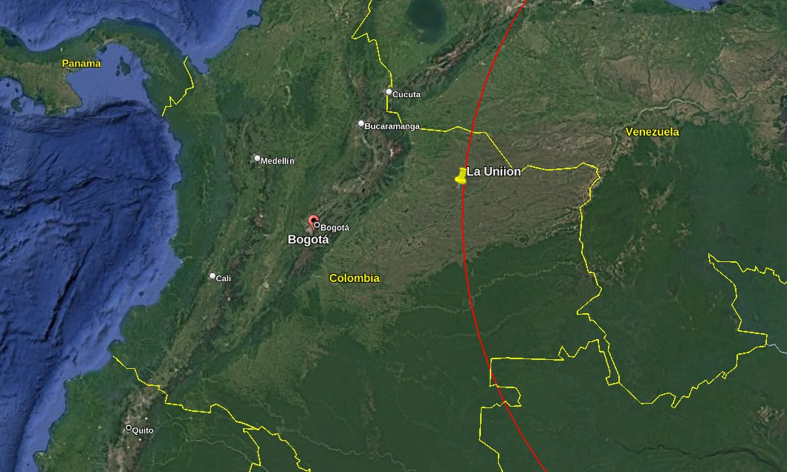
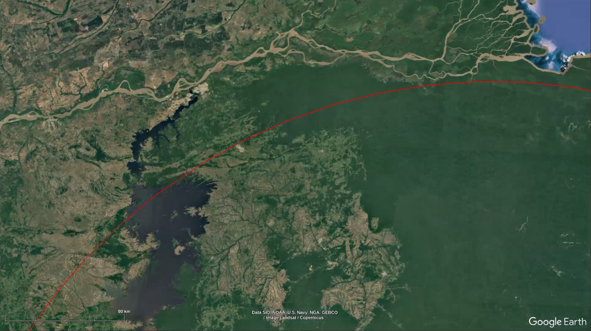
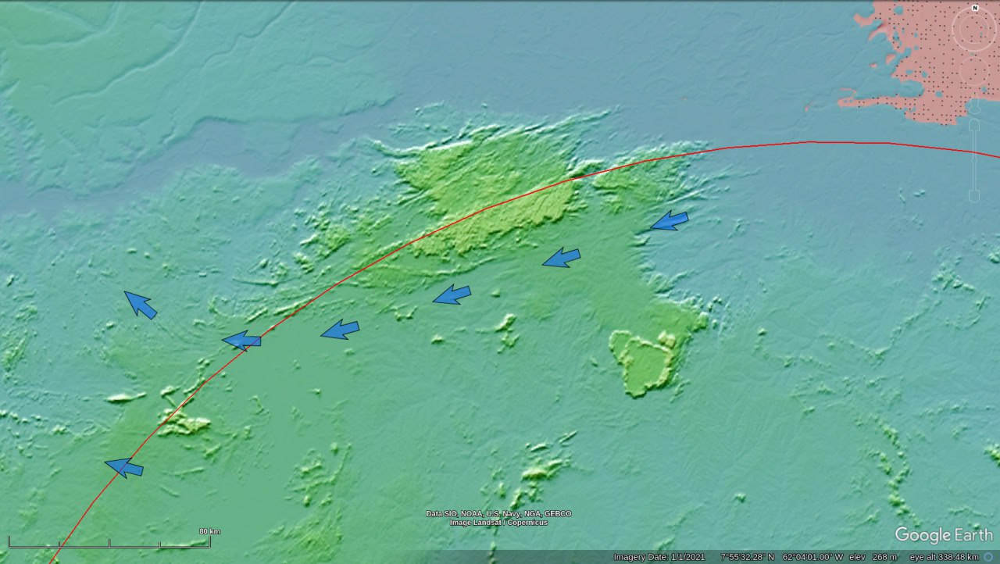
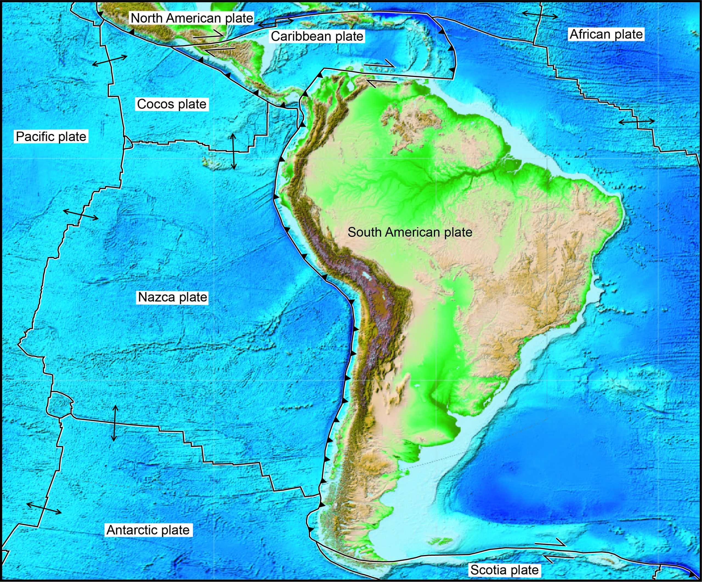

# South America

South America is home to the western ECDO pivot in east Venezuela.

Mount Roraima (the South American pivot) and the Amazon river network.

Mega current ripples in Chile and Argentina.

## Analysis [1]

https://github.com/user-attachments/assets/7cdc44f1-642e-408e-ae7f-1290120c06c3

See [here](https://github.com/sovrynn/ecdo/tree/master/6-LITERATURE-MEDIA/nobulart/ecdo-visualizations) for a visualization. [1]

South America. The western ECDO pivot [1] is located near Mount Roraima.[2] Mega current ripples and salt deposits in Argentina and Chile, and apparent gully erosion morphology in the vicinity of Drake Passage are in agreement with the predicted movement.[3]
1. https://theethicalskeptic.com/2024/05/12/exothermic-core-mantle-decoupling-dzhanibekov-oscillation-ecdo-theory/
2. https://x.com/nobulart/status/1809938647262585184
3. https://x.com/nobulart/status/1811105831573745686

## Colombia Morphology Structure [1]

This is some fascinating morphology. Colombia. Its massive. Spanning 1500 km.

It lies mostly in Colombia. A small portion is in Venezuela.

It looks like exposed or deposited sand. Neither wind nor ice can produce perfectly straight lines across hundreds of km. It's too easily disrupted. So far as I know only water can.

Been looking at this area some more. Being close to the pivot apparently increases the centrifugal movement of water away from the pivot. Note how the oceanic onboarding from the NW is somewhat contained by the high ground and then "flung" outwards (possibly including the lake water) through the openings on the west side. 

7°55'32.28" N  62°04'01.00" W

## [2/3] "It is impossible to...

[2/3] "It is impossible to reflect on the changed state of the [South] American continent without the deepest astonishment. Formerly it must have swarmed with great monsters now we find mere pigmies, compared with the antecedent allied races. The greater number, if not all, of…

[3/3] "It would seem, that one cause destroyed the terrestrial animals of South America, and that this cause is to be found in great dislocations of the ground caused by the upheaval of the Cordilleras. If not, it is difficult to conceive on the one hand the sudden and fortuitous…

## Tectonic plate map

## Citations

1. [Craig Stone](https://nobulart.com)
