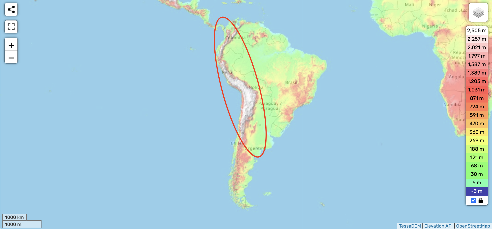
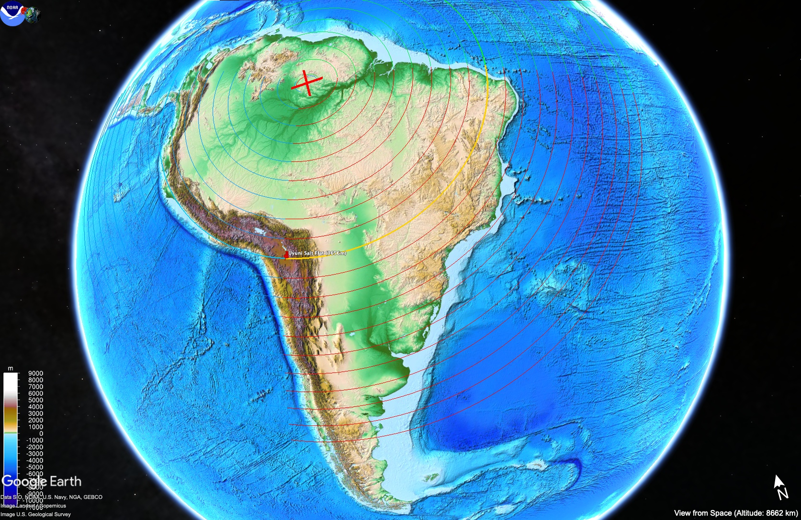
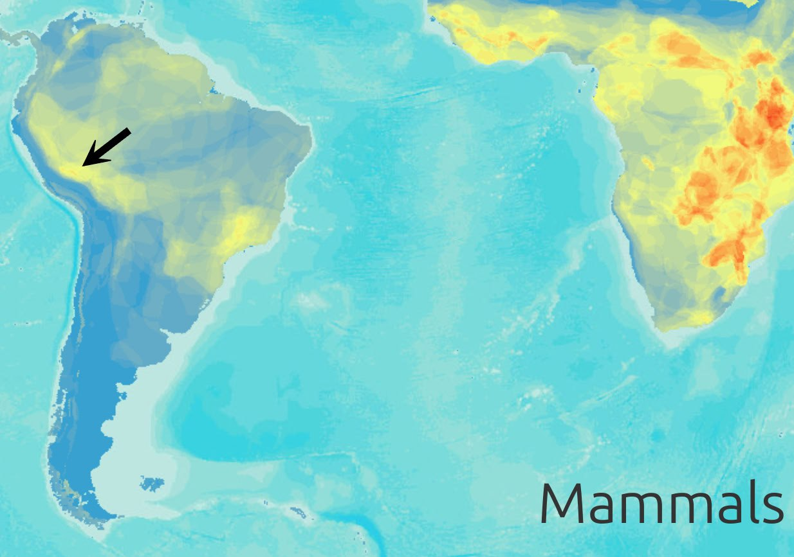
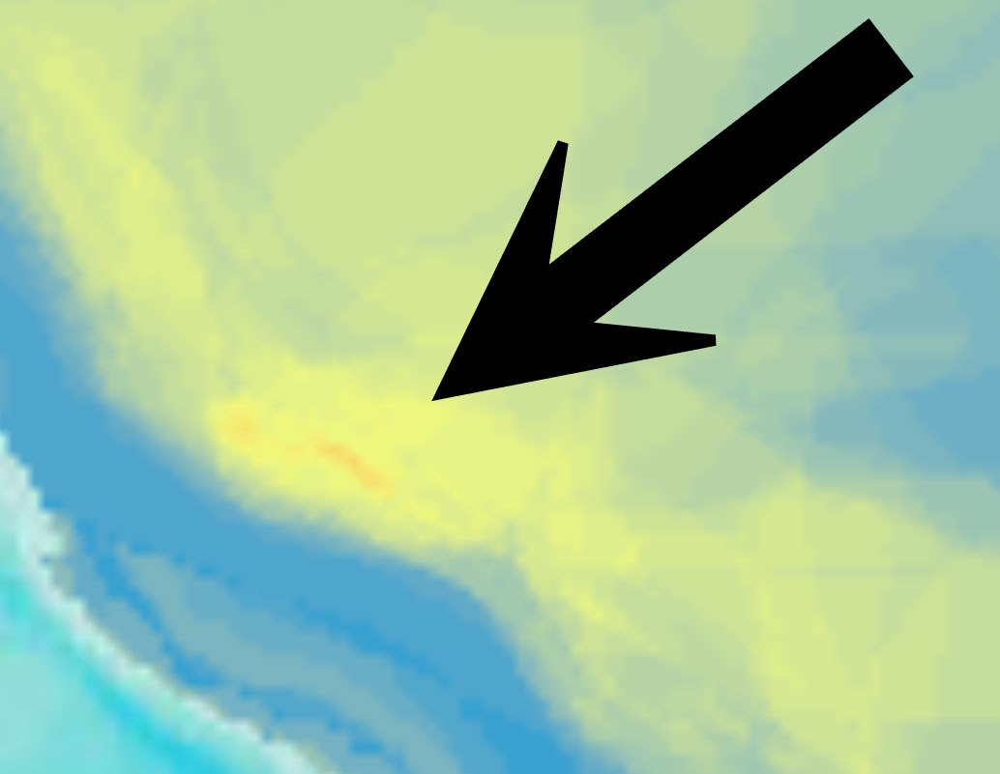

# Andes mountain range

The Andes are the tall mountain range running along the west coast of South America. High in elevation and close to the western pivot, they may be safe during S1 to S2 of the ECDO event.

## Dangers [1]

The Andes have to deal with the Pacific hitting them from the west at speeds probably up to 1000 km/h when returning from S2>S1. Problem with high places is that there is a lot of material to fall on top of you when the earth shakes.

Mountainous regions like the Andes will be less susceptible to water, but will be dangerous due to falling debris and renewed orogeny (mountain building).

## Uyuni Salt Flat (3656m) [2]

Coords (-20, -67.3). Supposedly part of a large former saline lake in the Altiplano of Bolivia - Lake Tauca.

Viz from -500m to 4000m:

Significant ocean isn't directly on the rotation path, but as you can see, the land in front of it on the rotation path is a flat plain offering little resistance for water. It wouldn't take much of an extra jolt to splash the water above the Andes. Alternatively, it may have been inundated on a potential quick rotation from S2 back to S1.

## Toctuca

That south part of the crescent appears to be richer in mammalian life as well.

Richest spot appears to be almost exactly near Toctuca.

## Citations

1. [Craig Stone](https://nobulart.com)
2. https://en.wikipedia.org/wiki/Salar_de_Uyuni
3. https://en.wikipedia.org/wiki/Lake_Tauca#Lake_Minchin
