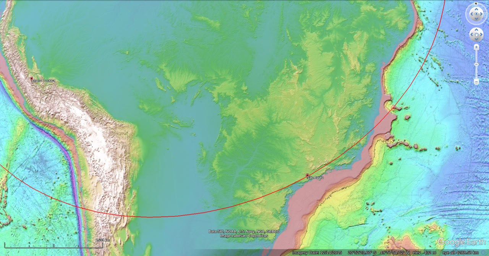
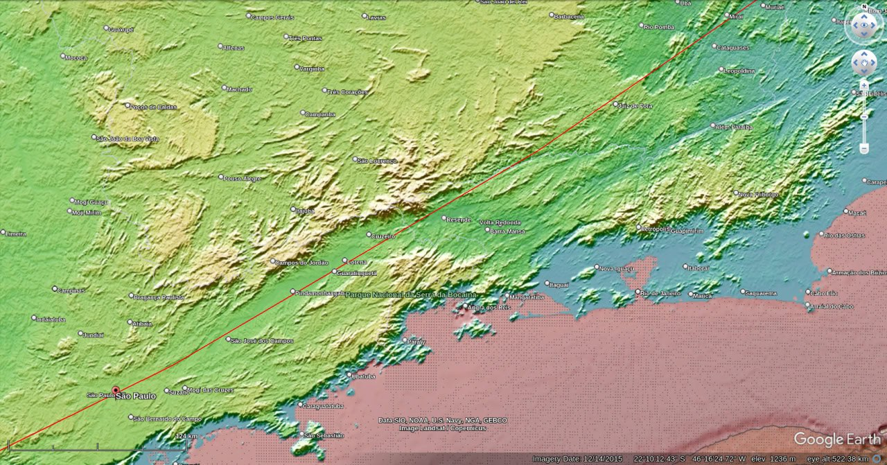
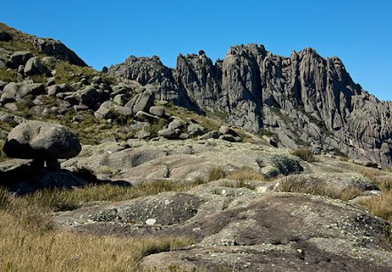
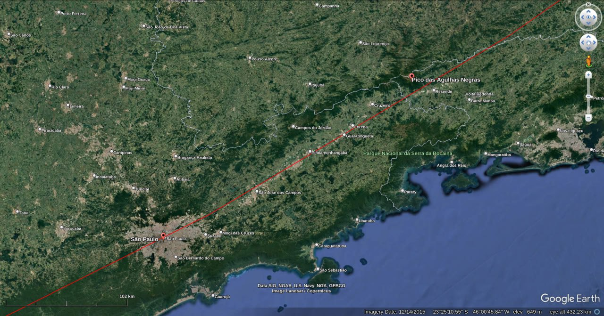
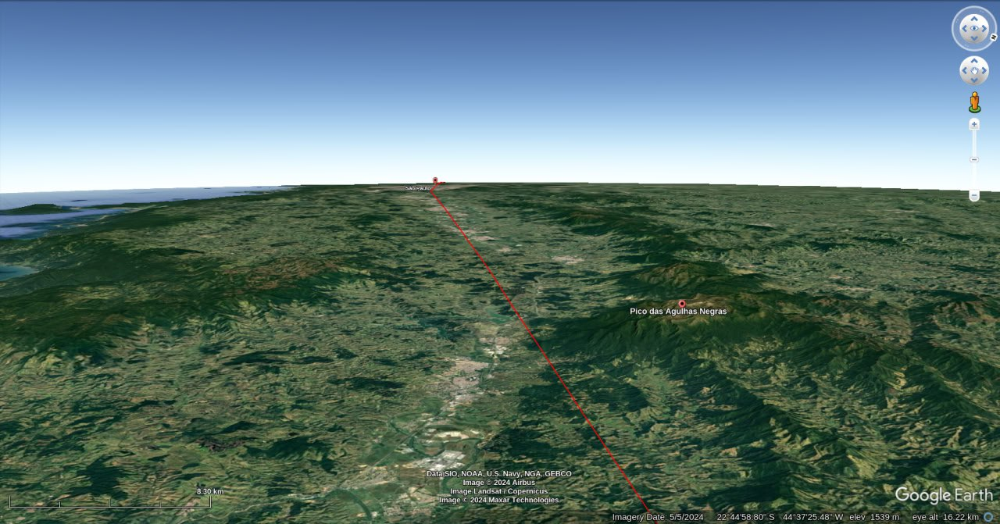

# Brazil

Red line is the ECDO path. The water would follow this approximately. The pink zones are water - the continental shelf. Strong evidence of water scouring along this path northeast of SP. Highest point is 2500m - Pico das Agulhas Negras 250km northeast of SP. This is possibly high enough. It is a biodiversity hotspot.
- https://maps.app.goo.gl/Y2rLtsVrZxfM8bUD7