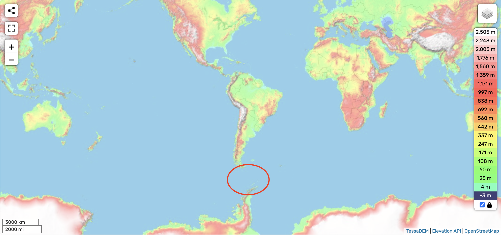
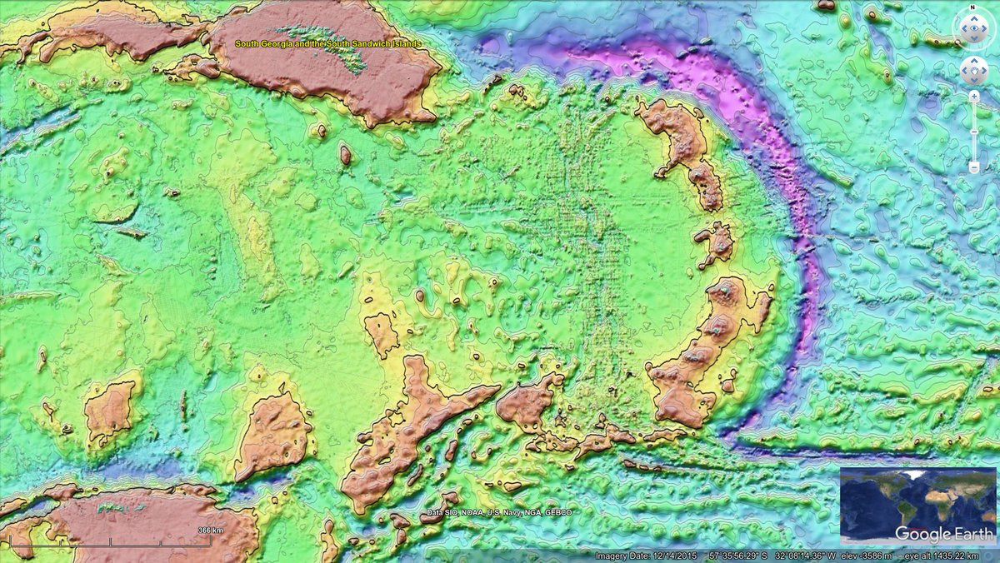
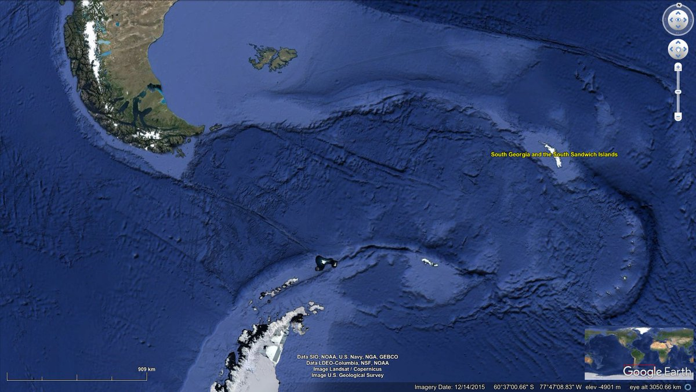
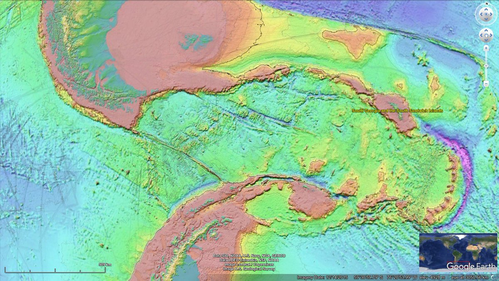

# Drake Passage (Scotia Plate, Argentina and Chile)

ECDO-derived displacement visualization of a full oscillation cycle from S1 > S2 > S1 [1]:

https://github.com/user-attachments/assets/c164d56c-84f3-423e-b31c-f7591afec28d

## To the southeast of Chile...

To the southeast of Chile we find the Scotia Ridge and the South Sandwich Islands. This spectacular formation is currently theorized to have formed through some fairly "magic bullet" type of tectonic movements. To my eye it appears as though water cut through the land bridge… https://t.co/lVmKwkA8Zc

## Citations

1. https://www.google.com/maps/@-51.9748086,-70.8967906,11z/data=!3m1!1e3
2. https://t.me/nobulart/2336
3. [Craig Stone](https://nobulart.com)
