# Peru

## Tip of northwest Peru

https://maps.app.goo.gl/tsafRpH3tTg6ukKi9

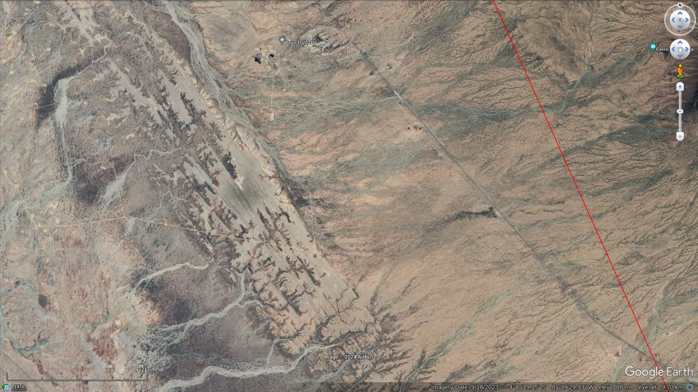
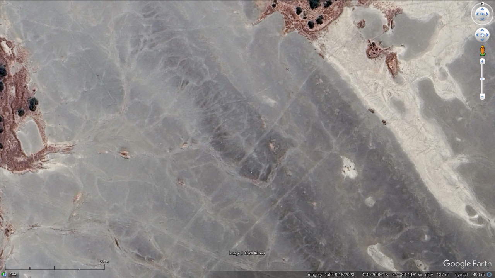

Looks like salt?

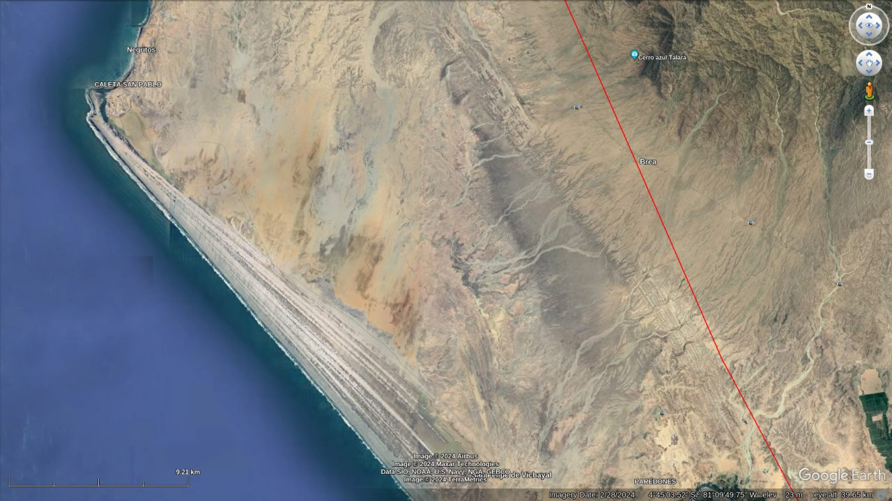
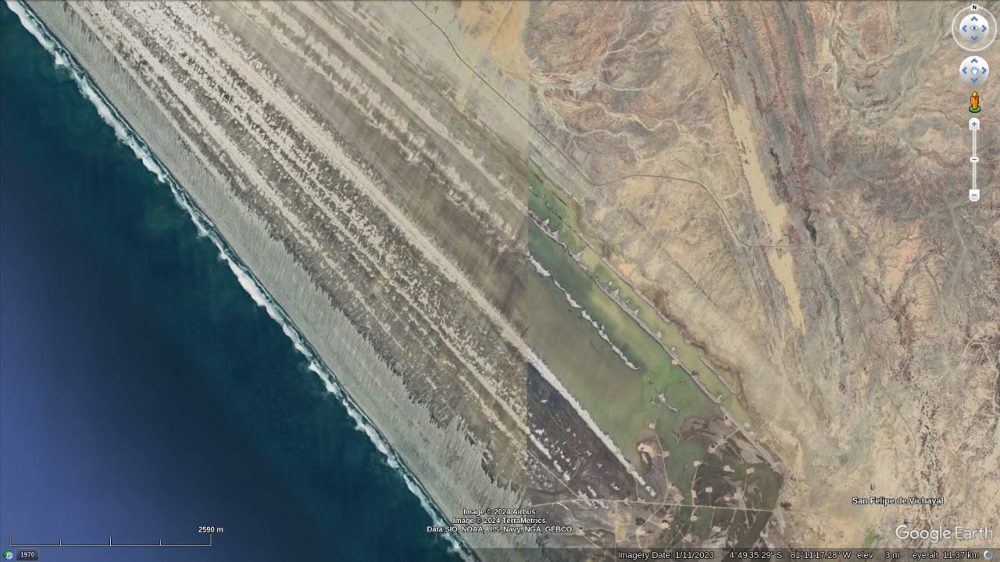
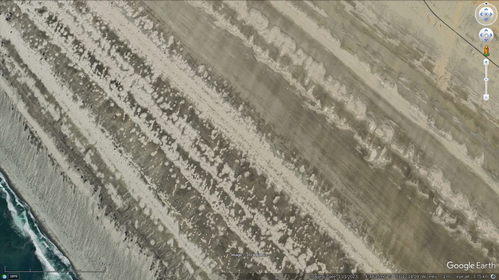
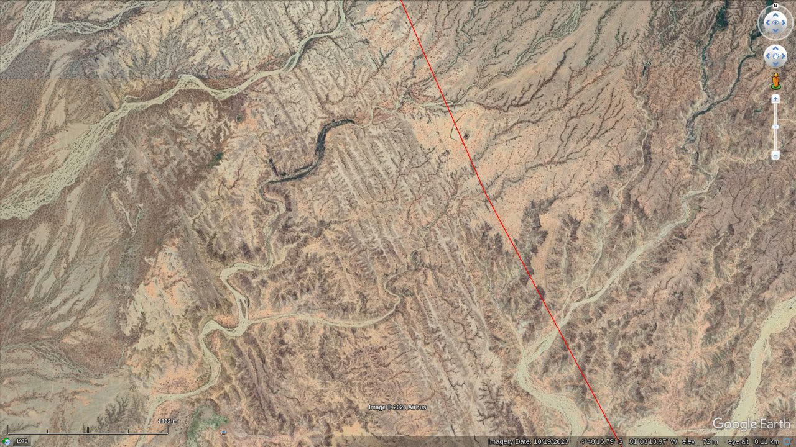
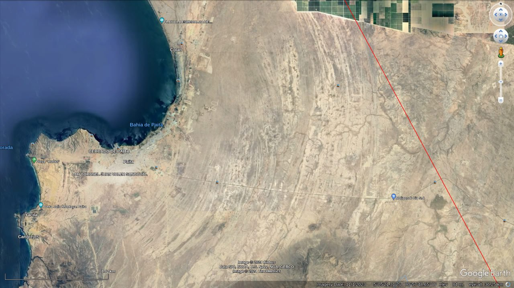

Refraction?

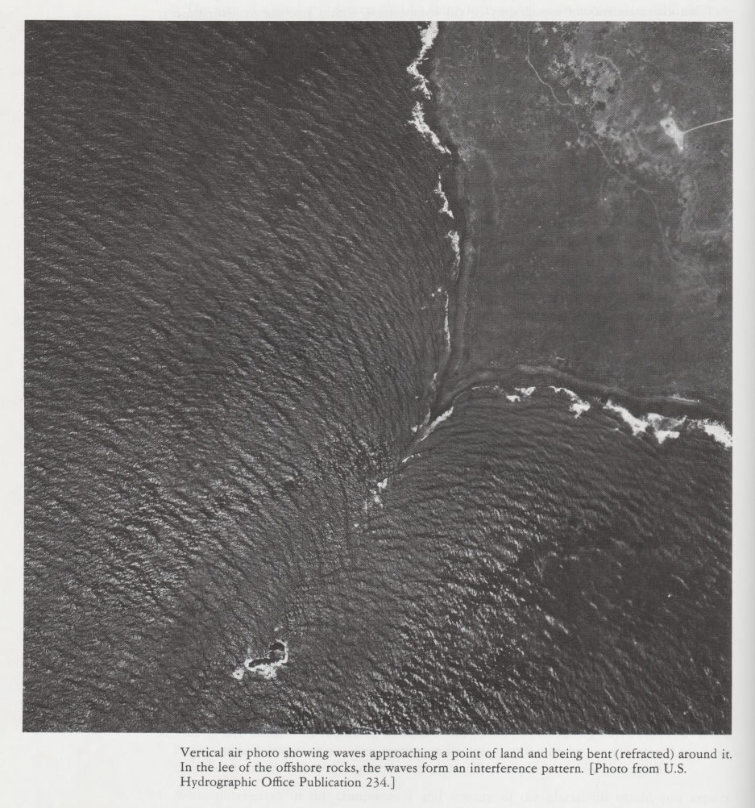
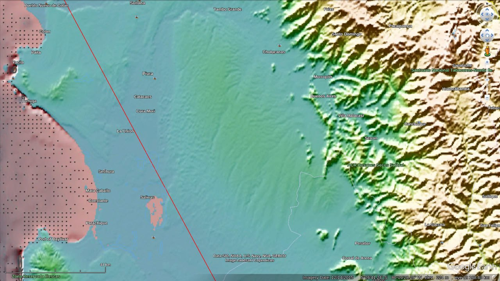
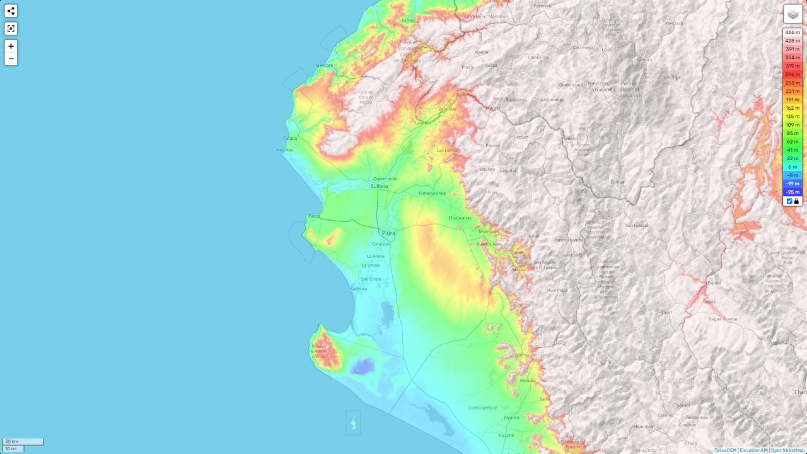

Those coves looks like they've been eroded with eddies maybe? That's actually something we should expect to see on a macro scale. Erosion caused by refraction and eddy currents.

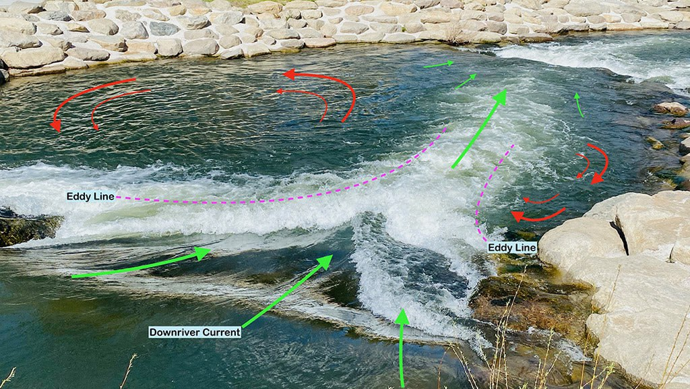

More salt?

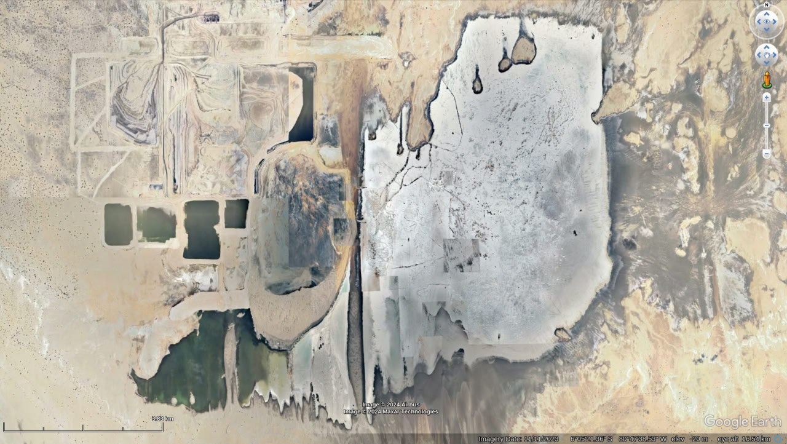

That's the dark blue hole 25m below seal level. Not surprised it has salt. I'd be surprised if it didn't.

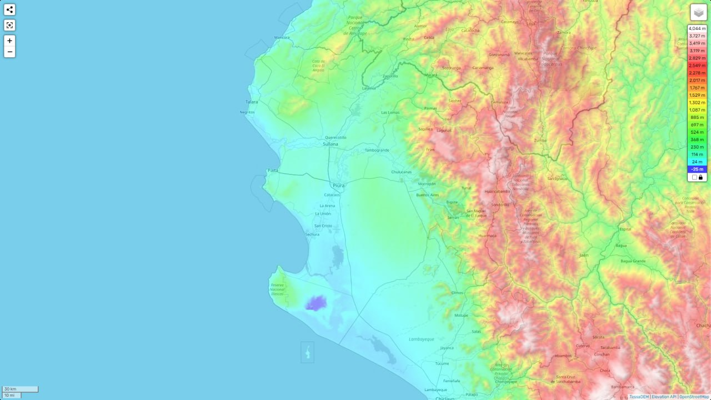