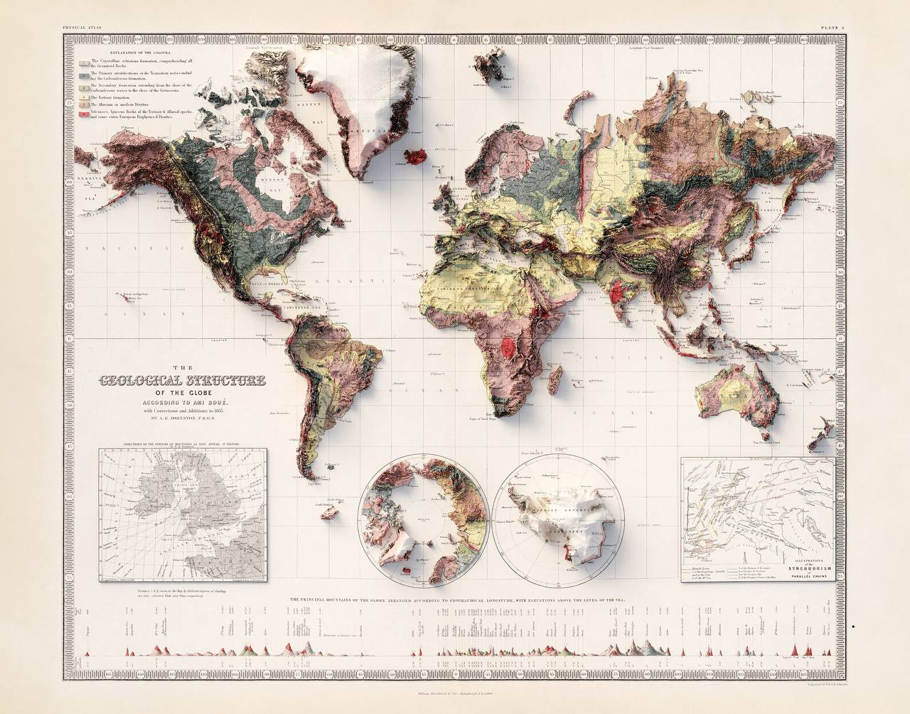

# Elevation

Obviously one of the most important factors for evaluating safe locations.

However it's not as simple as just fixed numbers for any location. Each location has a differing situation. You'd have to consider rotational path and surrounding bodies of water.
