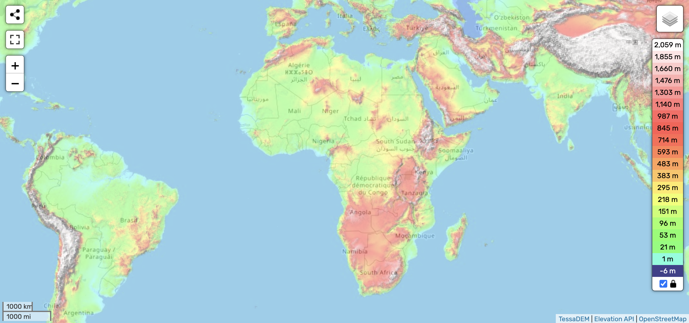

# Africa

Seems like there are definitely some safe spots in Africa.

## Nobulart

...[recommend] Drakensberg. The entire globe will be plunged into a nuclear-type winter during S2. It's going to be cold everywhere. Southern Africa is uniquely oriented and positioned such that it is not inundated during either movement - I know this because the "youngest" marine fossils here (found in the Karoo) are over 6 million years old. I believe I know why it isn't inundated going from S2>S1 but I have not yet published this.

Southern Africa also has some of the longest continuously inhabited caves in the world - many of them showing signs of continuous human activity for over 200,000 years.

Absolutely. There is a reason that Thomas, White Hapgood and the movie "2012" all singled out southern africa as the safest place (and possibly why the Oppenheimers chose to live here).

Southern Africa, especially above the Drakensberg range, is the safest from both water and falling rocks, but it will experience high winds, quakes and possibly some volcanic activity.

## Nobulart

“The area bounded by Zaire, South Africa, and Kenya suffers only severe earthquakes and winds – little inundation. Survivors there marvel at the Sun, standing still in the sky for nearly half a day.” - TAES, Chan Thomas (1963)
[1] https://nobulart.com/the-adam-and-eve-story/
