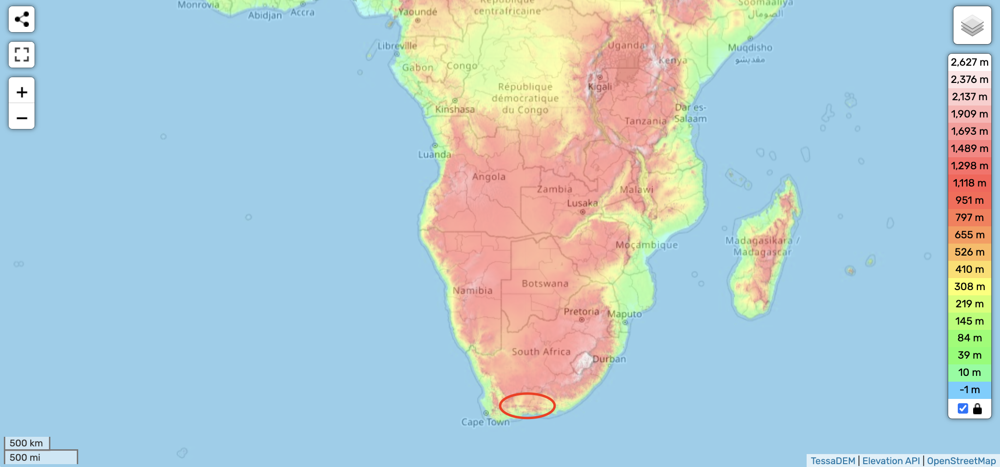

# Swartberg Range

## Analysis

The swartberg range has quite a distinctive form - multiple walls of rock jutting out towards the ocean. Maybe its enough to preserve something here during S2>S1.

https://en.wikipedia.org/wiki/San_people#Genetics

Seems to suggest that there's a good anomaly in that region, across multiple 12 000 year cycles. The genetic isolation & then rejoining the gene pool is also interesting.

Ditto cave drawings across the area.

Brenna Henn and colleagues found that the ǂKhomani San, as well as the Sandawe and Hadza peoples of Tanzania, were the most genetically diverse of any living humans studied. This high degree of genetic diversity hints at the origin of anatomically modern humans.[57][58]

A 2008 study suggested that the San may have been isolated from other original ancestral groups for as much as 50,000 to 100,000 years and later rejoined, re-integrating into the rest of the human gene pool.[59]