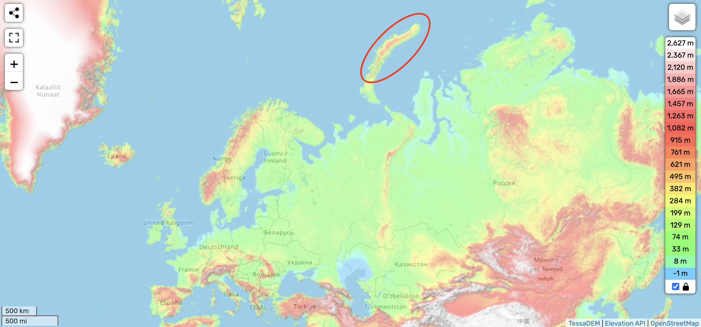
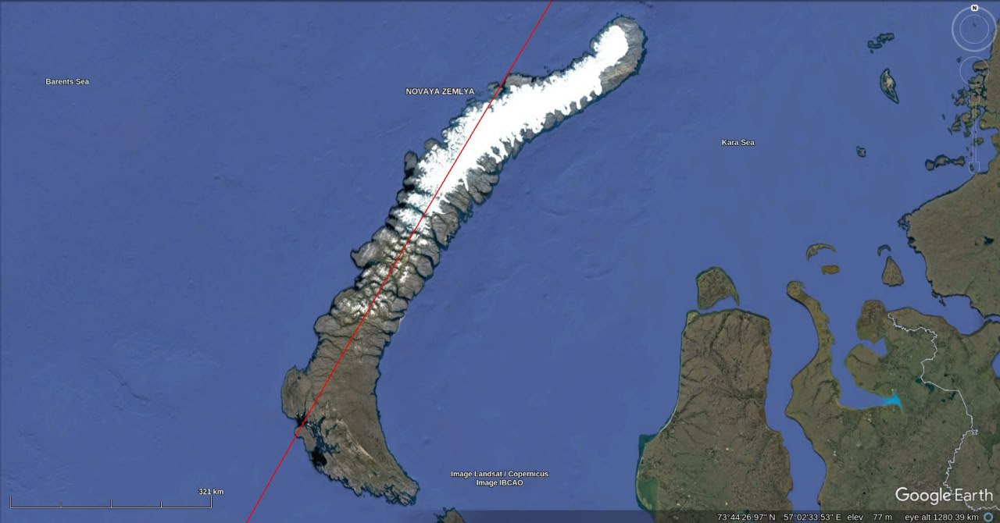
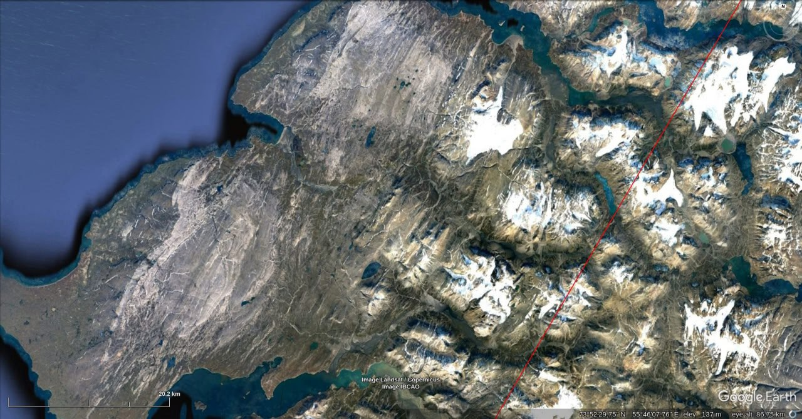
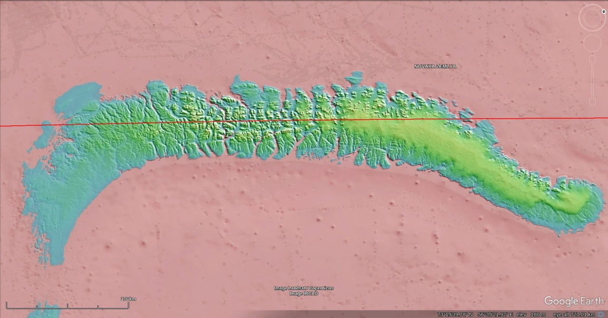

# Severny Island

## Analysis

Severny Island. Red lines are the ECDO moment of inertia. Extensive evidence of highly uniform directional scouring, as is characteristic of high velocity water flows.

[1] https://maps.app.goo.gl/4H5udi5mAWLa8AeP7