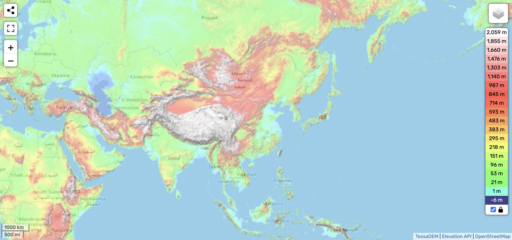
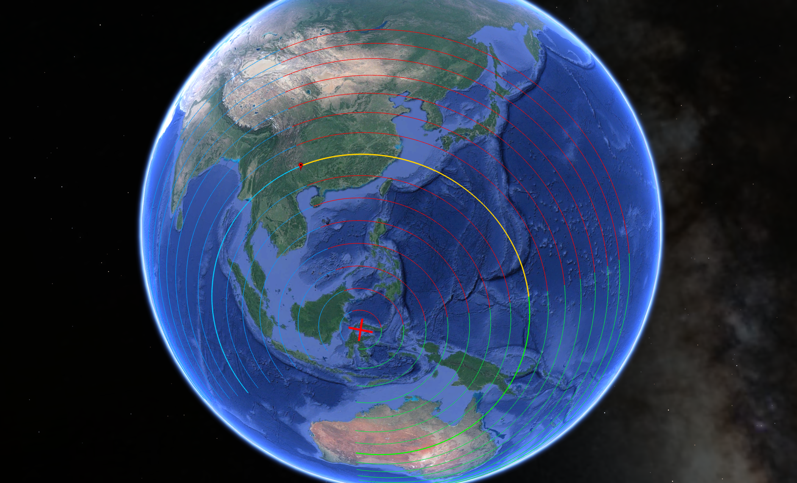
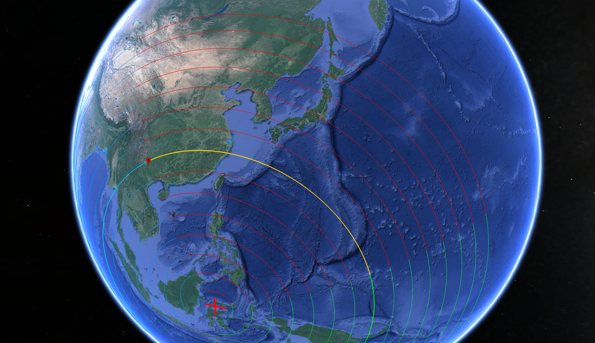

# Asia

A large continent, it is home of the east ECDO pivot at Sulawesi, Indonesia. It also has one of the largest areas of highest elevation, in west China north of India.

See `img/ECDO_ASIA.mp4` for a visualization.

# Analysis

## Oceanic Displacement

The oceanic displacement for Asia, particularly east Asia, begins with its shallow tranches of ocean near the coastline.

The Pacific Ocean to the right of Japan is anywhere from 5-6 km deep. In the Phillipine plate, it's 4.5-5.5 km deep. But in the Yellow Sea between China and Korea, it's only 100m deep, and to the right of Korea, 1-3 km deep.

As the shallow coastline sea shelves rush into the Pacific, the sea level in East Asia is temporarily going to surge before the water settles down.

Specifically, you can see that there is a huge underwater chokepoint to the right of Japan where the Pacific plate subducts into the Eurasian plate. You can expect that there will be large inflows of water at the two indents of that chokepoint.

## Tectonic Plates

Asia has one of the most fractured tectonic plate regions in the world.

