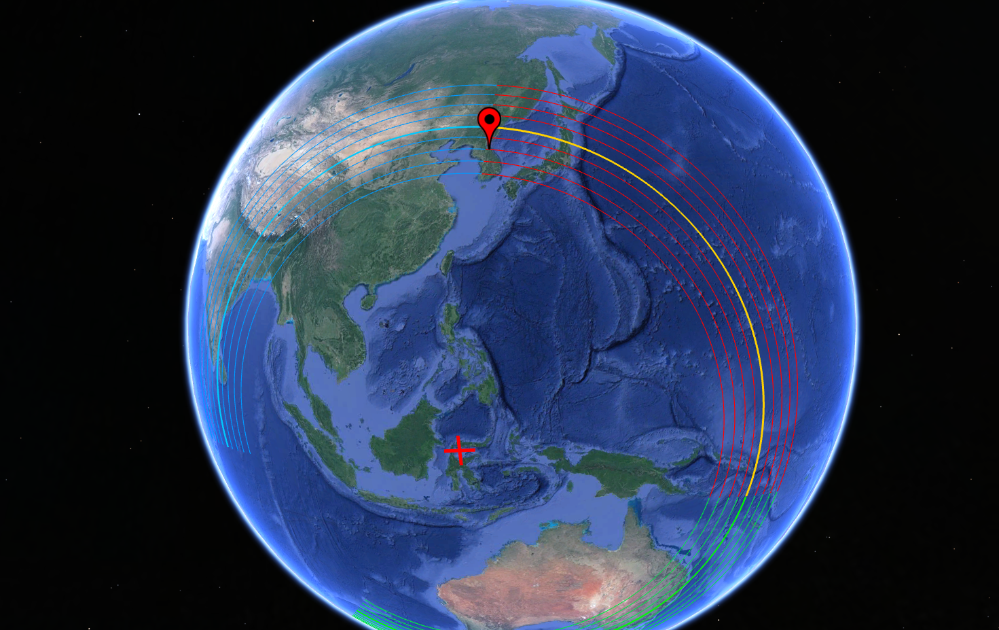
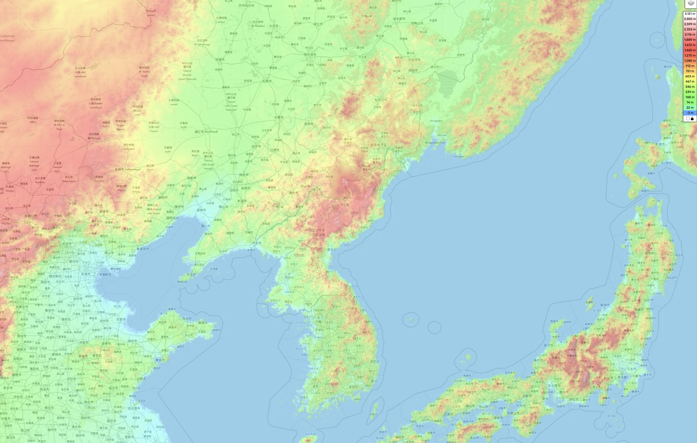
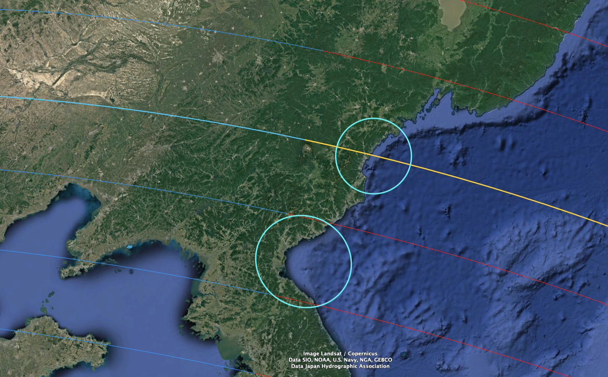
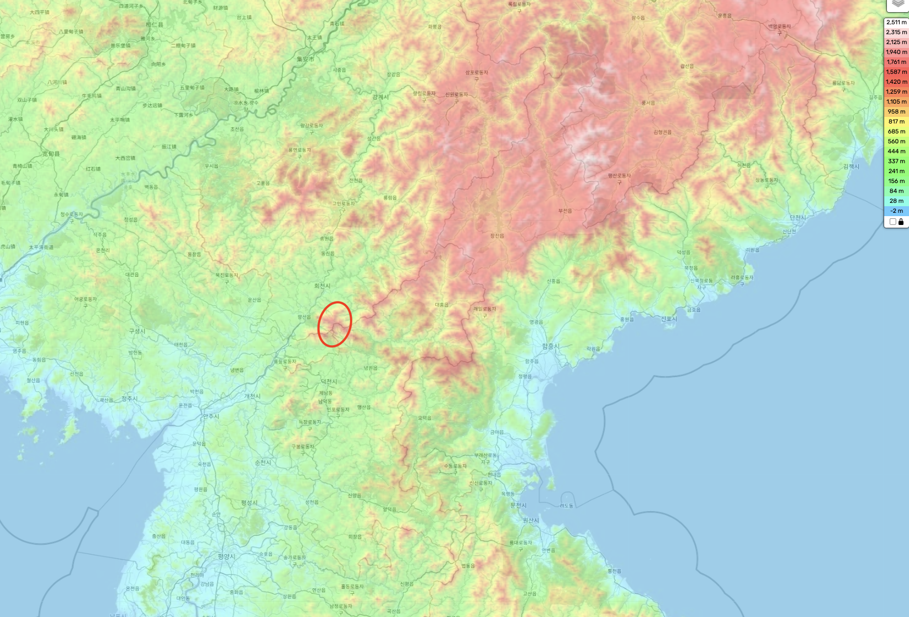
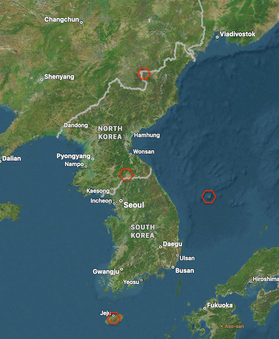
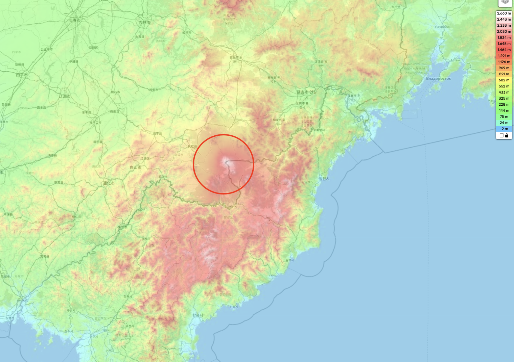
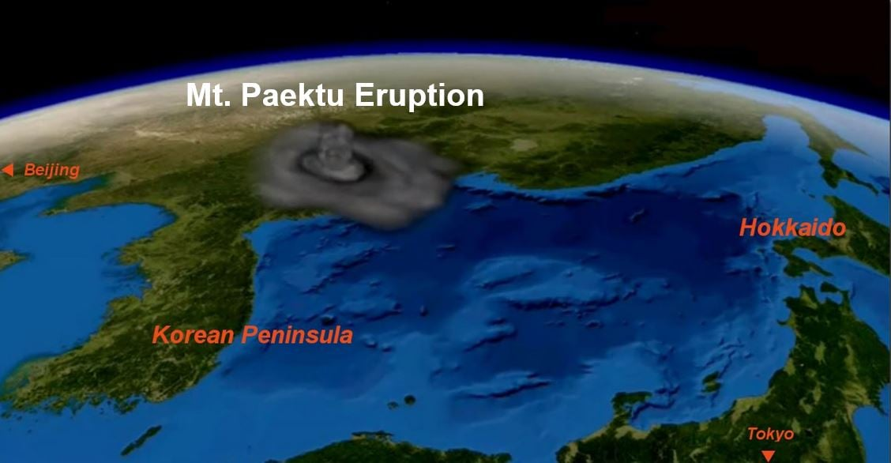
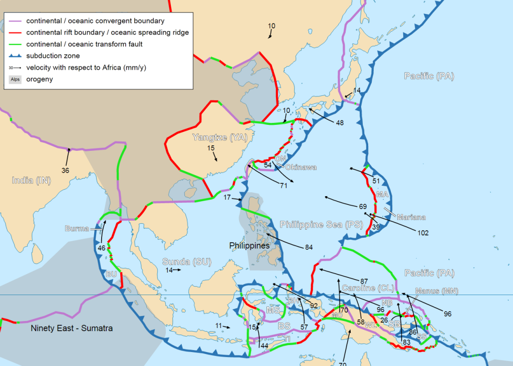
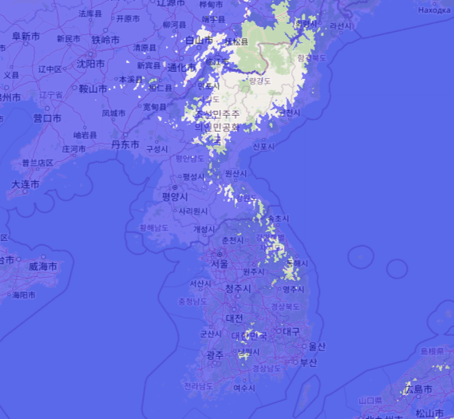

# Korea

Overall, while there is evidence of survivors of an ECDO event (Dangun's parents), Korea is not a great location. It's right on the coast, traverses a huge amount of water, has a massive volcano, and has a concave bay, which would force the ocean up over the land.

## S1 -> S2 Rotation path

Japan is the only land between Korea and the Pacific.

## Elevation profile

Korea is quite hilly, with mountains running along the east, particularly in the north. The west is more of a plain.

## Past flow evidence

From observing Korea on Google Maps and Earth, I did not find clear evidence of overtopping or flow. However, LIDAR data may be able to provide more info.

## Water flow

The way I see it, Korea's geography is not great for bypassing the water flow. It has two water chokepoints - areas where the bay forms a concave shape, forcing the water to flow up over the land.

If I had to guess, most of Korea will be inundated, with only a few areas at the highest elevations safe. These areas will almost certainly be inundated:

## Mt. Myohang

Surprisingly, the cave where Dangun's parents survived a likely ECDO event is not extremely high in elevation. It's on the extremity of Korea's high elevation land, and close to Korea's main water flow-point.

That being said, it's the furthest high-elevation location from Mt. Paektu, which is promising.

## Volcanoes

Korea has two volcanoes on the mainland:
- Mt. Paektu (north)
- Ch'uga-Ryong, maybe extinct (central) [4]

And two island volcanoes:
- Hallasan (Jeju, south)
- Ulleungdo (east)

Since Korea moves closer to the equator, and is also very close to major subduction fault lines, it's almost certain to see significant volcanic activity.

## Mt. Paektu

Unfortunately, most of Korea's high-elevation land is right next to a huge volcano. Perhaps the volcano is actually the reason that this high-elevation land exists.

*"The mountain's caldera was created in 946 by the colossal (VEI 6)[21] "Millennium" or "Tianchi" eruption, one of the most powerful eruptions in the last 5,000 years, comparable to the 230 CE eruption of Lake Taupō and the 1815 eruption of Mount Tambora.[22] The eruption, whose tephra has been found in the southern part of Hokkaidō, Japan, and as far away as Greenland,[23] destroyed much of the volcano's summit, leaving a caldera that today is filled by Heaven Lake."* [1]

It seems likely that if an ECDO were to happen, this volcano would erupt with at least as much strength as it did in the Millennium eruption. After all, the Millennium eruption was not the first eruption of this volcano either.

I stumbled across this little visual during my investigation - it highlights how while Mt. Paektu might not be submerged, most humans may not be able to survive anywhere near it unless they are underground due to the volcanic ash.

See https://en.wikipedia.org/wiki/946_eruption_of_Paektu_Mountain

## Tectonic plates

Korea lies quite close to major subduction of the Pacific and Phillipine plates, along with other fault lines.

This is an interesting dataset. From what I can see, it indicates that Mount Paektu is much greater in scale than the central volcano. The two island volcanoes have also clearly been active recently. [2]

## Final verdict

It's not clear to me that there are any surefire large safe locations on this peninsula. It might be possible that south Korea is almost completely submerged, and almost all of the mountain range in north Korea gets completely covered in ash. In that case, a cave in Mt. Myohang, which is basically the furthest possible high point that's away from Mt. Paektu in Korea, might actually be one of the very few places that a human could survive an ECDO event in Korea under normal circumstances. There's probably some other mountain peaks that would stick out but you'd have to be right on the peaks. Without ECDO knowledge you wouldn't get much of a warning signal.

This is an 800m flood map. For reference, Mount Myohang's highest point is 1909 m. [3] The temporary flow will likely be higher on the water chokepoints compared to the northwest or southeast.

As you can see, the only significant unsubmerged chunks of land are around Mount Paektu. During the quick S1 -> S2, you might see most of central and south Korea get washed away aside from a few high mountain peaks.

Probably, robust shelter on Mount Myohang or the mountain range right above or to the right of it would be the best bet for survival. Don't want to be too close to the volcano, and better to be on western mountains that are protected from the wind by eastern mountains.

## Citations

1. https://en.wikipedia.org/wiki/Paektu_Mountain
2. https://volcano.si.edu/volcano.cfm?vn=305060
3. https://en.wikipedia.org/wiki/Mount_Myohyang
4. https://www.volcanodiscovery.com/chuga-ryong.html