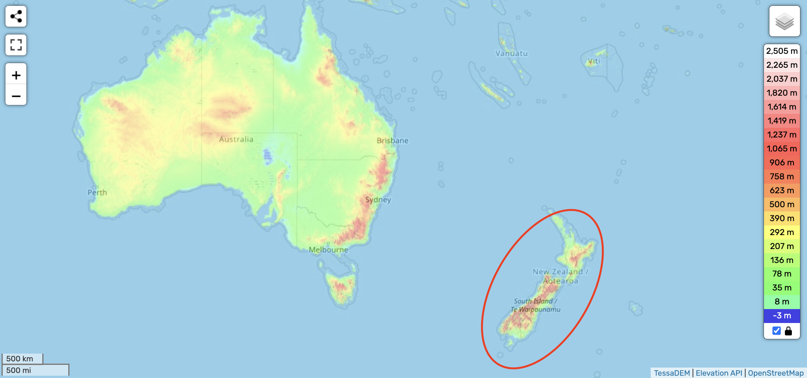

# New Zealand

See [here](https://github.com/sovrynn/ecdo/tree/master/6-LITERATURE/nobulart) for a visualization.

## Nobulart

New Zealand (Māori: Aotearoa) by request: ECDO displacement detail S1>S2>S1 [1]. Note the striking alignment between the local bathymetry and the displacement path.

"New Zealand was going to be a bolthole, a bunker. I never had a plan to live here permanently until we are close to the event [WW3], just like many other entrepreneurs who are setting themselves up here." - Kim Dotcom (2018) [2]

Māori deluge mythology [3]:
"The floods of heaven descended and killed everyone on earth." This event was called "The overwhelming of the Mataaho." [1][Gaster, p. 112]

[1] https://theethicalskeptic.com/2024/05/23/master-exothermic-core-mantle-decoupling-dzhanibekov-oscillation-theory/
[2] https://www.nzherald.co.nz/nz/steve-braunias-spending-doomsday-with-kim-dotcom/CNLGZOLRIZKRFWKH2WAWOY7PU4/
[3] https://talkorigins.org/faqs/flood-myths.html#Maori

## TODO Potential Leads

Peter Thiel's trying to put his doomsday bunker in Queenstown-Lakes district, New Zealand. Sensible location for ECDO?
- https://www.theguardian.com/technology/2022/aug/18/peter-thiel-refused-consent-for-sprawling-lodge-in-new-zealand-local-council
- Mount Alpha (1600m elevation)

Aboriginal Rock Art : The Enigmatic Wandjina Gods