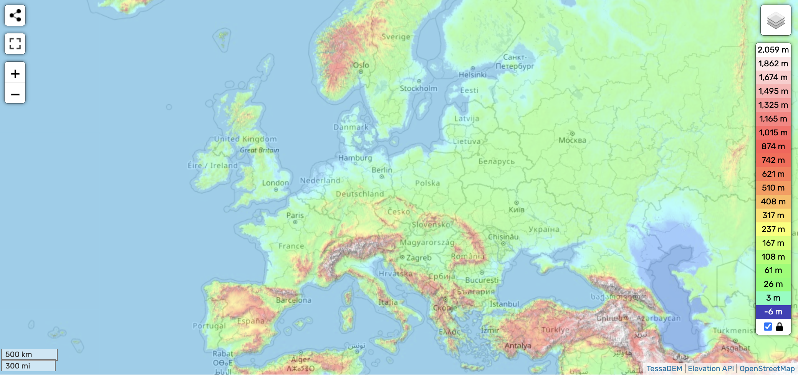

# Europe

Europe, being centered around the 31 Meridian, has to traverse a lot of net distance during the ECDO rotation.

See [here](https://github.com/sovrynn/ecdo/tree/master/6-LITERATURE-MEDIA/nobulart/ecdo-visualizations) for a visualization.