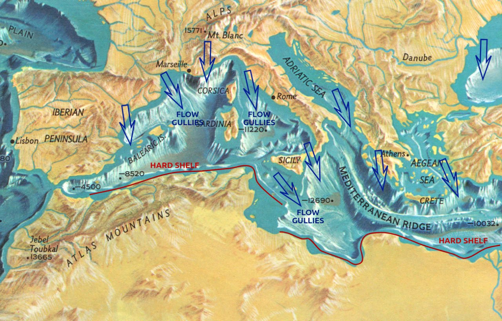

# Mediterranean

This folder is for analysis considering the Mediterranean as a whole, which would mostly consist of sea and tectonic factors.

See [here](https://github.com/sovrynn/ecdo/tree/master/6-LITERATURE-MEDIA/nobulart/ecdo-visualizations) for a visualization.

## Bathymetry

Mediterranean Bathymetry. Looks almost as though the entire thing emptied to the South and was refilled from the North.  In one movement probably.