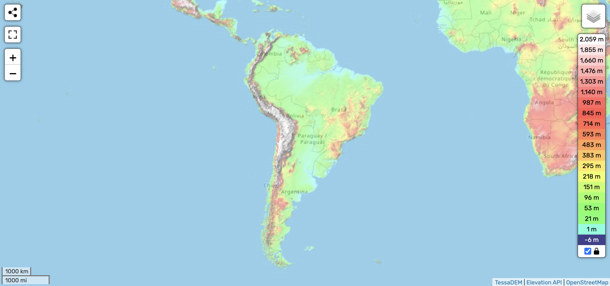

# South America

South America is home to the western ECDO pivot in east Venezuela.

See `img/ECDO_SAMERICA.mp4` for a visualization.

## Nobulart

South America. The western ECDO pivot [1] is located near Mount Roraima.[2] Mega current ripples and salt deposits in Argentina and Chile, and apparent gully erosion morphology in the vicinity of Drake Passage are in agreement with the predicted movement.[3]
[1] https://theethicalskeptic.com/2024/05/12/exothermic-core-mantle-decoupling-dzhanibekov-oscillation-ecdo-theory/
[2] https://x.com/nobulart/status/1809938647262585184
[3] https://x.com/nobulart/status/1811105831573745686