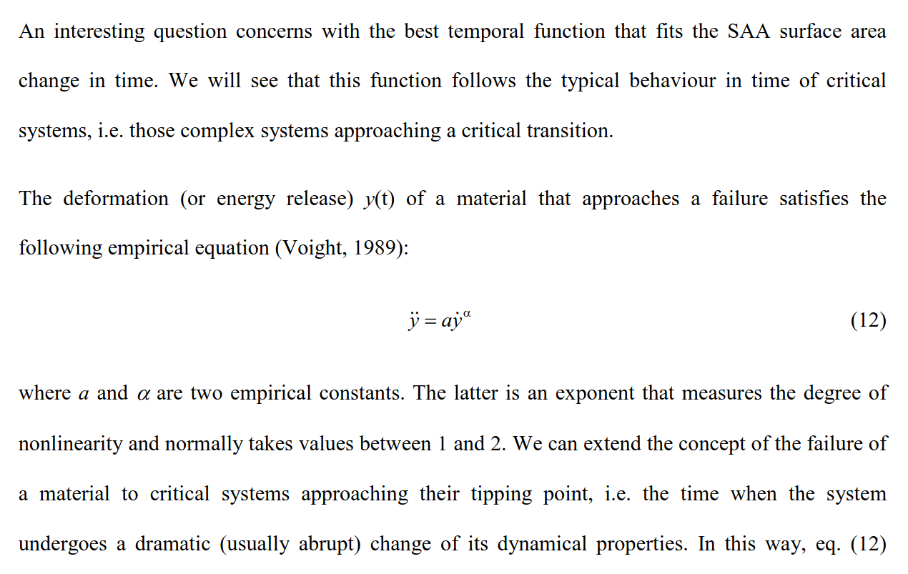
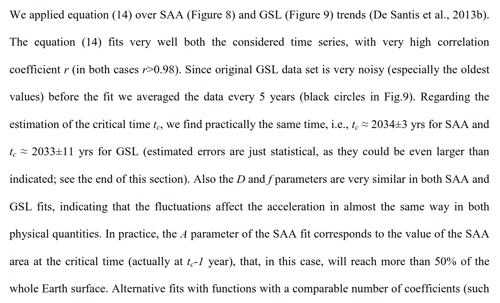
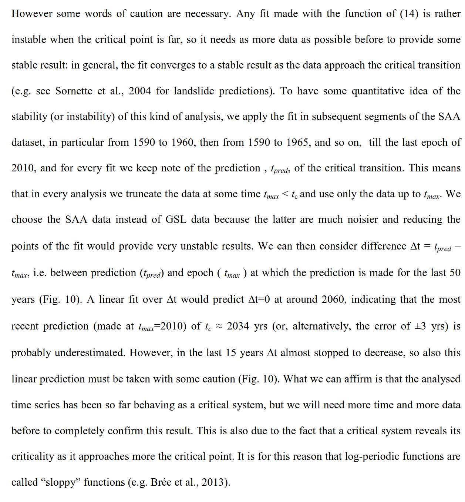
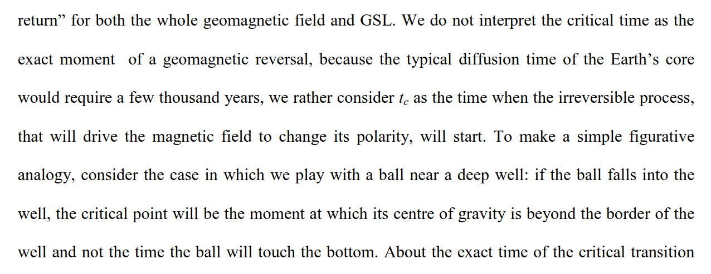
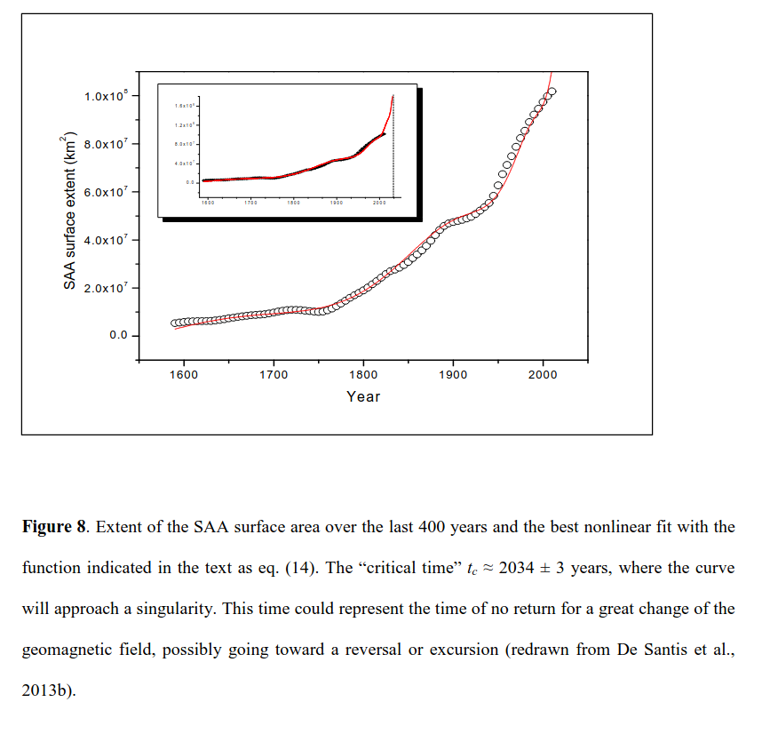
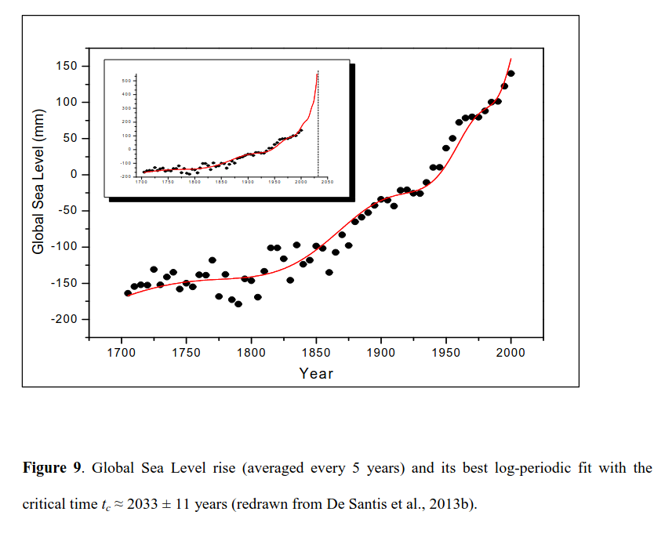
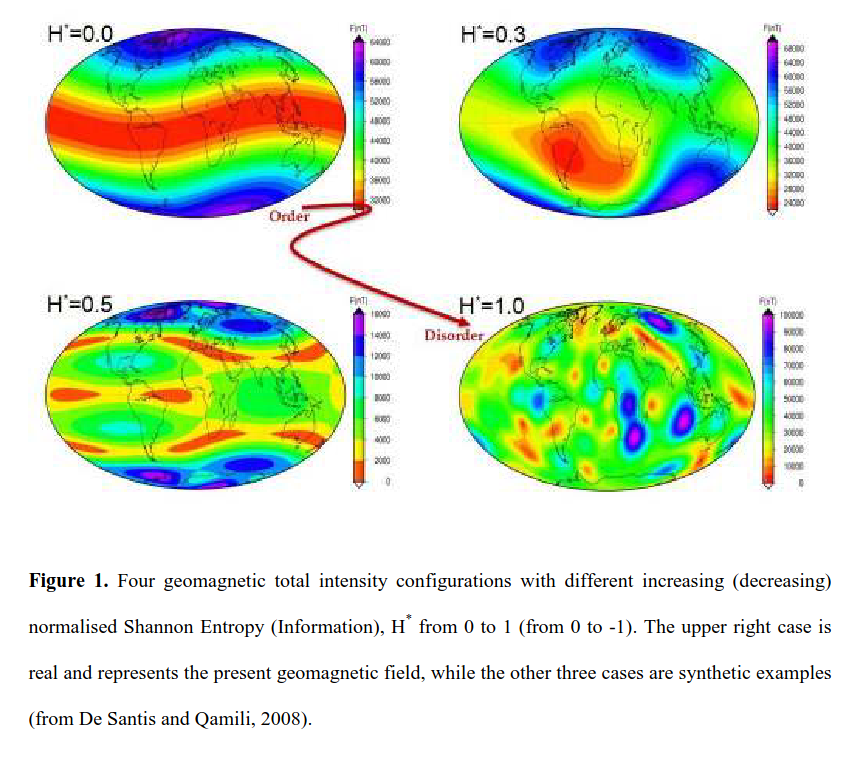

# The seminal paper.

"In practice, the A parameter of the SAA fit corresponds to the value of the SAA area at the critical time (actually at tc-1 year), that, in this case, will reach more than 50% of the whole Earth surface."

## De Santis, Qamili - Geosystemics: a systemic view of the Earth’s magnetic field and possibilities for an imminent geomagnetic transition (Hard copy here)

Published August 3rd, 2014, which means it's 10 years outdated: https://link.springer.com/article/10.1007/s00024-014-0912-x

<!-- 

 -->

These guys use SAA surface area and global sea level rise, fit to a "tipping point system" equation, to come up with a date.

### Quotes

The SAA is a significant depression in the total intensity of the present geomagnetic field that has been persisting at least for the last 400 years. It is generally interpreted as the Earth’s surface expression of a magnetic vortex present in the outer core, as a component of a strong reversed magnetic flux (Olson and Amit, 2006). During the last 400 years, the SAA has changed in space and in time. If we consider its extension from 1590 to present using GUFM1 and IGRF-11 models (we have considered the extent of the 32000 nT isoline because it is the lowest value in the oldest epoch), we obtain the trend shown as a thick curve in Figure 6. The continuous and accelerating growth of this anomaly is evident, especially during the last 250 years. We could ask whether this acceleration happens just by chance or not. Fig. 7 shows the real acceleration of the SAA in the last 400 years (red curve) compared with 10,000 simulations (blue curves) where all SAA increments have been randomly shuffled. Green curves represent the maximum acceleration (lower green curve) and deceleration (upper green curve). The real acceleration of the SAA stands clearly at the lower limit of the possibilities (maximum acceleration), supporting the case that the present situation is not occurring just by chance.

De Santis et al. (2012) found that also another, apparently unrelated quantity, the global sea level rise (GSL; Jevrejeva et al., 2008) has followed the same growing trend during the last three centuries (thin curve in Figure 6). To assess a real correlation between the two time series, some statistical tests have been performed, i.e., Spearman correlation test (Davis, 1986) and Kullback- Leibler Entropy (Kullback and Leibler, 1951). The results taken from the statistics, (both with or without a trend removal) confirm the high correlation between SAA extension area and GSL (see De Santis et al., 2012, 2013b). Although correlation does not always mean causation, we should consider this possibility as a serious hypothesis.

An interesting question concerns with the best temporal function that fits the SAA surface area change in time. We will see that this function follows the typical behaviour in time of critical systems, i.e. those complex systems approaching a critical transition. The deformation (or energy release) y(t) of a material that approaches a failure satisfies the following empirical equation (Voight, 1989): y ayα =ɺɺ ɺ (12) where a and α are two empirical constants. The latter is an exponent that measures the degree of nonlinearity and normally takes values between 1 and 2. We can extend the concept of the failure of a material to critical systems approaching their tipping point, i.e. the time when the system undergoes a dramatic (usually abrupt) change of its dynamical properties. In this way, eq. (12) assumes a more universal importance. Indeed, the solutions of equation (12) have been largely applied for the prediction of different critical systems like volcanic eruptions (Voight, 1988), earthquake main failure (Bufe and Varnes, 1993), financial crashes (Sornette, 2003), magnetic storms (Balasis et al., 2011), etcetera.

We applied equation (14) over SAA (Figure 8) and GSL (Figure 9) trends (De Santis et al., 2013b). The equation (14) fits very well both the considered time series, with very high correlation coefficient r (in both cases r>0.98). Since original GSL data set is very noisy (especially the oldest values) before the fit we averaged the data every 5 years (black circles in Fig.9). Regarding the estimation of the critical time tc, we find practically the same time, i.e., tc ≈ 2034±3 yrs for SAA and tc ≈ 2033±11 yrs for GSL (estimated errors are just statistical, as they could be even larger than indicated; see the end of this section). Also the D and f parameters are very similar in both SAA and GSL fits, indicating that the fluctuations affect the acceleration in almost the same way in both physical quantities. In practice, the A parameter of the SAA fit corresponds to the value of the SAA area at the critical time (actually at tc-1 year), that, in this case, will reach more than 50% of the whole Earth surface.

However some words of caution are necessary. Any fit made with the function of (14) is rather instable when the critical point is far, so it needs as more data as possible before to provide some stable result: in general, the fit converges to a stable result as the data approach the critical transition (e.g. see Sornette et al., 2004 for landslide predictions). To have some quantitative idea of the stability (or instability) of this kind of analysis, we apply the fit in subsequent segments of the SAA dataset, in particular from 1590 to 1960, then from 1590 to 1965, and so on, till the last epoch of 2010, and for every fit we keep note of the prediction , tpred, of the critical transition. This means that in every analysis we truncate the data at some time tmax < tc and use only the data up to tmax. We choose the SAA data instead of GSL data because the latter are much noisier and reducing the points of the fit would provide very unstable results. We can then consider difference ∆t = tpred – tmax, i.e. between prediction (tpred) and epoch ( tmax ) at which the prediction is made for the last 50 years (Fig. 10). A linear fit over ∆t would predict ∆t=0 at around 2060, indicating that the most recent prediction (made at tmax=2010) of tc ≈ 2034 yrs (or, alternatively, the error of ±3 yrs) is probably underestimated. However, in the last 15 years ∆t almost stopped to decrease, so also this linear prediction must be taken with some caution (Fig. 10). What we can affirm is that the analysed time series has been so far behaving as a critical system, but we will need more time and more data before to completely confirm this result. This is also due to the fact that a critical system reveals its criticality as it approaches more the critical point. It is for this reason that log-periodic functions are called “sloppy” functions (e.g. Brée et al., 2013).

We do not interpret the critical time as the exact moment of a geomagnetic reversal, because the typical diffusion time of the Earth’s core would require a few thousand years, we rather consider tc as the time when the irreversible process, that will drive the magnetic field to change its polarity, will start. To make a simple figurative analogy, consider the case in which we play with a ball near a deep well: if the ball falls into the well, the critical point will be the moment at which its centre of gravity is beyond the border of the well and not the time the ball will touch the bottom.
