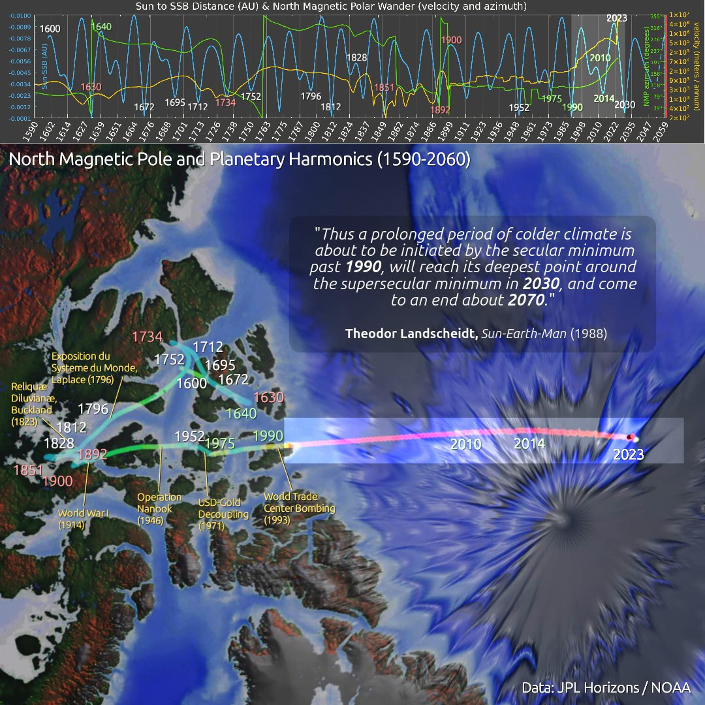

# Forecasting an Impending ECDO Rotation

Goal is to predict when the next ECDO will happen.

## Contents

- `date-and-triggers`: Date and triggers for the next ECDO event.
- (Speculative) `shudder`: A vague potential imminent phenomenon that Ethical Skeptic referred to on social media.

## Evidence for an impending ECDO

Currently, the strongest piece of evidence we have for an impending ECDO event is the accelerating north pole wander and weakening magnetic field. See `EVIDENCE/earth-geo-state/geomagnetic/north-pole-wander`.

https://github.com/user-attachments/assets/de8d7eff-800f-4030-b428-2667cd46179e

Past that, there are also exothermic core and temperature anomalies. These are causing climate change, such as increased rainfall.

## Signals that we are on the brink [1]

There will be quakes, eruptions and extreme weather due to the disruptions to the electromagnetic field. Weather like we have never seen I imagine. I think we will know when it’s imminent.

Almost certainly a globally experienced seismic movement in the hours before, and then a short time as the new dominant axis exponentially gains centrifugal dominance.

The concept of a *W-shaped climate event*, as we have seen some potential past evidence of, makes me wonder if we aren't at least 5 years to a few decades out from the actual flip. The caveat being, of course, that the leadup will bring an *intense aridification* probably involving *extreme heat*.

## Best forecast date - 2030

There are a host of solar, planetary, and cosmic alignments in 2030. See `date-and-triggers`.

## Citations

1. [Craig Stone](https://nobulart.com) (Intro image as well)

# TODO

- investigate additional data feeds related to the ECDO such as temperature
