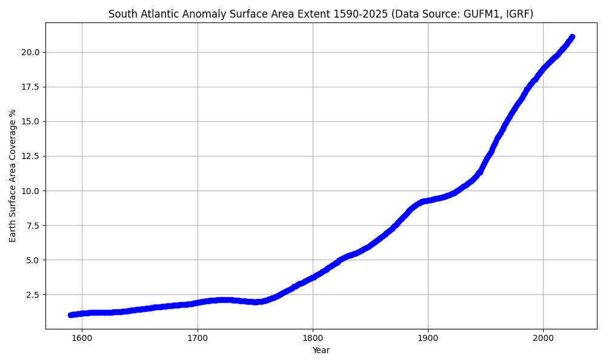

# Forecasting an Impending ECDO Rotation

Goal is to predict when the next ECDO will happen.
- Recent climate and geo-state anomalies are in `EVIDENCE/PRESENT-CLIMATE-ANOMALIES`.
- Impending cosmic/geomagnetic alignments are in `EVIDENCE/IMPENDING-ALIGNMENTS`.

## Contents

- `0-DATE-AND-TRIGGERS`: Date predictions and triggers for the next ECDO event.
- `case-against`: The best **counterarguments** for why we won't have an impending ECDO event.
- (Speculative) `shudder`: A vague potential imminent phenomenon that Ethical Skeptic referred to on social media.

## Evidence for an impending ECDO

Currently, the strongest piece of evidence we have for an impending ECDO event is the accelerating north pole wander and weakening magnetic field.

https://github.com/user-attachments/assets/de8d7eff-800f-4030-b428-2667cd46179e

Past that, there are also exothermic core and temperature anomalies. These are causing climate change, such as increased rainfall.

Finally we have some more emergent evidence in `EVIDENCE/conspiracy-theories` concerning frenzied movements of "elites" in potential preparation for this.

## Best forecast date - next few decades (2030-2060)

There are a host of solar, planetary, and cosmic alignments in 2030. Additionally the geomagnetic field seems to be approaching a tipping point. See `date-and-triggers`.

## Signals that we are on the brink [1]

There will be quakes, eruptions and extreme weather due to the disruptions to the electromagnetic field. Weather like we have never seen I imagine. I think we will know when it’s imminent.

Almost certainly a globally experienced seismic movement in the hours before, and then a short time as the new dominant axis exponentially gains centrifugal dominance.

The concept of a *W-shaped climate event*, as we have seen some potential past evidence of, makes me wonder if we aren't at least 5 years to a few decades out from the actual flip. The caveat being, of course, that the leadup will bring an *intense aridification* probably involving *extreme heat*.

## Citations

1. [Craig Stone](https://nobulart.com)

# TODO

investigate additional data feeds related to the ECDO that can help with monitoring
- geomagnetic field
- temperature
- storms
- auroras
