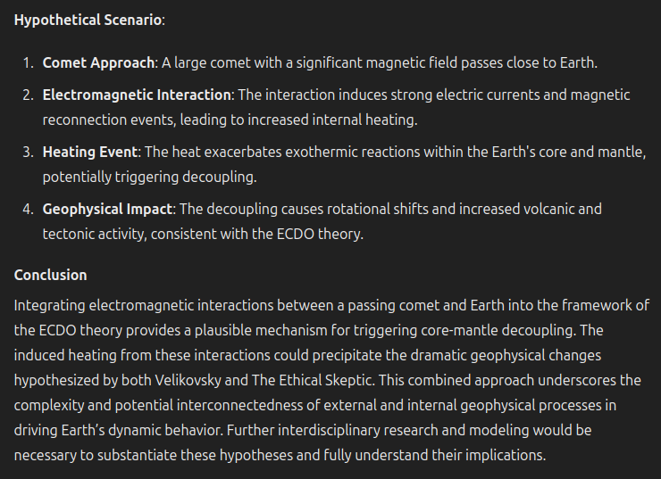

# Date and Triggers

This folder is for predicting the date of the impending ECDO, along with potential triggers for it. Most notably, there are a host of cosmic alignments in June 2030 - solar minimum, planetary and gas giant alignments, comets, and more. See `EVIDENCE/solar-system`.

## When did it start?

Possible destabilization began noticeably around 1973 although contributory processes were likely in place much before. See Ethical Skeptic's first thesis.

## S1 -> S2 Rotation Prediction: June 2030

Nobulart prediction: Worst case S1 -> S2 as early as mid-2030, with S2 -> S1 in 2042/3.

## Nobulart quote [1]

I don’t know what the date might be. If two magnets are twisted relative to one another, the field will flip after about 40 degrees of rotation. The Earth’s north magnetic pole has deviated by roughly 30 degrees between 1900 and 2024 and is accelerating. I strongly suspect that the decoupling might occur if the field flips (even briefly and returns to its current orientation). To me the known and observable rhythm of the planets is the only potentially accurate predictive tool we have. All that is to be done is to decode the coupled rhythms which we can now see exist between the earth, sun and other planets, and we may have unlocked all manner of precise prediction for quakes, volcanic activity, climate shifts, weather anomalies, space weather etc. This theory brings the entire thing together as a complete system which is rhythmic and predictable, and based entirely in observable, confirmable phenomena... Whilst recorded dates are often useful for confirmations, this issue is not really relevant to my research because it deals in geophysical ages as recorded by the Earth every time it goes around the sun, and in the highly predictable movements of the planets. As an interesting note - according to my harmonic theory as it stands now - disturbances are most likely to occur during periods of planetary equilibrium, the opposite state to alignments (where we observe multiple bodies in the same area of the sky). During moments of equilibrium the four giants are all in balanced opposition spread out around the sun. Next one is 2030. One after that is 2070.

## Nobulart speculative theory

## I asked ChatGTP4o to do... [1]

I asked ChatGTP4o to do an analysis of ECDO, Velikovsky, and electromagnetic coupling between the Earth and a passing comet as a possible trigger mechanism. https://t.co/yVOKzpp0Td

## Citations

1. [Craig Stone](https://nobulart.com)

# TODO Possible Triggers

Look into Ben Davidson

- galactic current sheet
- micronova
- planetary alignment
- periodic comet
- Earth simply letting go