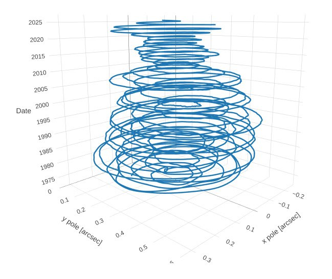

# Date and Triggers

This folder is for predicting the date of the impending ECDO, along with potential triggers for it.

## When did it start?

Possible destabilization began around 1973. See Ethical Skeptic's first thesis.

## S1 -> S2 Rotation Prediction: June 2030

Nobulart prediction: Worst case S1 -> S2 as early as mid-2030, with S2 -> S1 in 2042/3.

## Solar system triggers [1]

The steady narrowing of real polar nutation [1] in apparent lockstep with the approaching Landscheidt Minimum [2] in June 2030, and near pass by 2P/Encke in June 2030 [3] whilst we are at solar grand minimum[4]. AgeEnder 2030 courtesy of the Saturnalian maniacs behind it. As a sidenote: When the 360-365 day calendar adjustment around 687BC (See `EVIDENCE/date-anomalies`) is accounted for, the Mayan long-count does not resolve to 2012, but to around 2030-2040 depending on when one determines the calendar adjustment occurred.

1. https://www.iers.org/IERS/EN/DataProducts/EarthOrientationData/eop.html
2. https://landscheidt.info/
3. []
4. https://nobulart.com/360-days/

The data for the fourth chart is obtained from JPL's Ephemeris software: https://ssd.jpl.nasa.gov/horizons/app.html

## Solar system triggers v2 [1]

I think there is certainly enough energy involved between the sun and the earth for a field inversion in the sun during a gravitational lull to be the trigger for the decoupling. As we progress towards the slip the progression must manifest as accelerated magnetic polar wander and a narrowing of average real polar nutation (due to the drift occurring between core and mantle). The heat is rising and water is an excellent medium to draw it out.

I think the Sun's regular field inversion during a grand solar minimum may be the trigger for a micronova.

There is a perfect 4/5 harmonic on 4627 years, which is the grand orbital cycle of the four gas giants, which govern all solar cycles.

This shows how the gas giant orbital rhythm is locked to the grand solar minimums.

We have the first of one of those double-taps coming up in June 2030.

## Solar system triggers v3 [1]

The yellow chart is generated from JPL's Horizons data. It shows the Sun's displacement from the Solar System Barycenter (SSB) from 1600-2059 - this is our main proxy for planetary harmonics. The particular Neptune/Uranus disturbances ~172 years apart (marked in blue) are the key marker series in the 4,627-year (IV) cycle identified by Landscheidt et al - they are the precursor to previous Grand Solar Minimums. Note how the gravitational minimum (red circles) after the first disruptions aligns temporally with the mid-1800's Magnetic North Pole path deviation. The minimum after the second disturbance is Landscheidt's 2030 predicted date for the onset of the GSM. The animation provides a timelapse representation of the Sun's "wobble" due to planetary gravitational influences.

1. https://ssd.jpl.nasa.gov/horizons/
2. http://landscheidt.info
3. https://x.com/nobulart/status/1824455551939662016

Mentioned video is `img/SSBwobble.mp4`.

## Nobulart quote

I don’t know what the date might be. If two magnets are twisted relative to one another, the field will flip after about 40 degrees of rotation. The Earth’s north magnetic pole has deviated by roughly 30 degrees between 1900 and 2024 and is accelerating. I strongly suspect that the decoupling might occur if the field flips (even briefly and returns to its current orientation). To me the known and observable rhythm of the planets is the only potentially accurate predictive tool we have. All that is to be done is to decode the coupled rhythms which we can now see exist between the earth, sun and other planets, and we may have unlocked all manner of precise prediction for quakes, volcanic activity, climate shifts, weather anomalies, space weather etc. This theory brings the entire thing together as a complete system which is rhythmic and predictable, and based entirely in observable, confirmable phenomena... Whilst recorded dates are often useful for confirmations, this issue is not really relevant to my research because it deals in geophysical ages as recorded by the Earth every time it goes around the sun, and in the highly predictable movements of the planets. As an interesting note - according to my harmonic theory as it stands now - disturbances are most likely to occur during periods of planetary equilibrium, the opposite state to alignments (where we observe multiple bodies in the same area of the sky). During moments of equilibrium the four giants are all in balanced opposition spread out around the sun. Next one is 2030. One after that is 2070.

## June 2030 planetary positions, gravitational null?

In June 2030, which is approximately the next Landscheidt minimum, you can see [2] that the gas giants are approximately in line, which is what Landscheidt proposed caused solar perturbations, and is one of the two cases which Geoff Sharp stated are the most important gas giant positions.

In terms of a gravitational null effect, Earth passes around the Sun on the side of Jupiter during May/June 2030, at the same time as Jupiter is opposite the other gas giants (maximum effect of gas giants canceling each other out).

## Gas giant harmonic (June 2030)

See `EVIDENCE/solar-system` for details.

An important date in this data is June 2030 - grand solar minimum.

## Encke Comet (June 2030)

There will be a historically close pass with Encke in June 2030. ±40 million km.

## Nobulart speculative theory

## Citations

1. [Craig Stone](https://nobulart.com)
2. https://theskylive.com

# TODO Possible Triggers

Look into Ben Davidson

- galactic current sheet
- micronova
- planetary alignment
- periodic comet
- Earth simply letting go